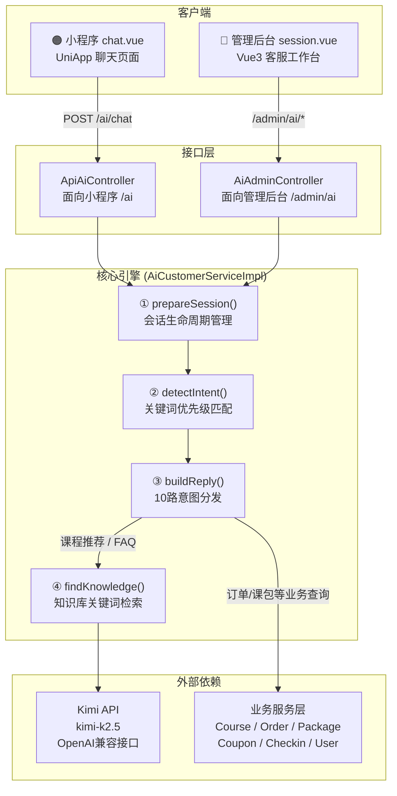
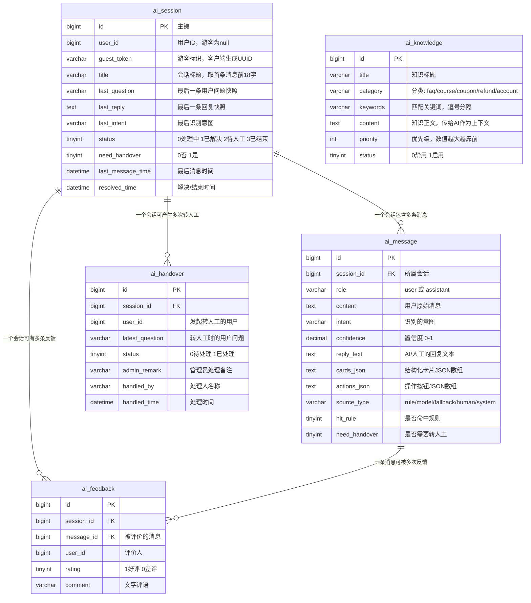
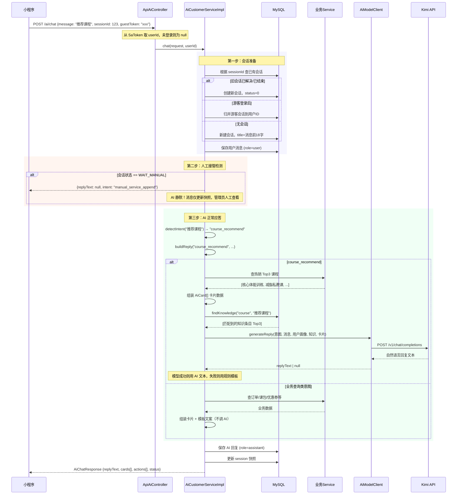
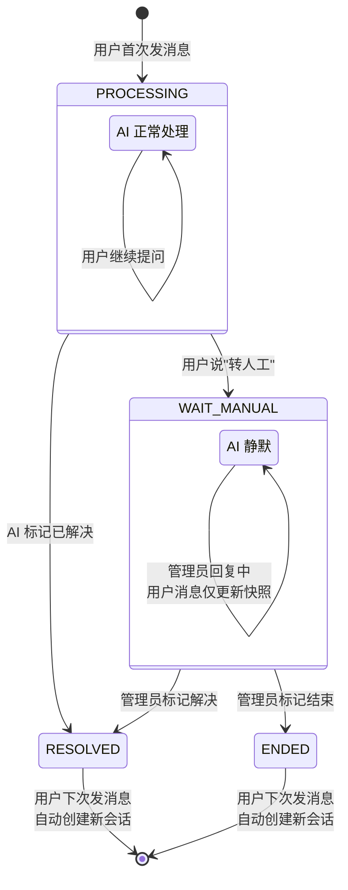
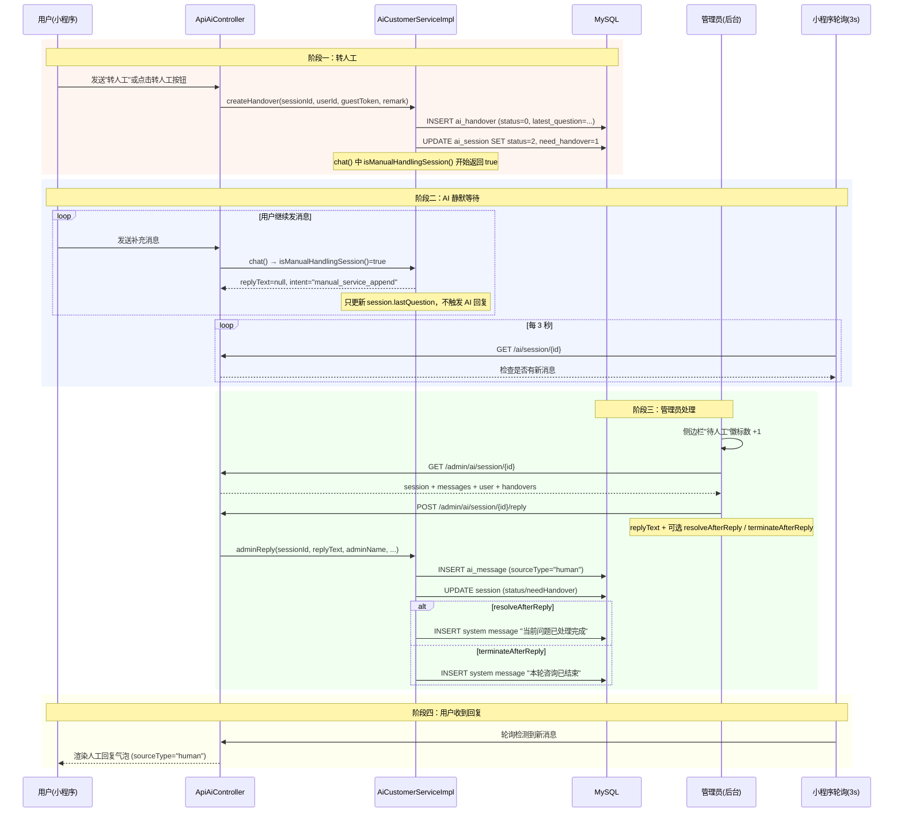

# AI 智能客服模块技术方案

## 一、模块概述

AI 智能客服是本平台的核心模块之一，承担用户咨询的自动应答任务。它的设计目标是：**用户在小程序中像跟真人客服聊天一样提问，系统自动识别问题类型，查询真实业务数据后给出回复**。

整个模块采用 **"规则引擎主导 + AI 大模型润色"** 的混合架构。为什么不用纯粹的生成式 AI？因为体育培训行业的客服问题高度依赖真实业务数据——用户问"我的课包还剩几节"，答案必须精确来自数据库，不能让大模型凭空编造一个数字。所以本模块的设计原则是：**业务数据查询走规则（保证准确性），自然语言表达走模型（提升亲和力）。**

---

## 二、整体架构



架构自上而下分为四层：

- **接口层**：两个 Controller。`ApiAiController` 面向小程序用户，路径是 `/ai`；`AiAdminController` 面向管理后台，路径是 `/admin/ai`，所有接口都有 Sa-Token 权限注解保护（如 `@SaCheckPermission("ai:session")`）。
- **核心引擎层**：全部逻辑集中在 `AiCustomerServiceImpl` 这一个类中（约 1355 行）。它不依赖第三方 NLP 框架，而是用自研的关键词匹配做意图识别，用 JDK 17 的 `switch` 表达式做意图分发。
- **外部依赖层**：两部分——Kimi 大模型 API 负责润色自然语言；业务 Service 层（CourseService、OrderService 等）负责查真实数据。
- **客户端层**：小程序聊天页（UniApp）和后台客服工作台（Vue3 + Element Plus），两端都通过轮询机制实现准实时通信。

---

## 三、数据模型设计

模块涉及 5 张数据库表，它们之间的关系如下：



### 设计要点

**1. 快照冗余设计**

`ai_session` 表中存储了 `last_question`、`last_reply`、`last_intent` 三个快照字段。这样做的好处是：管理员查看会话列表时，不需要 JOIN `ai_message` 表就能直接看到每个会话的"最后一条消息预览"和"最后意图"，查询效率更高。

**2. 结构化消息设计**

`ai_message` 表不仅存储纯文本 `reply_text`，还通过 `cards_json` 和 `actions_json` 两个 JSON 字段承载结构化数据。例如课程推荐时，cards_json 会存储课程名称、图片、价格、标签等字段，前端据此渲染带缩略图的课程卡片，而不是只能展示纯文本。

**3. 游客模式支持**

`user_id` 字段可为 null，同时有 `guest_token` 字段。这样用户不登录也能使用 AI 客服，由客户端生成一个 UUID 作为临时身份标识。当游客后续登录时，系统会将游客会话自动合并到登录用户 ID 下。

---

## 四、核心 Chat 链路详解

这是整个模块最关键的方法，理解它就理解了整个系统的运行逻辑。



下面是 `chat()` 方法的实际代码（我删除了非核心的日志和空行，保留完整逻辑）：

```java
@Override
@Transactional(rollbackFor = Exception.class)
public AiChatResponse chat(AiChatRequest request, Long userId) {
    // 1. 入参校验
    String message = request.getMessage();
    if (!StringUtils.hasText(message)) {
        throw new KineticSportsBindException("请输入咨询内容");
    }

    // 2. 会话准备：新建 or 复用旧会话 or 游客合并
    AiSession session = prepareSession(
        request.getSessionId(), userId, request.getGuestToken(), message);

    // 3. 保存用户消息到 ai_message 表
    aiMessageService.save(buildUserMessage(session.getId(), userId, message));

    // 4. ⭐ 人工接管检测：如果会话已转人工，AI 不再自动回复
    if (isManualHandlingSession(session)) {
        AiChatResponse response = new AiChatResponse();
        response.setSessionId(session.getId());
        response.setReplyText(null);          // 不回复！
        response.setIntent("manual_service_append");
        response.setSourceType("system");
        response.setNeedHandover(true);
        updateWaitingManualSnapshot(session, message, response);
        return response;  // 提前返回，后续 AI 链路不执行
    }

    // 5. 意图识别 + 回复生成
    String intent = detectIntent(message);     // 关键词匹配
    BigDecimal confidence = estimateConfidence(intent, message); // 计算置信度
    ChatDraft draft = buildReply(intent, message, userId, ...); // 意图分发

    // 6. 构造响应对象
    AiChatResponse response = new AiChatResponse();
    response.setSessionId(session.getId());
    response.setReplyText(draft.replyText);    // AI回复文本
    response.setIntent(intent);                // 识别的意图
    response.setSourceType(draft.sourceType);  // rule/model/fallback
    response.setCards(draft.cards);            // 结构化卡片
    response.setActions(draft.actions);        // 操作按钮

    // 7. 保存 AI 回复消息
    AiMessage assistant = buildAssistantMessage(
        session.getId(), userId, intent, confidence, draft);
    aiMessageService.save(assistant);
    response.setMessageId(assistant.getId());

    // 8. 更新会话快照
    updateSessionSnapshot(session, message, response);
    return response;
}
```

这个方法的逻辑可以总结为**一条主链路 + 一个提前出口**：

- **主链路**：准备会话 → 保存用户消息 → 识别意图 → 生成回复 → 保存回复 → 返回结果
- **提前出口**：如果会话已转人工（status=2），则在第 4 步直接返回 `replyText=null` 的响应，后续的 AI 链路不执行。这是一个**守门人模式**，防止 AI 在人工处理期间插话干扰。

---

## 五、意图识别引擎

意图识别是整个系统的"路由器"。它不需要训练 NLP 模型，而是用**关键词优先级匹配**——按业务紧急程度和语义明确度，从高到低排列 10 种意图规则，首次命中即返回。

```java
private String detectIntent(String message) {
    // P1 人工 -- 最高优先级，用户明确要求转人工
    if (containsAny(message, "人工", "转人工", "人工客服"))
        return "manual_service";

    // P2 退款/售后 -- 敏感问题，需要快速定位
    if (containsAny(message, "退款", "退费", "售后"))
        return "refund_help";

    // P3 课包剩余 -- 高频问题
    if (containsAny(message, "课包", "剩几节", "剩余节数"))
        return "package_query";

    // P4 优惠券
    if (containsAny(message, "优惠券", "优惠", "折扣"))
        return "coupon_query";

    // P5 签到记录
    if (containsAny(message, "签到", "上课记录", "消课"))
        return "checkin_query";

    // P6 账号相关
    if (containsAny(message, "绑定手机号", "手机号", "密码", "登录", "账号"))
        return "account_help";

    // P7 订单查询
    if (containsAny(message, "订单", "支付", "发货", "已买"))
        return "order_query";

    // P8 团课排期 -- 组合条件：课程类型词 + 时间/容量词
    if ((message.contains("团课") || message.contains("排课") || message.contains("名额"))
            && containsAny(message, "什么时候", "时间", "有名额", "场次", "最近"))
        return "course_schedule_query";

    // P9 课程推荐 -- 组合条件：推荐意图词 + 课程类型词
    if (containsAny(message, "推荐", "适合我", "报什么")
            && containsAny(message, "课程", "团课", "私教", "课包"))
        return "course_recommend";

    // 兜底：走知识库 FAQ 匹配
    return "general_faq";
}

// 辅助方法：判断消息是否包含任意关键词
private boolean containsAny(String source, String... terms) {
    for (String term : terms) {
        if (source.contains(term)) return true;
    }
    return false;
}
```

**为什么 P8 和 P9 用了组合条件？** 因为"团课"这个词可能出现在各种上下文中——"我想了解团课"（课程咨询）和"团课什么时候开"（排期查询）需走不同分支。组合条件（课程类型词 + 意图动词）能更准确地区分这两种场景。

**置信度估算**作为辅助信息一并返回给前端。`general_faq` 兜底意图默认置信度仅 0.55，而命中业务关键词的置信度从 0.65 起步，每多一个特征词 +0.1，上限 0.95。这个数值不参与逻辑判断，仅用于前端展示参考。

---

## 六、意图分发与回复生成

```java
private ChatDraft buildReply(String intent, String message,
        Long userId, String guestToken, Long sessionId) {
    return switch (intent) {  // JDK 17 switch 表达式
        case "course_recommend"       -> buildCourseRecommendReply(message, userId);
        case "course_schedule_query"  -> buildScheduleReply(message);
        case "order_query"            -> buildOrderReply(userId, message);
        case "refund_help"            -> buildRefundReply(userId);
        case "package_query"          -> buildPackageReply(userId);
        case "coupon_query"           -> buildCouponReply(userId, message);
        case "checkin_query"          -> buildCheckinReply(userId);
        case "account_help"           -> buildAccountReply(userId);
        case "manual_service"         -> buildManualReply(userId, guestToken, sessionId);
        default                       -> buildGeneralReply(message, userId);
    };
}
```

10 种意图分为**三类处理策略**：

| 策略类别 | 包含的意图 | 核心操作 | 是否调 AI |
|----------|-----------|---------|-----------|
| **规则 + AI 润色** | course_recommend, general_faq | 规则查数据 → 构建 Prompt → 调 Kimi 生成自然语言 → 失败则用模板兜底 | 是 |
| **纯规则** | order_query, refund_help, package_query, coupon_query, checkin_query, account_help, course_schedule_query | 直接查业务 Service → 拼装卡片 + 模板文案 | 否 |
| **纯操作** | manual_service | 创建转人工记录 → 修改会话状态 → 返回确认消息 | 否 |

### 6.1 规则+AI 润色：以课程推荐为例

```java
private ChatDraft buildCourseRecommendReply(String message, Long userId) {
    // 第一步：规则引擎 — 区分团课/私教，查热销 Top3
    Integer type = null;
    if (message.contains("团课")) {
        type = 2;
    } else if (message.contains("私教") || message.contains("课包")) {
        type = 1;
    }
    List<Course> courses = courseService.list(
        new LambdaQueryWrapper<Course>()
            .eq(Course::getStatus, 1)           // 只查上架课程
            .eq(type != null, Course::getType, type) // 如果有偏好类型则加筛选
            .orderByDesc(Course::getSales)      // 按销量降序
            .last("limit 3")                    // 取 Top3
    );

    // 第二步：构建结构化卡片（前端渲染用）
    ChatDraft draft = new ChatDraft();
    draft.cards = courses.stream()
        .map(this::toCourseCard)  // Course → AiCard{title, image, price, route...}
        .toList();
    draft.actions.add(action("navigate", "查看课程", null, COURSE_ROUTE));

    // 第三步：匹配知识库 + 调 AI 生成自然回复
    List<AiKnowledge> knowledges = findKnowledge("course", message);
    String fallback = "我先帮你挑了几门热度和口碑都不错的课程...";
    applyFinalReply(draft, "course_recommend", message, userId,
                    knowledges, draft.cards, fallback);

    // 第四步：标记回复来源
    draft.sourceType = StringUtils.hasText(draft.modelReply) ? "model" : "rule";
    draft.hitRule = true;
    return draft;
}
```

这里的关键方法是 `applyFinalReply()`，它封装了"模型优先、规则兜底"的策略：

```java
private void applyFinalReply(ChatDraft draft, String intent, String message,
        Long userId, List<AiKnowledge> knowledges, List<AiCard> cards, String fallback) {
    // 调大模型生成自然回复
    String modelReply = aiModelClient.generateReply(
        intent, message, buildUserProfileSummary(userId), knowledges, cards);
    draft.modelReply = modelReply;
    // 模型有结果就用 AI 文本，否则回退到规则模板
    draft.replyText = StringUtils.hasText(modelReply) ? modelReply : fallback;
}
```

### 6.2 纯规则：以订单查询为例

```java
private ChatDraft buildOrderReply(Long userId, String message) {
    // 未登录用户无法查到订单，引导登录
    if (userId == null) {
        return buildLoginRequiredReply(
            "登录后我才能帮你查询课程订单和退款状态。", COURSE_ORDER_ROUTE);
    }

    // 查最近 3 笔课程订单
    List<Order> latestOrders = orderService.list(
        new LambdaQueryWrapper<Order>()
            .eq(Order::getUserId, userId)
            .eq(Order::getOrderType, 1)      // 课程订单
            .orderByDesc(Order::getCreateTime)
            .last("limit 3")
    );

    // 统计全部订单状态分布
    List<Order> allOrders = orderService.list(
        new LambdaQueryWrapper<Order>()
            .eq(Order::getUserId, userId)
            .eq(Order::getOrderType, 1)
    );
    long pending = allOrders.stream()
        .filter(item -> Objects.equals(item.getStatus(), 1)).count();
    long paid = allOrders.stream()
        .filter(item -> Objects.equals(item.getStatus(), 2) || Objects.equals(item.getStatus(), 3)).count();

    ChatDraft draft = new ChatDraft();
    draft.cards = latestOrders.stream()
        .map(order -> toOrderCard(order, ...)).toList();  // 订单 → 订单卡片
    draft.replyText = "共有 " + pending + " 笔待支付，" + paid + " 笔已支付待处理。";
    draft.actions.add(action("navigate", "查看课程订单", null, COURSE_ORDER_ROUTE));
    draft.sourceType = "rule";   // 明确标记为规则生成
    return draft;
}
```

注意：纯规则意图**完全不调 AI**，直接从数据库查数据、拼装文本和卡片。因为涉及金额、数量等精确数据，不能用生成式 AI。

---

## 七、AI 模型集成

`AiModelClient` 是一个独立的 Service 类，封装了对 Kimi API 的调用。它不依赖任何第三方 SDK，仅使用 JDK 自带的 `java.net.http.HttpClient`。

```java
@Service
public class AiModelClient {
    // 公开方法：构建 Prompt 并请求模型
    public String generateReply(String intent, String userMessage,
            String userProfileSummary, List<AiKnowledge> knowledges, List<AiCard> cards) {
        // 1. 前置检查：模型未启用或无 API Key，直接返回 null
        if (!properties.isEnabled() || !StringUtils.hasText(properties.getApiKey())) {
            return null;   // null 在上层触发 fallback
        }

        // 2. 构建 OpenAI 兼容格式的消息体
        List<Map<String, String>> messages = new ArrayList<>();
        messages.add(Map.of("role", "system", "content", """
            你是 KINETIC 体育教培课程系统的智能客服。
            只基于给定的业务摘要、知识库和推荐卡片回答，不要编造数据。
            回复不要使用 Markdown 标题或列表符号，保持自然对话风格。
            """));
        messages.add(Map.of("role", "user", "content",
            buildPrompt(intent, userMessage, userProfileSummary, knowledges, cards)));

        // 3. 发送 HTTP 请求（含重试逻辑）
        // POST https://api.moonshot.cn/v1/chat/completions
        // Body: {model: "kimi-k2.5", temperature: 1, messages: [...]}
        // 失败/超时/状态码非 2xx → 返回 null
        // ...
    }

    // Prompt 构建：将所有上下文信息编码为一段结构化文本
    private String buildPrompt(...) {
        // 输出示例：
        // 意图：course_recommend
        // 用户问题：推荐适合我的课程
        // 用户业务摘要：昵称=张三，手机号已绑定=true，订单数=5，课包数=2，未使用优惠券数=3
        // 命中的知识：
        //   - 私教课介绍: 私教课是1v1教学模式...
        // 可展示卡片：
        //   - 核心体能训练 | 1v1私教 · 10节 | 价格=2999.00
        // 请结合以上信息生成 1 段适合前端直接展示的客服回复文本。
    }
}
```

**为什么用 JDK HttpClient 而不是 RestTemplate/OkHttp？** 因为这个模块只需要发一个 POST 请求到单个外部 API，不需要连接池、不需要异步回调、不需要拦截器链。JDK 自带的 HttpClient 足够胜任，避免引入额外依赖。

**Kimi k2.5 模型的特殊性**：该模型的 temperature 参数固定为 1，如果传入其他值反而可能导致 API 报错。所以在 `resolveTemperature()` 中做了特判——检测到是 Kimi 的 k 系列模型时，temperature 强制设为 1。

| 配置项 | 值 | 说明 |
|--------|-----|------|
| 提供商 | Kimi (Moonshot) | OpenAI 兼容接口 |
| 模型 | kimi-k2.5 | 当前使用的模型版本 |
| 端点 | `https://api.moonshot.cn/v1` | 自动拼接 `/chat/completions` |
| Temperature | 1（kimi-k 系列固定） | 其他模型默认 0.4 |
| 超时 | 60 秒 | 含两次请求（connect + read） |
| 重试 | 1 次 | 总共最多 2 次尝试 |
| 失败策略 | 返回 null | 上层自动回退规则模板 |

---

## 八、知识库匹配

知识库是一个轻量级的 FAQ 系统。管理员在后台录入知识条目（标题、分类、关键词、正文、优先级），系统在客服对话时自动匹配相关条目，作为上下文传给 AI 模型。

```java
private List<AiKnowledge> findKnowledge(String category, String message) {
    // 1. 查询所有启用条目，按优先级降序
    List<AiKnowledge> knowledges = aiKnowledgeService.list(
        new LambdaQueryWrapper<AiKnowledge>()
            .eq(AiKnowledge::getStatus, 1)          // 只取启用的
            .orderByDesc(AiKnowledge::getPriority)  // 优先级高的排前面
    );

    // 2. 两步过滤
    List<AiKnowledge> matched = knowledges.stream()
        // 2a. 分类过滤：同分类 或 faq（faq 为通用匹配，对所有分类开放）
        .filter(item -> category.equals(item.getCategory()) || "faq".equals(item.getCategory()))
        // 2b. 关键词匹配：用户消息中需命中至少一个关键词
        .filter(item -> matchKnowledge(item, message))
        .limit(3)  // 只取 Top3，避免 Prompt 过长
        .toList();

    // 3. 无匹配时用硬编码兜底知识
    return matched.isEmpty() ? defaultKnowledges(category, message) : matched;
}

private boolean matchKnowledge(AiKnowledge knowledge, String message) {
    // 将关键词按逗号拆分，在用户消息中逐词检索
    String[] keywords = knowledge.getKeywords().split("[,，]");
    for (String keyword : keywords) {
        if (StringUtils.hasText(keyword) && message.contains(keyword.trim())) {
            return true;
        }
    }
    return false;
}
```

**兜底知识的作用**：即使管理员没有配置任何知识条目，系统也能根据意图类别自动生成虚拟知识条目。例如退款类问题会自动获得一条"课程订单在已支付或待排课阶段可发起退款申请"的知识，确保 AI 至少能给出基础回复。

---

## 九、会话状态机



会话有 4 种状态，但核心行为只分两种：

| 状态 | 值 | 含义 | 用户发消息时 |
|------|----|------|------------|
| PROCESSING | 0 | AI 正常处理中 | AI 自动回复 |
| RESOLVED | 1 | 当前问题已解决 | **开启新会话**，AI 重新应答 |
| WAIT_MANUAL | 2 | 等待人工处理 | **AI 静默**，消息仅记录快照 |
| ENDED | 3 | 本轮咨询已结束 | **开启新会话**，AI 重新应答 |

**人工接管检测**实现了双重保险：

```java
private boolean isManualHandlingSession(AiSession session) {
    // 第一层：状态和标识的常规判断
    if (Objects.equals(session.getStatus(), WAIT_MANUAL)  // status=2
            || Objects.equals(session.getNeedHandover(), 1)) {  // needHandover=1
        return true;
    }
    // 第二层兜底：即使状态被意外改写，只要有未处理的转人工工单，就禁止 AI 回复
    return aiHandoverService.count(
        new LambdaQueryWrapper<AiHandover>()
            .eq(AiHandover::getSessionId, session.getId())
            .eq(AiHandover::getStatus, 0)  // status=0 表示待处理
    ) > 0;
}
```

第二层兜底的意义：即使 `ai_session` 的 status 字段因为某些异常被改回了 0，只要 `ai_handover` 表里还有待处理的工单，AI 就不会自动回复。这是一种防御性编程。

---

## 十、人工转接全流程

这是模块中最复杂的子流程，涉及前后端协同和双端轮询。



管理员回复的核心代码：

```java
public void adminReply(Long sessionId, String replyText, String adminName,
                        boolean resolveAfterReply, boolean terminateAfterReply) {
    // 互斥处理：只能标记解决或结束，不能同时
    terminateAfterReply = terminateAfterReply && !resolveAfterReply;

    // 1. 创建人工回复消息
    AiMessage msg = new AiMessage();
    msg.setRole("assistant");
    msg.setSourceType("human");        // ⭐ 前端据此显示"人工客服"标签
    msg.setReplyText(replyText.trim());
    msg.setConfidence(BigDecimal.ONE); // 人工回复置信度恒为 1
    aiMessageService.save(msg);

    // 2. 根据标记更新会话状态
    boolean keepManual = !resolveAfterReply && !terminateAfterReply;
    session.setStatus(resolveAfterReply ? RESOLVED
                     : terminateAfterReply ? ENDED : WAIT_MANUAL);

    // 3. 解决/结束时插入系统提示消息
    if (resolveAfterReply) {
        aiMessageService.save(systemMsg("当前问题已处理完成..."));
    }
    if (terminateAfterReply) {
        aiMessageService.save(systemMsg("本轮咨询已结束..."));
    }

    // 4. 更新转人工工单
    for (AiHandover handover : pendingHandovers) {
        handover.setStatus(keepManual ? 0 : 1);  // 保持待处理 or 标记已处理
        handover.setHandledBy(adminName);
        handover.setHandledTime(keepManual ? null : LocalDateTime.now());
    }
}
```

---

## 十一、结构化响应设计（Cards & Actions）

AI 客服的回复不只是纯文本，还带有结构化数据。`AiChatResponse` 中包含了两个关键字段：

```java
// 响应体结构
public class AiChatResponse {
    private String replyText;    // 纯文本回复
    private List<AiCard> cards;   // 结构化卡片
    private List<AiAction> actions; // 操作按钮
    // ...
}

// 卡片：承载业务对象的关键信息
public class AiCard {
    String type;    // course / order / package / coupon
    String id;      // 业务对象ID
    String title;   // 标题（课程名/订单号等）
    String subtitle; // 副标题
    String image;   // 封面图URL
    String price;   // 价格
    String meta;    // 元信息标签
    String route;   // 点击跳转路径
}

// 动作：可点击的快捷操作
public class AiAction {
    String type;    // navigate / handover / retry
    String label;   // 按钮文字
    String value;   // 业务值
    String route;   // 跳转路径
}
```

前端渲染效果（描述）：

- **纯文本** + **卡片列表**：文本在上方，下方是横向滚动或纵向排列的卡片，每张卡片有图片、标题、价格标签。点击卡片跳转到对应的课程详情/订单详情页。
- **操作按钮**：在文本下方显示一排按钮，如"查看课程"、"转人工"、"去登录"。不同类型按钮用不同颜色区分（navigate 蓝色，handover 橙色）。

---

## 十二、管理后台功能

管理后台的 AI 客服模块有三个页面：

| 页面 | 路由 | 权限 | 功能 |
|------|------|------|------|
| 会话管理 | `/admin/ai/session` | `ai:session` | 左右分栏布局，左侧会话列表（8s 轮询），右侧聊天区（3s 轮询详情）。支持快捷回复、手动回复、标记解决/结束、查看转人工记录和用户反馈 |
| 知识库管理 | `/admin/ai/knowledge` | `ai:knowledge` | CRUD 表格，字段：标题、分类（faq/course/coupon/refund/account）、关键词（逗号分隔）、优先级、内容、状态 |
| 数据统计 | `/admin/ai/stats` | `ai:stats` | 6 个统计卡片（总会话/已解决/转人工/知识条目/好评/差评）、Top6 热门意图排行、运营建议 |

---

## 十三、小程序端实现

`pages/ai/chat.vue`（约 720 行）实现了完整的聊天界面：

- **游客模式**：客户端生成 `guest_{timestamp}_{random}` 作为 guestToken，未登录也能使用
- **消息渲染**：根据 `sourceType` 显示不同标签——"AI 客服"（model/rule）、"人工客服"（human）、"系统提示"（system）
- **卡片渲染**：将 `cards[]` 中的 AiCard 渲染为富交互卡片组件
- **快捷问题**：6 个预设问题按钮，点击即可发送
- **轮询机制**：有活跃会话时每 3 秒轮询 `GET /ai/session/{id}` 检测新消息。发送消息后暂停 2.5 秒（避免与自身消息的保存产生竞态）
- **消息指纹**：用 `buildMessageFingerprint()` 比对消息变化，避免无意义的 DOM 更新
- **会话重置**：检测到 status=1 或 3 时自动清除本地 sessionId，下次提问开新会话

---

## 十四、关键设计决策总结

| 设计决策 | 原因 |
|----------|------|
| **规则主导，AI 辅助** | 订单金额、课包余量等数据必须精确，不能让生成式 AI 编造。AI 仅用于推荐和 FAQ 场景的自然语言润色 |
| **关键词匹配 vs NLP 模型** | 体育培训行业的客服意图种类有限（约 10 种），关键词匹配足够准确且零延迟，不需要训练/部署 NLP 模型 |
| **结构化卡片 + 文本双通道** | 纯文本回复的信息密度低，附带卡片（图片+价格+标签）能显著提升用户决策效率 |
| **游客模式** | 降低使用门槛，用户无需登录就能咨询。通过 guestToken 标识身份，登录后自动归并会话 |
| **人工接管双保险** | `isManualHandlingSession()` 同时检查 session 状态 + handover 工单，防止因状态异常导致 AI 在人工处理时插话 |
| **模型失败静默降级** | `generateReply()` 异常时返回 null → `applyFinalReply()` 自动回退规则模板，用户无感知 |
| **前端轮询而非 WebSocket** | 项目规模不大，轮询实现简单可靠。两个轮询频率不同（后台 3-8s，小程序 3s），分别优化延迟和服务器负载 |
