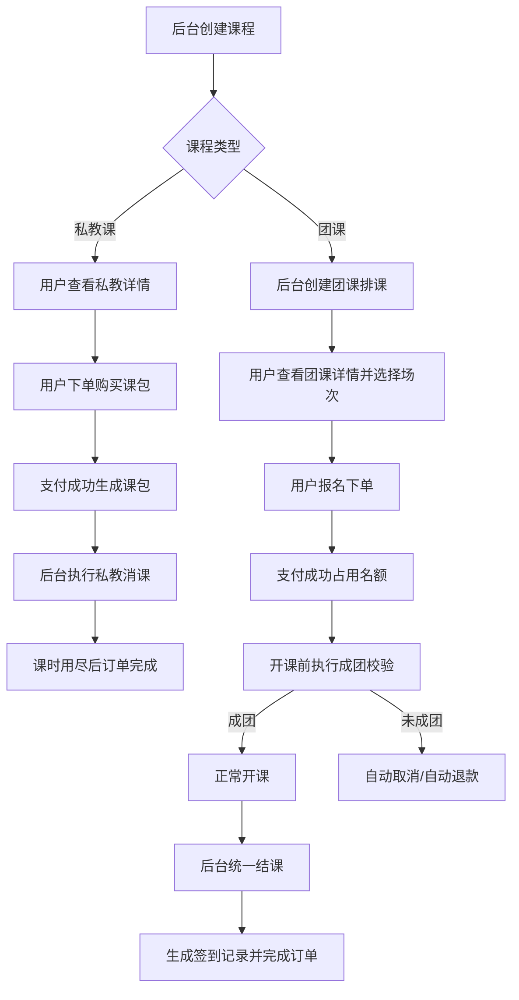
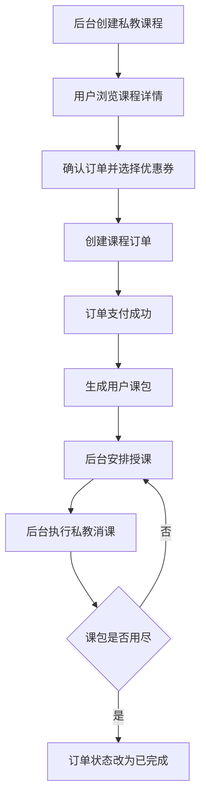
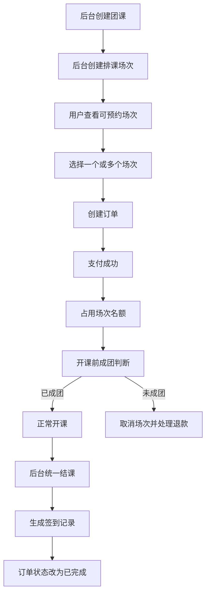

# 体育教培机构管理系统课程模块答辩正式展示文档

## 1. 模块定位

本项目的课程模块是体育教培机构管理系统的核心业务模块，承担了从课程供给、课程展示、用户报名、订单支付、排课履约、销课签到到售后退款的完整闭环。  
在系统设计中，课程模块按照业务形态拆分为两条主线：

- 私教课链路：以“购买课包、后续约课、按次销课”为核心。
- 团课链路：以“选择具体场次、报名占座、成团开课、统一结课”为核心。

这种设计符合真实体育培训机构的经营模式，也体现了本系统在课程交付逻辑上的业务适配能力。

## 2. 模块目标与设计思路

课程模块的总体设计目标包括以下四点：

1. 支持课程信息的标准化管理，包括课程分类、课程介绍、课程价格、适用教练、地点和状态控制。
2. 针对私教课和团课采用差异化履约模型，避免两类课程在业务规则上的混用。
3. 保证下单、支付、排课、销课、退款等关键环节的数据一致性。
4. 为运营管理、财务结算、教练绩效、推荐系统和 AI 客服模块提供结构化业务数据。

从实现角度看，本模块采用“统一课程主表 + 差异化履约规则”的设计方式：  
课程基础信息统一存储在 `course` 表中，但履约方式通过 `type` 字段区分：

- `type = 1` 表示私教课
- `type = 2` 表示团课

由此保证了课程展示层的统一性，同时在下单、排课、销课和退款阶段体现不同策略。

## 3. 课程模块核心数据对象

课程模块围绕以下几张核心数据表展开：

| 数据表 | 作用说明 |
| --- | --- |
| `course` | 存储课程主信息，包括课程类型、价格、教练、有效期、成团人数、结算比例等 |
| `course_schedule` | 存储团课排课信息，包括日期、时间、地点、总名额、已报名人数、状态 |
| `order` | 存储课程订单主信息，包括订单金额、支付状态、退款状态、关联排课 |
| `order_item` | 存储订单明细信息，记录具体购买的课程 |
| `user_course_package` | 私教课包表，记录用户购买后的课时总量、已用课时和有效期 |
| `course_checkin` | 销课与签到表，统一记录私教消课和团课结课结果 |

这组表结构共同支撑了课程模块从销售到履约的全流程。

## 4. 课程模块总体业务闭环

该流程体现了一个重要设计思想：  
课程本身只是商品定义，真正决定履约方式的是“课程类型”和“是否绑定排课”。

## 5. 课程管理后台实现

### 5.1 课程基础信息管理

后台课程管理负责维护课程名称、价格、分类、介绍、图片、地点和适用规则。其控制器位于：

[CourseController.java](/Users/atrox/集美大学/Graduation-Project/sports-course/shop-back-end/kinetic-sports-admin/src/main/java/com/kinetic/sports/admin/controller/CourseController.java:1)

该控制器的关键设计点有两项：

1. 在保存和更新课程前，对课程名称、简介和富文本详情进行内容清洗，防止非法内容直接入库。
2. 对团课的上课地点进行强校验，确保 `locationId` 必须对应一个启用状态的地点对象。

关键实现可见：

- 团课地点规范化：[CourseController.java:67](/Users/atrox/集美大学/Graduation-Project/sports-course/shop-back-end/kinetic-sports-admin/src/main/java/com/kinetic/sports/admin/controller/CourseController.java:67)
- 课程内容安全清洗：[CourseController.java:88](/Users/atrox/集美大学/Graduation-Project/sports-course/shop-back-end/kinetic-sports-admin/src/main/java/com/kinetic/sports/admin/controller/CourseController.java:88)

这一设计说明系统不仅关注业务功能，也关注后台数据质量和内容安全。

### 5.2 团课排课管理

团课履约依赖排课能力，后台控制器位于：

[ScheduleController.java](/Users/atrox/集美大学/Graduation-Project/sports-course/shop-back-end/kinetic-sports-admin/src/main/java/com/kinetic/sports/admin/controller/ScheduleController.java:1)

后台支持以下能力：

- 单次创建团课场次
- 批量创建多个日期场次
- 查看教练排课看板
- 删除无报名且未结课的排课
- 在开课前执行成团判断

其中，删除排课时系统会检查两类约束：

1. 是否已经存在有效报名订单
2. 是否已经产生结课记录

对应实现位于：

[ScheduleController.java:174](/Users/atrox/集美大学/Graduation-Project/sports-course/shop-back-end/kinetic-sports-admin/src/main/java/com/kinetic/sports/admin/controller/ScheduleController.java:174)

这说明系统对排课对象采取了“履约前可维护，履约后不可随意破坏”的约束策略。

## 6. 前台课程展示与下单入口

### 6.1 用户端课程展示

用户端课程查询接口位于：

[ApiCourseController.java](/Users/atrox/集美大学/Graduation-Project/sports-course/shop-back-end/kinetic-sports-api/src/main/java/com/kinetic/sports/api/controller/ApiCourseController.java:1)

该接口实现了以下关键能力：

- 按课程类型、分类、地点进行筛选
- 团课只展示可报名的未来场次
- 首页可直接返回近 7 天可预约的团课列表

其中团课场次查询会主动过滤：

- 非未来时间的场次
- 已满员的场次
- 非有效状态场次

对应实现位于：

[ApiCourseController.java:141](/Users/atrox/集美大学/Graduation-Project/sports-course/shop-back-end/kinetic-sports-api/src/main/java/com/kinetic/sports/api/controller/ApiCourseController.java:141)

### 6.2 私教课下单页面

私教课确认订单页位于：

[confirm-private.vue](/Users/atrox/集美大学/Graduation-Project/sports-course/sports-custom-mini/pages/order/confirm-private.vue:100)

该页面的关键逻辑包括：

- 进入页面后加载课程信息和可用优惠券
- 根据所选优惠券动态计算实付金额
- 提交订单前校验用户是否已绑定手机号
- 创建订单后跳转到订单详情页完成支付

这说明私教课的前台购买逻辑本质上是“购买课包”，而不是“购买某一节具体课程”。

### 6.3 团课下单页面

团课确认订单页位于：

[confirm-group.vue](/Users/atrox/集美大学/Graduation-Project/sports-course/sports-custom-mini/pages/order/confirm-group.vue:110)

团课页面支持：

- 单场次报名
- 多场次批量报名
- 单场次时可使用优惠券
- 多场次时系统自动拆分为多笔订单，并批量支付

其中前端已将多场次与单场次逻辑明确区分，说明系统在交互设计上已经与后端订单模型保持一致。

## 7. 私教课完整链路分析

### 7.1 私教课业务特征

私教课的核心特点不是固定排课，而是“先购买课包，再由机构安排上课并逐次销课”。  
因此系统的私教逻辑重点不在 `course_schedule`，而在 `user_course_package` 与 `course_checkin`。

### 7.2 私教课流程图

### 7.3 私教订单创建逻辑

课程订单统一由 `OrderServiceImpl#createCourseOrder` 负责：

[OrderServiceImpl.java:78](/Users/atrox/集美大学/Graduation-Project/sports-course/shop-back-end/kinetic-sports-service/src/main/java/com/kinetic/sports/service/impl/OrderServiceImpl.java:78)

在私教课场景下，该方法完成以下动作：

1. 校验当前登录用户是否存在。
2. 校验用户是否已经绑定手机号。
3. 校验课程是否存在且处于上架状态。
4. 统一计算订单总金额、优惠券抵扣金额和实付金额。
5. 创建 `order` 主表记录。
6. 创建 `order_item` 订单明细记录。
7. 锁定优惠券，防止并发重复使用。

这里体现了一个工程化设计点：  
虽然私教和团课履约逻辑不同，但创建订单的基础行为是统一抽象的，从而减少重复代码。

### 7.4 私教支付成功后生成课包

私教课支付逻辑位于：

[OrderServiceImpl.java:607](/Users/atrox/集美大学/Graduation-Project/sports-course/shop-back-end/kinetic-sports-service/src/main/java/com/kinetic/sports/service/impl/OrderServiceImpl.java:607)

其中真正区分私教与团课的是 `handleCoursePay` 方法：

[OrderServiceImpl.java:633](/Users/atrox/集美大学/Graduation-Project/sports-course/shop-back-end/kinetic-sports-service/src/main/java/com/kinetic/sports/service/impl/OrderServiceImpl.java:633)

私教课支付成功后，系统会：

- 将订单状态改为“待履约”
- 创建 `user_course_package` 课包记录
- 写入总课时数、已用课时数、有效期
- 累加课程销量

也就是说，私教课支付成功并不会占用某个排课名额，而是生成可后续消耗的课时资产。这一点是私教课和团课在业务模型上的根本区别。

### 7.5 私教销课逻辑

后台私教销课接口位于：

[CheckinController.java:36](/Users/atrox/集美大学/Graduation-Project/sports-course/shop-back-end/kinetic-sports-admin/src/main/java/com/kinetic/sports/admin/controller/CheckinController.java:36)

该接口核心逻辑如下：

1. 校验学员、课程、教练、上课时间是否完整。
2. 校验课程必须是私教课。
3. 查询该学员当前课程下所有有效课包。
4. 按“最早到期优先”选出可用课包。
5. 计算单节课价格与教练分成金额。
6. 写入 `course_checkin` 消课记录。
7. 更新课包已用节数。
8. 当课包节数全部使用完毕时，将关联订单改为已完成。

这说明系统已经具备课包履约的真实业务特征，而不是将私教课简单等同于普通商品购买。

## 8. 团课完整链路分析

### 8.1 团课业务特征

团课的关键在于“场次化管理”。  
用户购买的不是抽象课程，而是具体的未来场次；系统必须处理名额控制、重复报名控制、成团判断、结课签到和退款规则。

### 8.2 团课流程图

### 8.3 团课下单与防重复报名

团课订单创建仍使用统一入口：

[OrderServiceImpl.java:78](/Users/atrox/集美大学/Graduation-Project/sports-course/shop-back-end/kinetic-sports-service/src/main/java/com/kinetic/sports/service/impl/OrderServiceImpl.java:78)

但在团课分支中，系统增加了以下关键控制：

1. 必须传入 `scheduleId`。
2. 对“用户 + 场次”维度加分布式锁。
3. 校验场次是否存在、是否属于该课程、是否可报名、是否已满员。
4. 校验当前用户是否已对该场次存在未关闭或已支付订单。

核心校验方法位于：

[OrderServiceImpl.java:462](/Users/atrox/集美大学/Graduation-Project/sports-course/shop-back-end/kinetic-sports-service/src/main/java/com/kinetic/sports/service/impl/OrderServiceImpl.java:462)

这一实现保证了以下问题不会发生：

- 用户重复报名同一场次
- 已开始场次被继续购买
- 超卖问题
- 非法篡改课程与排课对应关系

### 8.4 团课支付成功后占用名额

团课支付成功后的关键逻辑仍在：

[OrderServiceImpl.java:633](/Users/atrox/集美大学/Graduation-Project/sports-course/shop-back-end/kinetic-sports-service/src/main/java/com/kinetic/sports/service/impl/OrderServiceImpl.java:633)

在团课分支中，系统会：

1. 对 `scheduleId` 对应场次加锁。
2. 再次校验场次是否仍然有效。
3. 校验是否存在同用户重复支付订单。
4. 将 `enrolledSeats` 加 1。
5. 将订单状态改为“待履约”。
6. 累加课程销量。

这里体现了一个重要的并发控制思想：  
名额真正被占用发生在“支付成功后”，而不是“仅创建订单后”。  
这样可以避免待支付订单长期占坑，提升场次名额利用率。

### 8.5 团课成团判断

团课成团判断接口位于：

[ScheduleController.java:198](/Users/atrox/集美大学/Graduation-Project/sports-course/shop-back-end/kinetic-sports-admin/src/main/java/com/kinetic/sports/admin/controller/ScheduleController.java:198)

具体实现位于：

[OrderServiceImpl.java:297](/Users/atrox/集美大学/Graduation-Project/sports-course/shop-back-end/kinetic-sports-service/src/main/java/com/kinetic/sports/service/impl/OrderServiceImpl.java:297)

其处理逻辑为：

1. 查询当前排课对应的成团人数要求。
2. 统计当前已支付、待履约、已完成订单数量。
3. 若达到最小成团人数，则将场次置为进行中。
4. 若未到成团判断时间，则仅返回当前报名情况。
5. 若到了成团判断时间仍未成团，则：
   - 取消场次
   - 自动取消待支付订单
   - 自动退款已支付订单

这一机制体现了系统对真实团课运营场景的模拟能力，能够支持“未成团自动退费”的业务规则。

### 8.6 团课结课与签到生成

团课结课逻辑位于：

[CourseCheckinServiceImpl.java:46](/Users/atrox/集美大学/Graduation-Project/sports-course/shop-back-end/kinetic-sports-service/src/main/java/com/kinetic/sports/service/impl/CourseCheckinServiceImpl.java:46)

后台结课入口位于：

[CheckinController.java:122](/Users/atrox/集美大学/Graduation-Project/sports-course/shop-back-end/kinetic-sports-admin/src/main/java/com/kinetic/sports/admin/controller/CheckinController.java:122)

其执行过程为：

1. 校验排课是否存在、是否已取消。
2. 校验当前时间是否已经晚于课程结束时间。
3. 防止同一场次重复结课。
4. 查询该场次下所有已支付或待履约订单。
5. 为每个学员生成一条 `course_checkin` 记录。
6. 缺勤学员标记为 `status = 0`，到课学员标记为 `status = 1`。
7. 将相关订单统一改为已完成。
8. 将排课状态改为已结课。

这一设计说明：  
团课结课并不是简单改状态，而是一次“生成签到结果 + 完成订单履约 + 保留教练结算数据”的统一收口动作。

## 9. 退款规则设计

退款规则是课程模块体现业务复杂度的重要部分。

### 9.1 退款预览能力

退款预览位于：

[OrderServiceImpl.java:387](/Users/atrox/集美大学/Graduation-Project/sports-course/shop-back-end/kinetic-sports-service/src/main/java/com/kinetic/sports/service/impl/OrderServiceImpl.java:387)

系统会根据不同课程类型输出不同退款结果：

- 私教课：按剩余未消耗课时折算退款金额。
- 团课：按距离开课时间判断是否允许退款以及是否扣除违约金。

### 9.2 私教课退款规则

私教课退款公式为：

`退款金额 = 实付金额 - 已消课节数 × 单节原价`

其意义在于：  
私教课属于课包型产品，已使用课时不可二次销售，因此退款只能基于剩余可履约课时计算。

### 9.3 团课退款规则

团课退款规则分三级：

1. 开课前 8 小时以上：支持全额退款。
2. 开课前 2 至 8 小时：允许退款，但默认扣除 20% 违约金。
3. 开课前 2 小时内：不允许退款。

这类阶梯式规则更符合线下团课对教练、场地和人数组织的实际要求。

### 9.4 退款落库与数据回滚

退款最终处理位于：

[OrderServiceImpl.java:687](/Users/atrox/集美大学/Graduation-Project/sports-course/shop-back-end/kinetic-sports-service/src/main/java/com/kinetic/sports/service/impl/OrderServiceImpl.java:687)

其中：

- 私教退款会将课包状态改为已退费。
- 团课退款会回滚排课已报名人数。
- 两类课程都会同步回滚课程销量。
- 满额退款时可恢复优惠券状态。

该设计说明系统并不是只改一条订单记录，而是将退款视为一次完整的业务回滚过程。

## 10. 课程模块关键技术亮点

### 10.1 统一订单模型 + 差异履约规则

本系统没有为私教和团课分别设计两套订单系统，而是通过统一 `order` 模型承载销售行为，再在支付、结课、退款阶段按课程类型分流处理。这种设计既控制了模型复杂度，也增强了系统可扩展性。

### 10.2 分布式锁保证并发安全

在团课下单与支付过程中，系统使用 Redisson 锁控制：

- 用户对同一场次的重复报名
- 同一场次的名额并发竞争
- 成团判断期间的状态一致性

因此该模块不仅有业务设计，也体现了后端并发控制能力。

### 10.3 订单状态与履约状态分离

订单状态并不直接等同于课程完成状态。  
例如私教课支付后先进入“待履约”，只有课包用尽后才进入“已完成”；团课支付后先占位，结课后才真正完成。这种设计更贴近真实业务。

### 10.4 退款规则具备业务可解释性

课程模块没有采用简单的“可退/不可退”二元规则，而是根据课程类型、已履约程度、开课时间窗口进行细粒度控制，体现了系统的业务深度。

## 11. 答辩展示建议

在答辩现场展示本模块时，建议按以下顺序讲解：

1. 先说明为什么要把课程拆成私教和团课两条链路。
2. 再展示总体流程图，说明系统如何从课程销售走到课程履约。
3. 接着重点讲“私教生成课包”和“团课占用场次名额”这两个差异点。
4. 然后说明成团判断、结课和退款规则，体现业务复杂度。
5. 最后补充并发控制、状态机设计和数据一致性策略，体现技术深度。

## 12. 常见答辩问题与回答要点

### 问题 1：为什么私教课和团课不能共用同一种履约方式？

回答要点：  
私教课是课包型产品，支付后应生成可逐次消耗的课时资产；团课是场次型产品，支付后应立即占用具体时间段的名额。两者的履约对象不同，因此必须使用不同的后续处理策略。

### 问题 2：如何避免团课重复报名和超卖？

回答要点：  
系统在创建订单和支付订单两个阶段都做了校验，并通过 Redisson 分布式锁控制“用户 + 场次”和“场次名额”两个关键并发点，从而避免重复报名和超卖。

### 问题 3：为什么团课要在支付成功后才增加已报名人数？

回答要点：  
如果在创建订单时就占用名额，会导致大量待支付订单长期占坑，降低场次利用率。支付成功后再占位，能更符合真实业务，也更利于资源利用。

### 问题 4：为什么私教退款要按已消课节数折算？

回答要点：  
因为私教课本质是按课时履约，已消耗课时对应的服务已经完成，不能再退回。因此退款金额必须从实付金额中扣除已履约部分。

### 问题 5：团课为什么要设计成团判断机制？

回答要点：  
线下团课通常要求最低开班人数，否则会造成教练、场地和运营成本浪费。因此系统引入成团判断机制，在保证用户体验的同时，也体现了机构经营规则。

## 13. 结论

课程模块是本系统最能体现“业务复杂性与系统实现能力结合”的部分。  
它不仅完成了课程的基础展示和销售，还围绕私教课与团课的不同经营模型，设计了差异化的支付、履约、结课和退款机制，并通过分布式锁、状态控制和数据联动保证了业务闭环的正确性。

从毕业设计角度看，本模块能够较好体现以下能力：

- 对真实体育教培业务场景的建模能力
- 前后端协同的系统设计能力
- 对复杂订单状态流转的实现能力
- 对并发控制和数据一致性的工程实现能力

因此，课程模块既是本项目的核心业务模块，也是最适合在答辩中重点展示的模块之一。
