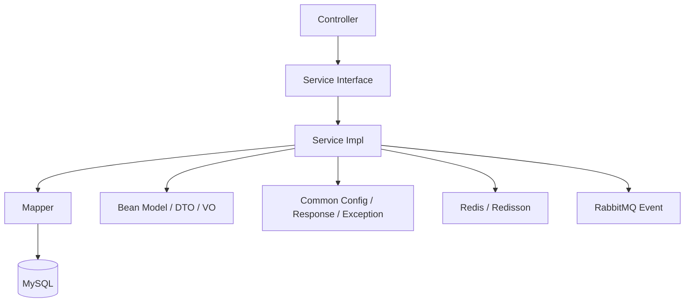
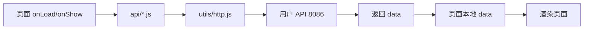
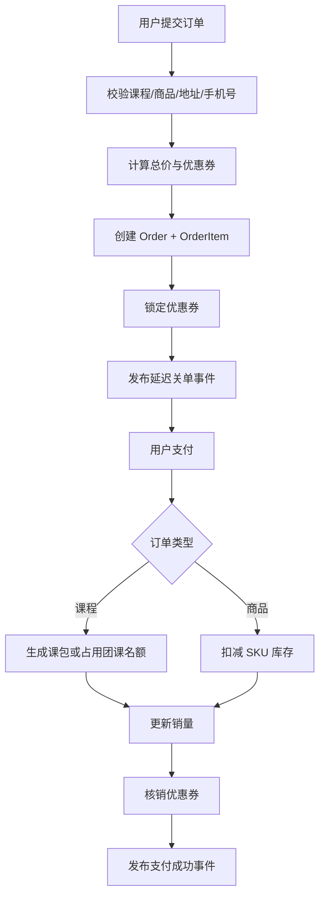
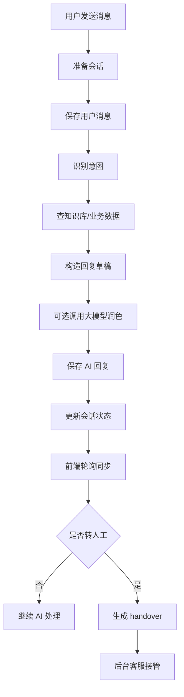

# KINETIC 项目技术架构文档

## 1. 项目概览

`KINETIC` 是一个围绕体育培训与运动商城场景构建的多端业务系统，包含：

- 管理后台：面向运营、教务、客服、财务与系统管理员
- 用户端小程序：面向学员用户进行课程浏览、下单、查看订单、管理课包与优惠券
- 后端服务：提供后台管理接口、用户端业务接口、认证鉴权、订单与推荐等核心业务能力

项目当前是一个典型的前后端分离仓库，但并非单一应用，而是由以下三大子系统组成：

- `shop-back-end`：Java Spring Boot 多模块后端
- `sports-admin-web`：Vue 3 + Element Plus 管理后台
- `sports-custom-mini`：uni-app 小程序端

从业务上看，系统主要覆盖四条主线：

- 课程业务：私教课包、团课、排课、销课、教练结算
- 商城业务：商品、规格 SKU、购物车、订单、收货地址
- 用户运营：登录注册、手机号绑定、优惠券、推荐行为采集
- 智能增强：个性化推荐、AI 客服、人工接管工作台

---

## 2. 仓库结构

### 2.1 顶层目录

```text
sports/
├── docs/                  # 业务功能与演示文档
├── shop-back-end/         # Spring Boot 多模块后端
├── sports-admin-web/      # 管理后台 Web
├── sports-custom-mini/    # uni-app 小程序
└── uploads/               # 本地上传文件目录
```

### 2.2 后端模块结构

```text
shop-back-end/
├── kinetic-sports-admin/          # 后台管理应用入口（8085）
├── kinetic-sports-api/            # 用户 API 应用入口（8086）
├── kinetic-sports-service/        # 核心业务服务层、Mapper、MQ、AI/推荐逻辑
├── kinetic-sports-bean/           # 实体、DTO、VO
├── kinetic-sports-common/         # 公共配置、响应体、异常、Web/MQ/MyBatis 配置
├── kinetic-sports-sys/            # 系统管理控制器（用户/角色/菜单）
└── kinetic-sports-security/       # Sa-Token 安全模块拆分
    ├── kinetic-sports-security-api/
    ├── kinetic-sports-security-admin/
    └── kinetic-sports-security-common/
```

### 2.3 管理端结构

```text
sports-admin-web/src/
├── api/                 # 按业务域划分的接口封装
├── components/          # 通用组件
├── layout/              # 后台整体布局
├── router/              # 静态路由
├── store/               # Pinia 用户状态
├── utils/               # axios 封装
└── views/               # 页面视图（课程/订单/AI/系统等）
```

### 2.4 小程序端结构

```text
sports-custom-mini/
├── api/                 # 小程序端接口封装
├── pages/               # 页面
├── utils/               # 请求、登录校验、配置
├── static/              # 静态资源
├── App.vue
├── main.js
├── pages.json           # 页面与 tabBar 配置
└── manifest.json        # uni-app / 微信小程序配置
```

---

## 3. 技术栈分析

### 3.1 后端技术栈

- 语言与运行时：`Java 17`
- 框架：`Spring Boot 4.0.3`
- ORM：`MyBatis-Plus 3.5.16`
- 鉴权：`Sa-Token 1.45.0`
- 缓存与分布式锁：`Redis + Redisson`
- 消息队列：`RabbitMQ`
- 工具库：`Hutool`、`Guava`
- API 文档：`springdoc-openapi` + `Knife4j`
- JSON：`Jackson`
- 密码处理：`BCryptPasswordEncoder`
- 短信：`阿里云短信 SDK`

### 3.2 管理端技术栈

- 框架：`Vue 3.5`
- 构建工具：`Vite 8`
- UI 组件库：`Element Plus`
- 状态管理：`Pinia`
- 路由：`Vue Router`
- HTTP 客户端：`Axios`

### 3.3 小程序端技术栈

- 框架：`uni-app`
- Vue 版本：`Vue 3`
- 请求：`uni.request` 自定义封装
- 存储：`uni.setStorageSync / uni.getStorageSync`
- 目标平台：微信小程序为主，`manifest.json` 中保留多端配置

### 3.4 构建与包管理

- 管理端：`npm`
- 后端：`Maven`
- 小程序：使用 `uni-app` 工具链构建

---

## 4. 核心配置解读

### 4.1 管理端 `package.json`

管理端依赖非常精简，说明当前后台采用轻量级 SPA 架构：

- `vue`
- `element-plus`
- `pinia`
- `vue-router`
- `axios`
- `vite`

这意味着：

- 没有引入大型工程化框架，如 Nuxt、Vue CLI、TypeScript
- 页面状态主要靠本地组件状态 + 一个 `user` store 维护
- 项目整体复杂度更多集中在业务页面与后端，而不是前端基础设施

### 4.2 管理端 `vite.config.js`

开发代理配置体现了双后端入口设计：

- `/api -> http://localhost:8085`
- `/uploads -> http://localhost:8085`

因此管理端只调用后台管理服务，不直连用户 API 服务。

### 4.3 后端根 `pom.xml`

根 POM 是 Maven 聚合工程，统一管理：

- Spring Boot BOM
- MyBatis-Plus BOM
- Java 17 编译
- 多模块聚合

这说明后端采用“模块化单仓”而非单体单模块结构。

### 4.4 `application.yml / application-dev.yml`

两个启动应用均加载：

- MySQL
- Redis
- RabbitMQ
- Sa-Token
- 文件上传目录
- AI 模型配置

其中差异主要是：

- `kinetic-sports-admin`：端口 `8085`，`biz.order.rabbit-enabled=false`
- `kinetic-sports-api`：端口 `8086`，`biz.order.rabbit-enabled=true`，并增加微信小程序配置

这意味着：

- 后台管理端偏同步、后台操作
- 用户 API 端承担面向用户的异步事件链路

### 4.5 小程序配置

`pages.json` 定义了：

- 首页、课程、商城、我的四个 tabBar 页面
- 登录、地址、订单、AI 客服等非 tabBar 页面

`utils/config.js` 中将用户端基础 API 地址固定为：

- `http://localhost:8086`

说明小程序直接面向用户 API 服务。

---

## 5. 整体架构

### 5.1 系统架构图

```mermaid
flowchart LR
    A[管理后台 sports-admin-web] -->|HTTP /api| B[kinetic-sports-admin 8085]
    C[小程序 sports-custom-mini] -->|HTTP| D[kinetic-sports-api 8086]

    B --> E[service 业务层]
    D --> E

    E --> F[mapper 持久层]
    F --> G[(MySQL)]

    E --> H[(Redis / Redisson)]
    E --> I[(RabbitMQ)]
    E --> J[AI 模型 Kimi]
    B --> K[/uploads 静态映射]
    D --> K
```

### 5.2 后端分层图



### 5.3 前后端职责边界

- 管理端负责：运营后台、系统管理、AI 客服工作台、数据看板、人工审核
- 小程序负责：用户自助业务流，包括登录、课程浏览、下单、查询、咨询
- 后端负责：统一业务规则、鉴权、状态流转、库存/名额控制、推荐与 AI 编排

---

## 6. 后端代码结构与职责

### 6.1 `kinetic-sports-admin`

职责：

- 后台业务接口入口
- 管理课程、商品、排课、订单、营销、财务
- 提供仪表盘、AI 会话工作台、后台登录

典型控制器：

- `AuthController`
- `DashboardController`
- `CourseController`
- `OrderController`
- `AiAdminController`

### 6.2 `kinetic-sports-api`

职责：

- 小程序业务接口入口
- 用户登录注册
- 课程、商品、购物车、订单、地址、个人中心
- 推荐与 AI 客服

典型控制器：

- `ApiAuthController`
- `ApiCourseController`
- `ApiCartController`
- `ApiOrderController`
- `ApiProfileController`
- `ApiRecommendController`
- `ApiAiController`

### 6.3 `kinetic-sports-service`

职责：

- 所有领域服务与实现
- Mapper
- MQ 事件发布/消费
- 推荐算法
- AI 客服核心逻辑

核心服务：

- `OrderServiceImpl`
- `RecommendServiceImpl`
- `AiCustomerServiceImpl`
- `CourseCheckinServiceImpl`
- `CoachSettlementServiceImpl`

### 6.4 `kinetic-sports-bean`

职责：

- 持久化实体 `model`
- 传输对象 `dto`
- 展示对象 `vo`

核心实体：

- `Order`
- `Course`
- `CourseSchedule`
- `Prod`
- `User`
- `UserCoupon`
- `UserCoursePackage`
- `AiSession`
- `AiMessage`

### 6.5 `kinetic-sports-common`

职责：

- 响应统一封装
- MyBatis 分页与 Mapper 扫描
- Web 静态资源映射
- RabbitMQ 配置
- 业务配置绑定

### 6.6 `kinetic-sports-security`

职责：

- 统一 Sa-Token 拦截器
- 分离 admin/api 应用的安全依赖

特点：

- 拦截全路径
- 白名单开放课程、商品、推荐、上传、短信、AI 聊天等公开接口

---

## 7. 前端代码结构与职责

### 7.1 管理端架构

管理端是标准 SPA：

- `main.js`：注册 `Pinia`、`Router`、`Element Plus`
- `router/index.js`：静态路由 + 登录守卫
- `store/user.js`：用户 token、用户信息、动态菜单
- `utils/http.js`：axios 实例、请求/响应拦截器
- `layout/index.vue`：整体框架、动态菜单渲染、用户信息、退出登录

其主要特点是：

- 路由表是静态定义
- 菜单展示是后端返回后动态过滤
- token 持久化在 `localStorage`

### 7.2 小程序端架构

小程序端更接近“页面驱动型”架构：

- `pages.json`：页面注册与导航
- `utils/http.js`：统一请求封装
- `utils/auth.js`：登录校验、回跳逻辑
- `api/*.js`：按业务域定义接口函数
- `pages/*`：页面负责状态与交互

其特点是：

- 没有集中式状态管理库
- 用户状态主要在本地缓存中维护
- 页面在 `onLoad/onShow` 中主动拉取数据

---

## 8. 认证与权限模型

### 8.1 后端鉴权

统一使用 `Sa-Token`：

- token 名：`Authorization`
- 拦截方式：`SaInterceptor + StpUtil.checkLogin()`
- admin 与 api 两个应用共用安全配置模式

### 8.2 管理端登录流

流程：

1. 登录页调用 `/auth/login`
2. 后端校验管理员账号密码
3. 返回 token 与用户信息
4. 前端写入 `localStorage`
5. 页面加载后调用 `/auth/info` 和菜单接口

### 8.3 小程序登录流

支持三种方式：

- 微信登录
- 手机号密码登录
- 短信验证码登录/自动注册

特点：

- 微信登录支持 `code -> openId` 后端换取
- 首次注册用户会自动发放注册赠券
- 用户下单前强制要求绑定手机号

---

## 9. 关键业务域分析

### 9.1 课程域

课程分两类：

- `1 = 私教课`
- `2 = 团课`

差异体现在：

- 私教课对应课包，支付后生成 `UserCoursePackage`
- 团课依赖 `CourseSchedule` 排课与成团逻辑

相关数据模型：

- `Course`
- `CourseCategory`
- `CourseSchedule`
- `CourseCheckin`
- `UserCoursePackage`

### 9.2 商城域

商城域包含：

- 商品 `Prod`
- 分类 `ProdCategory`
- 规格 `Sku`
- 购物车 `Cart`
- 收货地址 `UserAddress`
- 商品订单 `Order + OrderItem`

订单支持两种来源：

- 购物车结算
- 立即购买

### 9.3 订单域

订单是最复杂的核心聚合，状态码为：

- `1 = 待支付`
- `2 = 已支付`
- `3 = 待处理/履约中`
- `4 = 已完成`
- `5 = 已取消`
- `6 = 退款中`
- `7 = 已退款`

后台更新接口额外使用 `8` 作为“退款驳回”操作命令，但不会作为最终订单持久化状态，而是恢复到退款前状态。

订单分两类：

- `1 = 课程订单`
- `2 = 商品订单`

订单服务承担的规则包括：

- 课程/商品合法性校验
- 优惠券计算、锁定、消费、释放
- 分布式锁保护库存与排课名额
- 团课成团与失败退款
- 私教课包生成与退款折算
- 商品库存扣减与回补
- 地址快照保存

### 9.4 优惠券域

优惠券逻辑覆盖：

- 注册赠送
- 手动领取
- 消费满额活动发放
- 下单可用券筛选
- 下单时锁券，支付后核销，取消/退款后释放

说明项目已具备基础营销能力，但仍偏“单券规则”，未抽象复杂营销引擎。

### 9.5 推荐域

推荐不是简单的销量排序，而是融合了多源信号：

- 已支付订单
- 购物车行为
- 上课签到
- 用户浏览/推荐点击行为
- 价格亲和度
- 内容相似度
- 热门度
- 团课可约性

推荐输出：

- 首页推荐
- 课程推荐
- 相关课程推荐
- 商品推荐
- 相关商品推荐

### 9.6 AI 客服域

AI 客服采用“规则 + 业务数据 + 大模型润色”的混合模式：

1. 识别意图
2. 命中知识库或规则
3. 拉取真实业务数据（订单、课包、优惠券等）
4. 组装卡片与动作
5. 可调用模型生成更自然回复
6. 无法处理时支持转人工

同时后台提供客服工作台，支持：

- 会话列表
- 多轮咨询历史
- 快捷回复
- 接入人工
- 标记解决
- 结束本轮咨询

---

## 10. 关键数据流与状态流

### 10.1 管理端数据流

```mermaid
flowchart LR
    A[登录页] --> B[/auth/login]
    B --> C[localStorage token]
    C --> D[Pinia userStore]
    D --> E[/auth/info]
    D --> F[/system/menu/user]
    E --> G[layout/index.vue]
    F --> G
    G --> H[业务页面]
```

特点：

- token 是全局状态的唯一根
- store 只保存“用户态”，业务页大都自行拉数据
- 菜单数据来自后端，但路由表本身是前端静态配置

### 10.2 小程序数据流



特点：

- 无集中 store
- 页面状态自治
- token 直接从本地存储读取

### 10.3 订单核心流程图



### 10.4 AI 客服流程图



---

## 11. API 设计风格

### 11.1 统一响应体

响应统一为：

```json
{
  "code": 200,
  "msg": "success",
  "data": {}
}
```

优点：

- 前后端约定统一
- 管理端与小程序端都易于处理

不足：

- HTTP 状态码语义利用不充分
- 错误分类不够清晰

### 11.2 REST 风格整体较一致

常见模式：

- `GET /list`
- `GET /detail/{id}`
- `POST /`
- `PUT /`
- `DELETE /{id}`

但仍有一些命令式接口：

- `/order/pay/{id}`
- `/order/confirm/{id}`
- `/session/{id}/handover`

这类设计更贴合业务动作，但与纯 REST 资源风格略有混合。

### 11.3 前后端 API 封装方式

管理端：

- `src/api/*.js`
- axios 返回统一响应对象
- 拦截器内统一错误提示

小程序端：

- `api/*.js`
- 请求层直接返回 `data.data`
- 错误 toast 多由页面决定

这导致两个前端对接口结果的消费方式并不完全一致。

---

## 12. 设计模式与最佳实践识别

### 12.1 分层架构

项目整体采用典型的：

- Controller
- Service
- Mapper
- Model/DTO/VO

这是后端最稳定、最易维护的主架构模式。

### 12.2 模块化单体

后端不是微服务，而是“模块化单体”：

- 部署形态仍是两个 Spring Boot 应用
- 业务代码共享同一个 service/common/bean 模块

优点：

- 结构清晰
- 开发成本低
- 适合毕业设计与中小业务项目

### 12.3 领域集中式服务

例如 `OrderServiceImpl` 汇聚大量订单规则，属于“领域服务中心化”模式：

- 优点：规则集中，便于统一维护
- 风险：单类持续膨胀，后续易变成巨型服务

### 12.4 事件驱动补充同步交易

订单使用：

- 事务内写库
- 事务提交后发 MQ 事件
- 延迟队列处理关单与成团检查

这是比较成熟的“同步主流程 + 异步事件补偿”模式。

### 12.5 前端请求层封装

两端前端都抽离了独立 HTTP 封装：

- 管理端：axios 拦截器
- 小程序端：request/get/post/put/del

这体现了基础设施复用意识。

### 12.6 代码规范特点

可观察到的规范：

- 包路径命名规范
- Java 实体和服务接口命名统一
- 前端 API 文件按业务域拆分
- 注释较多，尤其在业务规则与状态码处
- 使用 Lombok 减少样板代码

---

## 13. 技术债务、潜在风险与优化建议

### 13.1 高风险问题

1. 敏感配置明文入库

- `application.yml / application-dev.yml` 中存在数据库密码、AI API Key 等敏感信息明文配置
- 风险：源码泄露即导致外部资源被滥用
- 建议：改为环境变量、密钥管理服务或本地 `env` 覆盖

2. 管理员密码兼容逻辑不安全

- 管理端登录同时兼容明文、MD5、BCrypt
- 修改密码接口中旧密码校验仍存在直接字符串比较
- 风险：安全边界不统一，口令存储与校验策略混乱
- 建议：统一迁移到 BCrypt，并在登录后完成透明升级

3. 小程序 API 地址硬编码

- `utils/config.js` 中写死 `http://localhost:8086`
- 风险：多环境切换困难，部署时容易遗漏
- 建议：引入环境配置文件或编译期注入

### 13.2 中风险问题

4. 领域服务过于集中

- `OrderServiceImpl` 体量很大，承载下单、支付、退款、库存、成团、券处理等多职责
- 风险：修改某个规则可能影响其他链路
- 建议：按 `创建/支付/退款/券/成团` 拆成领域子服务

5. N+1 查询较多

- 多个控制器与服务中存在循环 `getById()` 模式
- 典型场景：订单详情拼装、课包列表、推荐逻辑、购物车信息填充
- 风险：数据量增大后性能下降明显
- 建议：改为批量查询 + Map 装配

6. 状态码大量硬编码

- 订单、会话、课程等状态多处使用整数魔法值
- 风险：可读性与可维护性下降
- 建议：抽取枚举或常量类

7. 前端状态管理不统一

- 管理端使用 Pinia，小程序完全靠页面本地状态
- 这本身不是问题，但用户信息与会话缓存策略较分散
- 建议：小程序至少抽一层用户会话状态工具

### 13.3 低到中风险问题

8. README 和工程文档不足

- 管理端 README 仍是 Vite 模板默认内容
- 风险：新成员接手困难
- 建议：以本文件为基础补齐根级开发文档

9. 自动化测试缺失

- 当前仓库看不到明确的单元测试 / 集成测试
- 风险：订单、退款、推荐等规则回归风险高
- 建议：优先给订单服务和 AI/推荐规则补核心测试

10. 管理端路由与菜单双轨

- 路由静态定义，菜单动态返回
- 风险：如果菜单配置与路由不一致，会出现空白页或权限错配
- 建议：至少增加菜单 path 与路由 path 的校验机制

11. 小程序页面承担较多业务细节

- 订单确认页中包含价格计算、优惠券折算、手机号校验等
- 风险：规则容易与后端偏离
- 建议：页面只做展示，价格与可用券逻辑尽量以后端为准

---

## 14. 可构建性验证

本次分析过程中已执行以下验证：

- 管理端：`npm run build`
- 后端：`mvn -q -DskipTests package`

结果：

- 两者均成功退出，当前仓库处于“可构建”状态

说明：

- 代码主体结构完整
- 依赖关系与构建脚本基本可用
- 但这不代表运行环境依赖一定齐全，实际启动仍需要数据库、Redis、RabbitMQ 与正确配置

---

## 15. 本地环境搭建步骤

### 15.1 基础环境

建议环境：

- `JDK 17`
- `Maven 3.9+`
- `Node.js 18+`
- `npm 9+`
- `MySQL 8.x`
- `Redis 7.x`
- `RabbitMQ 3.x`
- `HBuilderX` 或微信开发者工具（用于 uni-app 小程序调试）

### 15.2 初始化数据库

1. 创建数据库：

```sql
CREATE DATABASE kinetic_sports DEFAULT CHARACTER SET utf8mb4;
```

2. 按需导入：

- `shop-back-end/db/kinetic_sports.sql`
- 或更完整版本 `kinetic_sports_v2_no_mall.sql`
- 再按增量脚本执行 `migration_v*.sql`

建议做法：

- 先选一个基础全量 SQL
- 再按版本顺序补齐 migration
- 最后校验轮播图、地址、券扩展等独立脚本是否已包含

### 15.3 配置基础设施

默认开发配置：

- MySQL：`127.0.0.1:3306`
- Redis：`127.0.0.1:6379`
- RabbitMQ：`127.0.0.1:5672`

注意：

- 后台管理服务即使 `rabbit-enabled=false`，配置中仍声明了 RabbitMQ
- 最稳妥做法仍是把 RabbitMQ 一起启动

### 15.4 启动后端

在 `shop-back-end` 下执行：

```bash
mvn -DskipTests package
```

启动后台管理服务：

```bash
cd kinetic-sports-admin
mvn spring-boot:run
```

启动用户 API 服务：

```bash
cd kinetic-sports-api
mvn spring-boot:run
```

启动后默认端口：

- 管理服务：`8085`
- 用户 API：`8086`

### 15.5 启动管理端

```bash
cd sports-admin-web
npm install
npm run dev
```

Vite 会通过代理将 `/api` 转发到 `8085`。

### 15.6 启动小程序端

方式一：使用 HBuilderX 打开 `sports-custom-mini`

方式二：通过 uni-app CLI 构建到微信小程序，然后用微信开发者工具运行

注意：

- 小程序默认请求 `http://localhost:8086`
- 真机调试或局域网调试时需改为可访问地址

---

## 16. 部署流程建议

### 16.1 后端部署

推荐流程：

1. 配置生产数据库、Redis、RabbitMQ
2. 将敏感配置改为环境变量
3. 打包：

```bash
cd shop-back-end
mvn -DskipTests package
```

4. 产出 jar：

- `kinetic-sports-admin/target/*.jar`
- `kinetic-sports-api/target/*.jar`

5. 分别启动两个应用

Nginx 建议：

- `admin.example.com -> 管理端静态资源 + /api 转发 8085`
- `api.example.com -> 用户 API 8086`
- `/uploads` 统一映射或透传后端

### 16.2 管理端部署

```bash
cd sports-admin-web
npm install
npm run build
```

将 `dist/` 部署到静态服务器或 Nginx。

### 16.3 小程序部署

1. 替换 `utils/config.js` 中基础地址
2. 使用微信开发者工具构建
3. 提交审核并发布

建议：

- 将环境区分为 dev/test/prod
- 通过编译配置自动注入 API 域名，而不是手改源代码

---

## 17. 常见问题与排查方案

### 17.1 管理端能打开但接口全失败

可能原因：

- `8085` 未启动
- Vite 代理未生效
- token 失效被拦截器跳回登录

排查：

- 检查后端服务日志
- 检查浏览器 Network 中 `/api/*` 是否返回 401/500

### 17.2 小程序接口请求失败

可能原因：

- `utils/config.js` 仍指向 `localhost`
- 真机无法访问本地服务
- 微信小程序未加入合法域名

排查：

- 模拟器先验证本地请求
- 真机改成局域网 IP 或公网域名

### 17.3 下单时报“请先绑定手机号”

原因：

- 后端订单服务在创建订单前强制校验手机号

处理：

- 先去个人中心完成手机号绑定

### 17.4 团课支付失败或无法报名

可能原因：

- 排课已开始
- 名额已满
- 用户已报名该场次
- 排课状态不是“未开始”

处理：

- 检查排课时间、状态、名额和订单状态

### 17.5 优惠券无法使用

可能原因：

- 不在有效期内
- 使用门槛未满足
- 适用范围不匹配
- 优惠券已锁定或已使用

处理：

- 检查 `coupon.scope / minAmount / startTime / endTime`

### 17.6 AI 回复不稳定

可能原因：

- 模型 Key 无效
- 模型服务网络不通
- 知识库命中不足
- 模型调用失败后回退到规则回复

处理：

- 先检查是否仍能返回规则型回复
- 再检查 AI 配置与模型服务连通性

---

## 18. 后续优化路线

建议按优先级推进：

### P0

- 敏感配置脱敏与环境变量化
- 管理员密码策略统一到 BCrypt
- 为订单服务补关键单元测试与集成测试

### P1

- 拆分超大 `OrderServiceImpl`
- 批量查询消除 N+1
- 提炼状态枚举
- 小程序 API 地址环境化

### P2

- 推荐策略可配置化
- AI 知识库命中统计与评估
- 客服会话未读/分配/SLA 机制
- Docker Compose 一键本地启动

---

## 19. 结论

该项目已经不是简单的 CRUD 毕业设计，而是具备以下特征的“中等复杂度业务系统原型”：

- 多端协同
- 多模块后端
- 订单与履约规则较完整
- 推荐与 AI 客服具备真实业务耦合
- 支持异步事件与人工处理闭环

当前最突出的优势是：

- 业务覆盖完整
- 模块划分清晰
- 订单、推荐、AI 三个核心亮点明确

当前最需要优先修复的问题是：

- 明文敏感配置
- 安全策略不一致
- 核心服务过度集中
- 自动化测试不足

如果后续继续迭代，这个项目完全可以朝“可演示、可部署、可维护”的完整作品方向继续演进。
