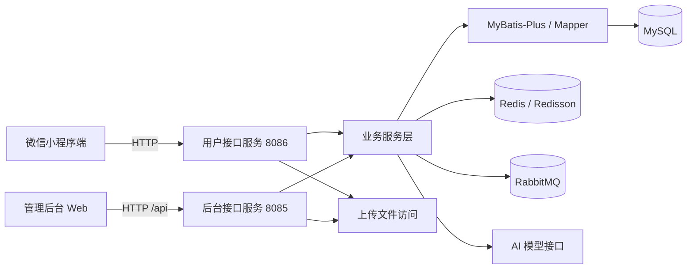
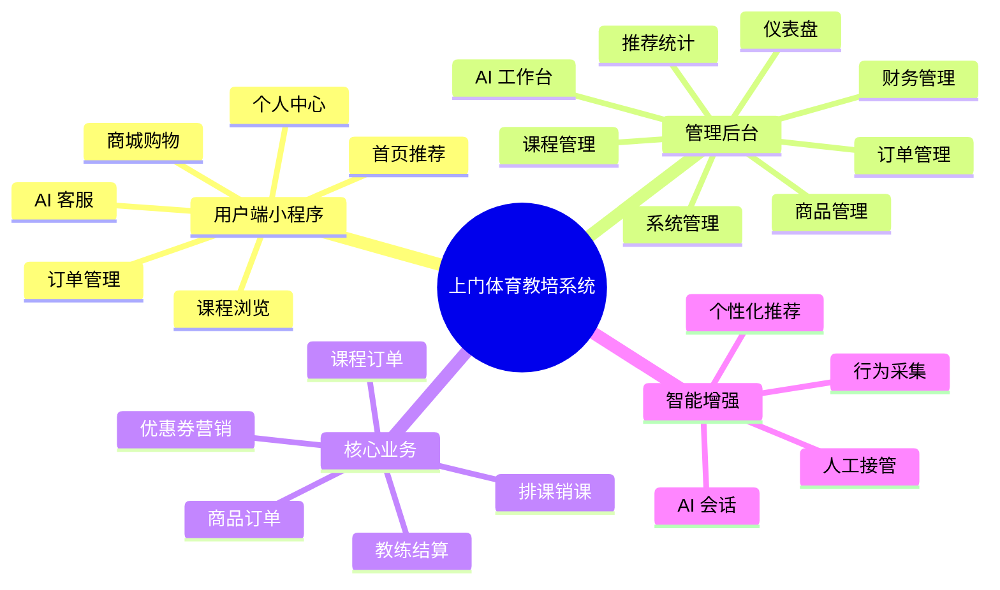
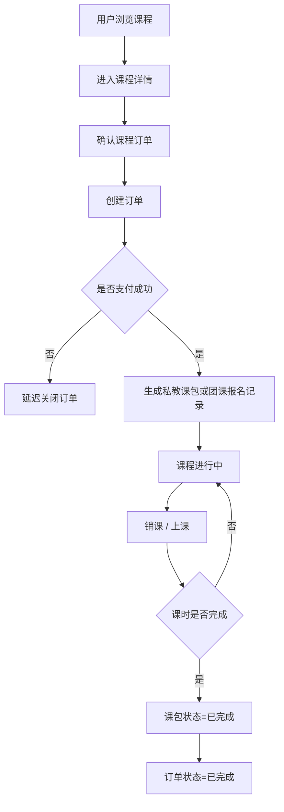
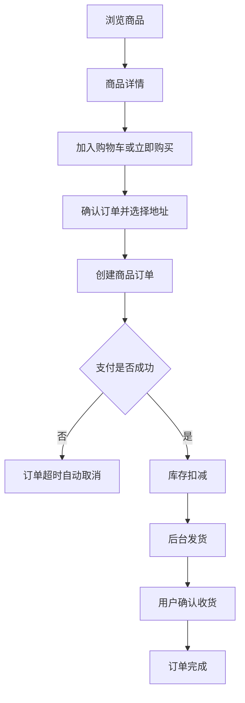
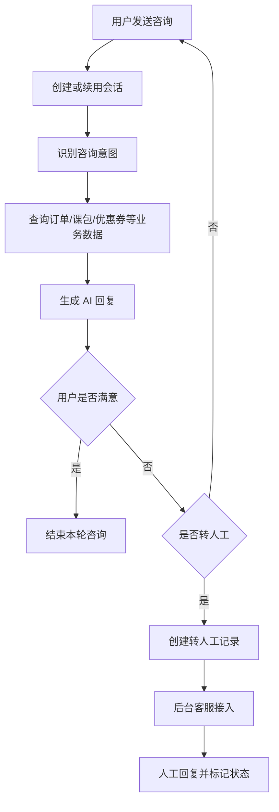

# 基于微信小程序的上门体育教培系统设计与实现-附件

## 1. 截图补充清单

以下截图建议按照论文正文中的图号顺序补充，截图时尽量保持页面完整、信息清晰、分辨率一致。

1. 图3-1 系统总体业务用例图
2. 图3-2 课程下单与课包流转流程图
3. 图3-3 商品下单与收货流程图
4. 图3-4 AI 客服处理流程图
5. 图3-5 系统总 E-R 图
6. 图3-6 课程与订单域核心 E-R 图
7. 图4-1 系统总体架构图
8. 图4-2 系统功能结构图
9. 图4-3 数据库核心表关系图
10. 图4-4 小程序登录页截图
11. 图4-5 后台系统用户/角色/菜单管理页截图
12. 图4-6 小程序课程列表页截图
13. 图4-7 私教课详情页或团课详情页截图
14. 图4-8 课程确认订单页截图
15. 图4-9 课程订单详情页或我的课包页截图
16. 图4-10 商城首页截图
17. 图4-11 商品详情页截图
18. 图4-12 购物车页截图
19. 图4-13 商品确认订单页或商品订单详情页截图
20. 图4-14 后台排课管理页截图
21. 图4-15 后台销课管理页截图
22. 图4-16 后台收入统计页或教练结算页截图
23. 图4-17 首页推荐区域截图
24. 图4-18 课程详情页相似推荐截图
25. 图4-19 后台推荐统计页截图
26. 图4-20 小程序 AI 客服聊天页截图
27. 图4-21 后台 AI 客服工作台截图
28. 图4-22 后台 AI 知识库管理页截图

## 2. 可直接转图片的 Mermaid 图源码

### 2.1 系统总体架构图

### 2.2 系统功能结构图

### 2.3 课程下单与课包流转流程图

### 2.4 商品下单与收货流程图

### 2.5 AI 客服处理流程图

## 3. 数据库图建议绘制范围

### 3.1 系统总 E-R 图建议包含

1. 用户表 `user`
2. 教练表 `coach`
3. 课程表 `course`
4. 排课表 `course_schedule`
5. 商品表 `prod`
6. SKU 表 `sku`
7. 订单表 `order`
8. 订单明细表 `order_item`
9. 课包表 `user_course_package`
10. 销课表 `course_checkin`
11. 教练结算表 `coach_settlement`
12. 优惠券表 `coupon`
13. 用户优惠券表 `user_coupon`
14. AI 会话表 `ai_session`
15. AI 消息表 `ai_message`
16. 用户行为表 `user_behavior`

### 3.2 课程与订单域核心 E-R 图建议包含

1. 用户表 `user`
2. 课程表 `course`
3. 排课表 `course_schedule`
4. 订单表 `order`
5. 订单明细表 `order_item`
6. 课包表 `user_course_package`
7. 销课表 `course_checkin`
8. 教练表 `coach`
9. 教练结算表 `coach_settlement`

## 4. 正文补图提醒

1. 第 4 章是全文重点，截图尽量优先补齐。
2. 同一模块如果能同时提供用户端和后台端截图，优先两端都放。
3. 订单、推荐、AI 客服三个模块建议补足细节截图，因为它们是本文亮点。
4. E-R 图建议用专业建模工具导出，不建议直接用表格截图替代。
