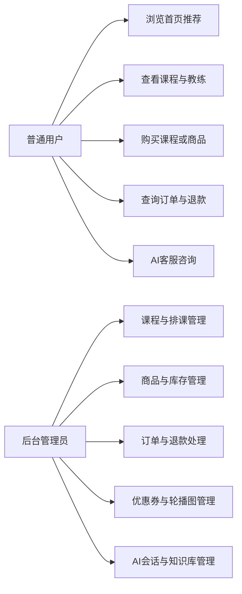
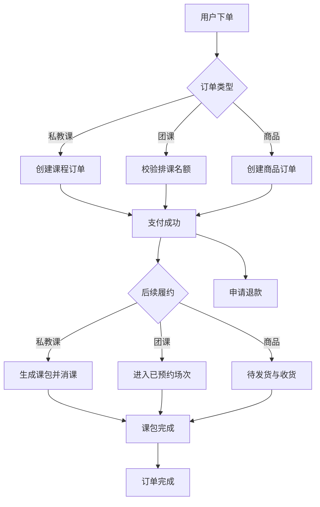
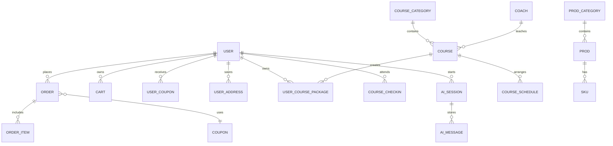
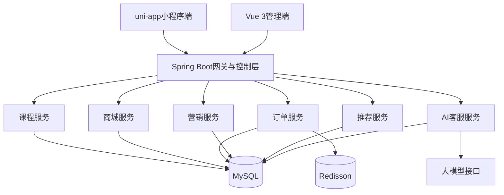
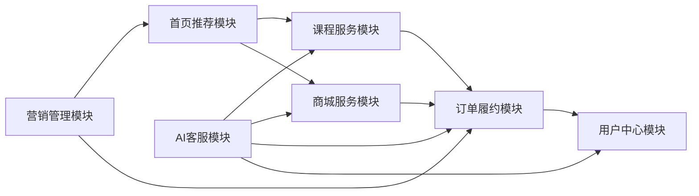
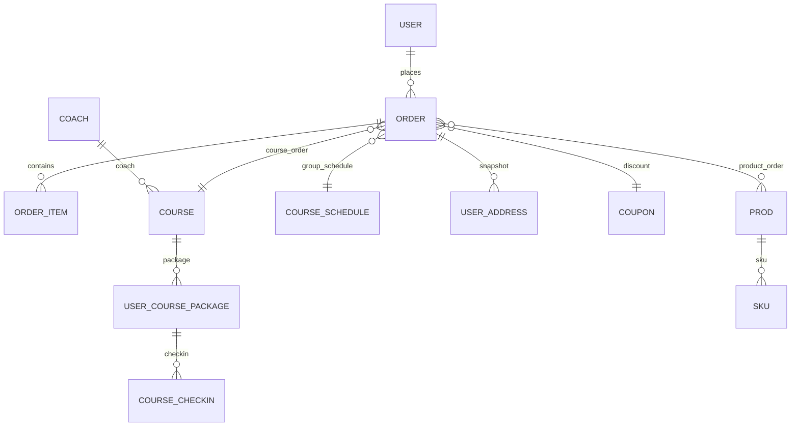

# 运动健身课程预约与商城系统的设计与实现

## 摘要
随着全民健身理念的普及和移动互联网应用的持续渗透，传统线下健身服务在课程预约、教练匹配、商品购买、会员沟通和售后管理等环节逐渐暴露出信息分散、流程割裂和服务响应不及时等问题。针对上述问题，本文结合运动健身场景的业务特征，设计并实现了一套运动健身课程预约与商城系统。系统采用前后端分离架构，面向普通用户提供基于 uni-app 的移动端小程序，面向运营与管理人员提供基于 Vue 3 和 Element Plus 的后台管理端，后端服务以 Spring Boot 为核心框架，配合 MyBatis-Plus、Sa-Token、MySQL 和 Redisson 等技术构建完整业务中台。

本文首先分析了运动健身服务在线化过程中在课程预约、团课排班、商品下单、订单履约、用户营销和智能客服方面的现实需求，明确系统需要同时覆盖课程服务与商城交易两条业务主线。随后，围绕系统总体架构、功能模块划分、数据库设计和核心流程设计展开详细说明。在实现层面，系统完成了首页推荐、私教课包购买、团课报名、购物车结算、地址管理、优惠券营销、订单退款、课包消课、教练结算、后台权限管理以及 AI 智能客服等功能，并在推荐服务中引入用户行为、销量与可预约状态的综合评分机制，在客服服务中实现了 AI 自动回复与人工接入协同的会话闭环。

通过对课程模块、商城模块、订单模块和智能客服模块的测试可以看出，该系统能够较好地满足运动健身场景下“课程预约+商品销售+会员服务”的一体化需求，具有较好的可扩展性、业务完整性和应用价值。本文的研究与实现结果可为同类本地生活服务系统、健身工作室数字化平台以及课程电商融合场景提供一定参考。

关键词：运动健身系统；课程预约；商城订单；智能客服；Spring Boot

## Abstract
With the popularization of the national fitness strategy and the rapid growth of mobile Internet services, traditional offline fitness businesses are facing increasingly obvious problems in course reservation, coach matching, product purchasing, member communication, and after-sales management. Typical issues include scattered information, fragmented business processes, and delayed service response. To address these problems, this paper designs and implements a sports fitness reservation and shopping system for integrated online operation in fitness scenarios.

The system adopts a front-end and back-end separated architecture. A uni-app based mobile client is designed for end users, while a management platform built with Vue 3 and Element Plus is provided for operators and administrators. The back-end service is implemented with Spring Boot and supported by MyBatis-Plus, Sa-Token, MySQL, and Redisson. Based on the characteristics of fitness services, the system simultaneously supports two major business lines: course reservation and product commerce.

This paper first analyzes the practical requirements of digital fitness services, including private course packages, group class scheduling, shopping cart checkout, coupon marketing, order fulfillment, customer service coordination, and member account management. Then the paper presents the overall architecture, module design, database schema, and core business processes. In the implementation stage, the system realizes home recommendation, private package purchase, group course enrollment, product ordering, address management, refund application, course package check-in, coach settlement, role-based management, and AI-assisted customer service. In addition, a composite recommendation strategy combining user behavior, popularity, and availability is introduced, and a service workflow combining AI responses with manual takeover is implemented.

Functional testing results show that the system can effectively support the integrated business needs of “course reservation + product sales + member service” in sports and fitness scenarios. Therefore, the proposed system has practical value in local lifestyle services, studio digitalization, and service-commerce integration.

Keywords: sports fitness system; course reservation; shopping platform; intelligent customer service; Spring Boot

## 第1章 引言
运动健身行业正从单一的线下服务模式逐步走向线上线下融合的数字化运营模式。对健身工作室、体育培训机构和综合运动品牌而言，课程预约、团课排期、课包管理、教练服务、商品销售和会员沟通并不是彼此独立的业务环节，而是共同组成用户完整消费链路的关键节点。如果仍然依靠微信群、Excel 表格或人工登记完成排课与订单处理，不仅会降低服务效率，还容易造成库存不准、沟通滞后和数据沉淀不足等问题。

本项目来源于真实的运动健身业务场景。通过对项目源码的梳理可以看出，系统同时包含移动端小程序、后台管理端以及多模块 Java 后端服务，覆盖课程、商城、订单、课包、签到、推荐、营销和 AI 客服等多个业务域，具有较为典型的“服务电商一体化”特征。因此，以该项目为研究对象开展系统设计与实现分析，具有较好的工程实践意义。

### 1.1 研究背景及意义
近年来，用户对运动健身服务的需求呈现出三个明显变化。第一，用户对预约效率和服务透明度的要求显著提高，希望能够直接在移动端完成课程浏览、下单支付、订单查询和退款申请。第二，健身机构越来越重视会员留存，希望通过推荐、优惠券、客服答疑和课包管理提升用户复购率。第三，业务规模扩大后，课程排班、教练安排、消课统计和商品发货等流程需要被结构化和系统化管理，否则数据很难形成闭环。

与传统的纯商城系统或纯预约系统相比，运动健身系统还具有明显的行业特性。一方面，私教课与团课在商品形态、履约方式和售后规则上存在差异；另一方面，用户购买课程后并不会立即完成全部服务，而是进入排课、上课、消课、完成或退款等后续流程，这要求系统能够提供面向生命周期的业务状态管理。项目源码中的订单状态设计、课包状态设计、退款流程和消课逻辑，正体现了这种行业特征。

本课题的研究意义主要体现在以下几个方面。其一，从业务价值角度看，系统能够帮助运动机构形成课程服务、商品销售与会员运营的统一平台，提高服务效率。其二，从技术价值角度看，系统结合 Spring Boot、Vue 3 与 uni-app 构建跨端一体化架构，适合中小型服务平台快速迭代。其三，从应用拓展角度看，系统在推荐与 AI 客服方面引入了更智能的交互能力，为后续构建数据驱动型运营体系奠定基础。

### 1.2 国内外研究现状
围绕本课题相关的研究现状，主要可以从三条线索展开。第一类是推荐系统研究。运动推荐系统的应用场景正在持续扩展，相关综述研究指出，体育推荐服务正在从内容推荐逐步发展到训练方案、行为指导和健康促进等更复杂场景[9]。这说明在运动类平台中，简单的静态展示已经难以满足用户需要，推荐能力正成为提升转化率和服务质量的重要手段。

第二类是数字健身与虚拟教练研究。近年来，在线训练平台、虚拟教练和数字康复系统的研究不断增多。相关研究表明，虚拟教练类系统在提升训练可达性、引导用户完成计划和增强交互反馈方面具有积极作用[10][12][13]。这类研究虽然更多聚焦于健康干预或训练支持，但其核心启示在于，运动服务系统不仅要能“卖课程”，还应尽可能形成过程性陪伴和反馈机制。

第三类是智能客服与服务自动化研究。随着大模型与对话系统的发展，智能客服逐渐从基于规则的问答工具转向可理解业务上下文的服务代理。相关研究指出，面向站点业务知识组织对话结构并结合序列模型构建智能服务代理，可以提升对复杂服务流程的支持能力[11]。与此同时，AI 客服形象与交互质量也会显著影响用户满意度与复购意愿[14]。这对运动健身系统具有直接借鉴意义，因为课程、课包、优惠券和退款都属于高频咨询场景。

总体来看，现有研究对推荐系统、虚拟教练、智能客服和在线运动服务已有较多讨论，但面向“课程预约+商品商城+课包服务+后台运营+AI 客服”一体化场景的工程实现分析仍相对不足。因此，本文以实际项目为基础，尝试从系统设计与工程实现角度给出完整解决方案。

### 1.3 研究内容与论文结构
本文研究对象为一个面向运动健身场景的综合服务平台。项目包含 `sports-custom-mini` 小程序端、`sports-admin-web` 管理端和 `shop-back-end` 后端工程。后端又划分为 `kinetic-sports-admin`、`kinetic-sports-service`、`kinetic-sports-api`、`kinetic-sports-security`、`kinetic-sports-common`、`kinetic-sports-bean` 等模块，形成了较清晰的工程边界。

围绕该项目，本文主要完成以下研究内容：
1. 分析运动健身业务在课程预约、商城交易、订单履约、会员运营和客服服务方面的功能需求。
2. 研究系统的整体架构设计、数据库建模和核心业务流程设计方法。
3. 结合项目源码，说明课程、商城、订单、推荐与 AI 客服模块的关键实现逻辑。
4. 通过测试验证系统在主要业务场景下的可用性与完整性。

本文共分为五章。第 1 章介绍研究背景、研究现状与论文结构；第 2 章说明系统涉及的关键理论与技术；第 3 章开展需求分析与模型设计；第 4 章重点展开系统设计与实现；第 5 章给出系统测试结果，最后对全文进行总结与展望。

## 第2章 相关理论与技术支持
本章主要介绍系统在实现过程中所采用的主要技术和支撑方法，包括后端基础框架、前端跨端开发方案、数据访问与权限控制方案，以及推荐与智能客服能力的实现基础。

### 2.1 Spring Boot 与分层架构
Spring Boot 是当前 Java Web 系统中应用最广泛的开发框架之一，具有自动配置、约定优于配置、生态成熟和集成效率高等优势[1]。本系统后端以 Spring Boot 为核心框架，将控制层、服务层、数据访问层和模型层拆分到不同模块中，从而提升代码组织性与可维护性。

从项目结构看，控制器层主要负责接收前端请求并返回统一响应格式，服务层聚合业务规则，`bean` 模块维护实体、DTO 和 VO，`common` 模块封装公共配置、异常处理和消息中间件配置。这种分层结构能够较好地适配课程订单、商品订单、营销活动、客服消息等多域业务并行演进的需求。

### 2.2 Vue 3 与 uni-app 前端技术
Vue 3 采用组合式 API 和组件化开发模式，能够高效构建交互复杂的管理后台界面[2]。本项目管理端基于 Vue 3、Vite、Pinia 和 Element Plus 实现，主要服务于课程管理、订单管理、营销管理、AI 会话管理、推荐统计和权限管理等后台功能。Element Plus 提供了较完善的表格、表单、对话框和统计组件，为后台运营页面的快速构建提供了基础[8]。

在移动端方面，系统采用 uni-app 构建小程序界面。uni-app 的核心特点是一套代码可适配多端，且与 Vue 语法保持较高一致性[3]。对本项目而言，采用 uni-app 可以用较低成本完成首页、课程、商城、订单、个人中心和 AI 客服等页面的统一开发，从而提升跨端维护效率。项目中的 `pages.json` 清晰定义了首页、课程详情、确认订单、退款、地址管理和客服页面等路由入口，体现了移动端业务链路的完整性。

### 2.3 MyBatis-Plus、Sa-Token 与 MySQL
MyBatis-Plus 在 MyBatis 基础上提供了更便捷的 CRUD 能力、分页支持、逻辑删除、自动填充等功能，可显著降低数据访问层开发成本[4]。本项目后端大量实体和服务实现都建立在 MyBatis-Plus 基础上，便于快速完成课程、商品、订单和用户等核心模型的增删改查。

权限控制方面，系统采用 Sa-Token 进行登录认证与权限管理。Sa-Token 在多端登录、角色认证、权限校验和会话管理方面提供了较完整能力[5]。项目管理端结合角色、菜单与管理员表实现后台权限模型，小程序端则通过用户登录态保证订单、课包、优惠券等数据的访问安全。

数据库层采用 MySQL 8.0 存储核心业务数据。MySQL 在事务处理、关系建模和中小型互联网业务场景中应用广泛[6]。项目数据库中定义了 `user`、`coach`、`course`、`course_schedule`、`prod`、`sku`、`order`、`order_item`、`user_course_package`、`course_checkin`、`coupon`、`ai_session`、`ai_message` 等表，为课程服务与商城交易提供统一数据支撑。

### 2.4 AI 客服与推荐服务实现基础
系统在服务智能化方面主要包含两块能力。第一块是个性化推荐服务。项目中的 `RecommendServiceImpl` 根据用户订单、购物车、签到记录与行为日志构建用户画像，并综合行为分值、内容分值、热度分值和可预约分值生成推荐结果。这种多因素评分方式比单一销量排序更能体现用户偏好。

```java
candidate.finalScore = 0.45D * behaviorScore
        + 0.25D * candidate.contentScore
        + 0.20D * candidate.popularityScore
        + 0.10D * candidate.availabilityScore;
```

第二块是 AI 客服服务。项目中的 `AiCustomerServiceImpl` 对接了大模型服务，并围绕课程、订单、课包、优惠券和退款等问题构建业务回复能力。系统支持会话创建、意图识别、业务卡片返回、转人工接管、会话解决和历史轮次保留等功能，形成了“AI 处理 + 人工兜底”的客服闭环。这一能力与近年来智能服务代理的研究趋势具有一致性[11][14]。

### 表 2.1 系统主要开发技术
| 层次 | 主要技术 | 作用说明 |
| --- | --- | --- |
| 移动端 | uni-app、Vue | 构建小程序界面与页面交互 |
| 管理端 | Vue 3、Vite、Element Plus、Pinia | 构建后台运营与管理页面 |
| 后端 | Spring Boot、MyBatis-Plus | 构建 REST 接口与业务服务 |
| 认证授权 | Sa-Token | 登录鉴权、角色与权限控制 |
| 数据存储 | MySQL 8.0 | 存储用户、课程、订单、客服等业务数据 |
| 缓存与并发控制 | Redisson | 分布式锁与会话辅助能力 |
| 智能服务 | 大模型接口、规则识别 | AI 客服与智能推荐扩展 |

### 2.5 本章小结
本章对系统实现所依赖的关键技术进行了梳理。Spring Boot 提供了稳定的后端服务框架，Vue 3 与 uni-app 满足了管理端和移动端的界面构建需求，MyBatis-Plus、Sa-Token 与 MySQL 为数据管理和安全控制提供了基础支持，而推荐与 AI 客服能力则体现了系统向智能化服务方向的扩展。以上技术共同构成了后续需求分析和系统实现的技术基础。

## 第3章 运动健身系统需求分析
本章结合项目业务场景，对系统需求进行分析，并通过功能需求、用例关系、状态设计和数据模型说明系统的边界与目标。

### 3.1 需求概述
系统的目标用户主要包括三类：普通健身用户、教练/客服协同角色以及后台运营管理人员。普通用户希望在移动端完成课程浏览、教练查看、商城选购、订单支付、课包查询、退款申请和客服咨询。后台运营人员则希望统一完成课程管理、排课管理、商品管理、订单处理、优惠券营销、AI 知识维护和推荐统计等工作。系统需要在两类角色之间建立清晰的数据协同机制。

从业务主线看，系统至少需要覆盖两套完整流程。第一套是课程服务流程，即课程展示、报名支付、排课履约、消课完成与售后退款。第二套是商品零售流程，即商品浏览、购物车、下单、发货、收货与售后处理。此外，还需要支持会员资料维护、地址维护、优惠券使用、客服问答与个性化推荐等辅助能力。

### 3.2 系统功能需求分析
#### 3.2.1 课程预约与教练服务功能
课程业务是系统的第一核心模块。用户需要能够区分私教课和团课，按照分类浏览课程，并查看课程价格、节数、教练信息、时间与地点等详细内容。对私教课而言，购买后形成课包，需要支持有效期管理和消课记录管理；对团课而言，需要关联具体排课场次，并控制报名人数和开课时间。

项目源码中的课程表 `course` 通过 `type` 字段区分私教课与团课，排课表 `course_schedule` 用于维护团课场次信息，课包表 `user_course_package` 和签到表 `course_checkin` 则用于承载私教课包的后续服务过程。这说明系统需要支持不同课程类型下的差异化履约逻辑。

#### 3.2.2 商城购物与订单管理功能
商城模块需要支持分类浏览、商品检索、规格选择、购物车、地址管理和订单查询等基础电商能力。由于运动装备与训练课程存在协同关系，商城模块不仅是独立销售入口，也承担着提升客单价和延长用户停留链路的功能。

商品相关数据主要由 `prod`、`sku`、`cart`、`order` 和 `order_item` 表共同支撑。系统需要在确认订单阶段完成价格计算、库存校验、地址快照保存和优惠券抵扣，并在支付完成后形成后续待发货、待收货、已完成等履约状态。

#### 3.2.3 订单履约、推荐与智能客服功能
订单服务贯穿课程与商城两条主线，是系统业务完整性的关键。用户需要能够查看课程订单和商品订单，进行退款申请、查看详情、查看课包和确认收货等操作。后台则需要对退款审核、订单完成、发货履约和收入统计进行处理。

与此同时，系统希望通过推荐与 AI 客服提升服务效率。推荐模块需要根据用户浏览、购买、签到和行为数据输出更符合偏好的课程与装备。AI 客服模块则应能够解答“推荐课程”“订单查询”“课包剩余”“优惠券咨询”“退款操作”等高频问题，并在复杂场景下转人工处理。

#### 3.2.4 用户中心与营销管理功能
用户中心模块需要承担个人资料、地址、我的订单、我的课包、我的优惠券、签到记录和密码修改等功能。营销模块则主要面向后台，包括轮播图配置、优惠券管理、推荐统计和 AI 会话统计等内容。该部分功能虽然不是直接履约模块，但对用户留存和后台运营效率具有重要影响。

### 表 3.1 角色与核心需求映射
| 角色 | 主要目标 | 典型功能 |
| --- | --- | --- |
| 普通用户 | 便捷购买与预约 | 浏览课程、购买课包、团课报名、下单商品、查询订单、退款申请 |
| 教练/客服协同角色 | 承接服务与沟通 | 课后消课、人工接管会话、解答用户咨询 |
| 后台运营人员 | 统一配置与统计 | 课程管理、排课管理、营销配置、订单审核、AI 会话管理 |

### 3.3 用例模型
为了更加清晰地描述系统交互关系，本文将普通用户和后台管理员作为两类主要参与者。普通用户发起课程浏览、商品浏览、下单支付、查看订单、咨询客服等行为；后台管理员负责课程、商品、订单、营销和 AI 知识的配置与管理。


图 3.1 运动健身系统主要参与者用例关系图

#### 3.3.1 用例图说明
从图 3.1 可以看出，系统的前台与后台分工清晰。用户行为主要围绕消费和服务展开，而管理员行为主要围绕配置、履约和运营展开。这样的设计有利于降低前台交互复杂度，同时保证后台具备较强的运营能力。

#### 3.3.2 用例规约
在关键用例中，“购买私教课程”与“报名团课”虽然都属于课程订单，但二者在后续流程上存在明显差异。前者支付完成后形成课包，后者则直接绑定某一场具体排课，因此系统在创建订单时需要分别校验课程类型与排课信息。商品下单则更接近标准电商流程，需要对购物车、SKU 和地址快照进行统一处理。

### 表 3.2 主要业务状态设计
| 对象 | 状态值 | 含义 |
| --- | --- | --- |
| 课程/商品订单 | 1 | 待支付 |
| 课程/商品订单 | 2 | 已支付 |
| 课程/商品订单 | 3 | 待排课或待发货 |
| 课程/商品订单 | 4 | 已完成 |
| 课程/商品订单 | 5 | 已取消 |
| 课程/商品订单 | 6 | 退款中 |
| 课程/商品订单 | 7 | 已退款 |
| 课程/商品订单 | 8 | 退款驳回 |
| 用户课包 | 0 | 已过期 |
| 用户课包 | 1 | 正常使用中 |
| 用户课包 | 2 | 已退费 |
| 用户课包 | 3 | 已完成 |
| AI 会话 | 0 | AI 处理中 |
| AI 会话 | 1 | 已解决 |
| AI 会话 | 2 | 待人工 |
| AI 会话 | 3 | 本轮结束 |

### 3.4 主要业务流程
课程订单的生命周期设计是本系统区别于普通电商系统的关键。私教课支付完成后并不立即结束，而是进入课包服务阶段；团课则需要与排课绑定，并在开课前控制报名人数和重复下单。商品订单则进入待发货、待收货和完成等履约状态。为了兼顾售后需求，系统还对退款前原始状态进行了记录。


图 3.2 系统主要业务流程图

### 3.5 系统 E-R 图
数据库设计直接决定系统能否承载后续复杂业务。通过对源码中的建表脚本分析，可以发现系统围绕用户、课程、教练、商品、订单、课包、优惠券和 AI 会话等实体展开。为避免单张图过于复杂，本文将 E-R 设计拆分为总表设计图和核心业务设计图两部分。


图 3.3 系统总表 E-R 图

### 3.6 本章小结
本章从业务目标、功能需求、状态设计和数据关系四个层面对系统进行了需求分析。通过分析可以看出，系统不仅是一个简单的预约工具或商城系统，而是一个围绕课程服务、商品交易、会员管理和客服支持构建的综合业务平台。需求分析结果为后续系统设计与实现提供了明确依据。

## 第4章 系统设计与实现
本章是全文的核心部分，重点说明系统的总体架构设计、功能模块划分、数据库结构以及关键模块的实现方法。

### 4.1 总体架构设计
系统采用典型的前后端分离架构。移动端小程序为用户提供首页推荐、课程浏览、商城购物、订单查询和客服咨询等交互能力；管理端为后台人员提供课程、商品、订单、营销和 AI 运营能力；后端服务负责统一提供 REST 接口、业务规则处理、数据访问和消息协调。数据库层负责持久化核心业务数据，Redis/Redisson 用于处理锁控制和部分高并发场景。


图 4.1 系统总体架构图

该架构的优势主要体现在三个方面。首先，前台用户端与后台管理端解耦，便于分别迭代。其次，不同业务域由独立服务实现，利于未来扩展更多业务模块。最后，订单、推荐与客服等复杂逻辑集中在服务层处理，保证前端交互相对轻量。

### 4.2 功能模块设计
基于前文需求分析，系统可以划分为首页推荐模块、课程服务模块、商城服务模块、订单履约模块、用户中心模块、营销管理模块和 AI 客服模块。各模块之间并不是简单并列关系，而是通过订单、用户和行为数据形成联动。


图 4.2 系统功能模块图

在实现上，首页推荐模块通过推荐服务聚合课程和商品数据；课程服务模块负责私教课和团课的展示与预约；商城服务模块完成商品、规格和购物车管理；订单履约模块统一承接课程订单与商品订单状态流转；用户中心模块提供课包、签到、优惠券和个人资料能力；营销模块提供轮播图和优惠券配置；AI 客服模块则为用户提供业务咨询入口。

### 4.3 系统数据库设计
系统数据库围绕交易、服务和运营三类数据进行建模。交易类数据包括商品、SKU、购物车、订单和订单项；服务类数据包括课程、排课、课包、签到和教练；运营类数据包括优惠券、轮播图、推荐行为和 AI 会话等。

### 表 4.1 核心数据库表设计
| 数据表 | 主要字段 | 作用说明 |
| --- | --- | --- |
| `user` | `nick_name`、`phone`、`open_id` | 存储用户基础信息与登录标识 |
| `coach` | `name`、`years`、`rating`、`skills` | 存储教练资料与能力标签 |
| `course` | `type`、`price`、`lesson_count`、`coach_id` | 存储课程与课包基础信息 |
| `course_schedule` | `start_time`、`location`、`total_seats` | 存储团课排期与名额 |
| `prod` | `price`、`sales`、`detail` | 存储商品基础信息 |
| `sku` | `properties`、`stocks`、`price` | 存储商品规格与库存 |
| `order` | `order_type`、`status`、`actual_amount` | 存储课程或商品订单主记录 |
| `order_item` | `item_type`、`sku_properties`、`qty` | 存储订单明细快照 |
| `user_course_package` | `total_lessons`、`used_lessons`、`status` | 存储私教课包使用状态 |
| `course_checkin` | `checkin_time`、`status` | 存储消课与签到记录 |
| `coupon` / `user_coupon` | `discount_amount`、`status` | 存储营销优惠信息 |
| `ai_session` / `ai_message` | `status`、`need_handover` | 存储客服会话与消息记录 |

系统核心业务域可以进一步抽象为用户、课程、商品和订单四大中心对象，其关系如下图所示。


图 4.3 核心业务 E-R 图

### 4.4 关键功能模块实现
#### 4.4.1 课程预约与教练服务模块
课程模块是移动端中曝光最高的模块之一。小程序课程页通过顶部私教/团课切换、分类标签和列表卡片实现课程筛选功能；详情页则进一步展示课程特色、价格、教练和用户评价等信息。首页还将课程推荐与团课场次在首屏进行聚合展示，以缩短用户从浏览到下单的路径。

[此处插入截图：小程序首页]
图 4.4 小程序首页推荐界面

[此处插入截图：课程列表页]
图 4.5 课程列表界面

[此处插入截图：私教课程详情页]
图 4.6 私教课程详情界面

[此处插入截图：团课课程详情页]
图 4.7 团课课程详情界面

[此处插入截图：教练列表页]
图 4.8 教练列表界面

从实现逻辑看，课程页会根据当前激活的 tab 决定请求私教课还是团课数据，并进一步根据分类筛选课程。团课列表则需要异步加载每个课程的最近排课信息，从而在列表中直接展示时间、地点和已报人数。该实现方式兼顾了列表展示效率与排课信息的实时性。

在订单创建层面，课程订单的核心难点在于区分私教课与团课。项目在 `OrderServiceImpl` 中通过 `course.type` 判断不同流程：若为团课，则必须校验 `scheduleId` 是否存在、场次是否未开始、剩余名额是否充足，以及用户是否已经报名同一场次；若为私教课，则支付成功后进入课包创建与后续消课流程。

```java
long existCount = this.count(new LambdaQueryWrapper<Order>()
        .eq(Order::getUserId, userId)
        .eq(Order::getScheduleId, params.getScheduleId())
        .in(Order::getStatus, ORDER_PENDING, ORDER_PAID, ORDER_PROCESSING, ORDER_FINISHED, ORDER_REFUNDING));
if (existCount > 0) {
    throw new IllegalArgumentException("您已报名该场次，请勿重复购买");
}
```

上面的实现体现了课程预约场景中的强业务约束。与普通商品下单不同，团课报名必须防止重复报名和超卖，而私教课则需要为后续课包消课提供数据基础。项目文档中还给出了“课包用尽后自动将订单改为已完成、标记缺勤后可回滚状态”的逻辑，这使课程订单管理更符合真实健身业务场景。

#### 4.4.2 商城购物与订单结算模块
商城模块以分类浏览、商品卡片、规格选择和购物车入口为核心交互。用户进入商城页后，可以按分类筛选训练鞋、器械、护具和补剂等商品，并通过浮动购物车查看当前待结算数量。商品详情页支持规格选择、数量选择与加入购物车，确认订单页则展示地址、商品信息、优惠券和金额明细。

[此处插入截图：商城首页]
图 4.9 商城首页界面

[此处插入截图：商品详情页]
图 4.10 商品详情界面

[此处插入截图：商品确认订单页]
图 4.11 商品确认订单界面

[此处插入截图：商品订单页]
图 4.12 商品订单界面

在后台实现中，商品订单创建会先构建购物车或直接购买的商品行数据，再统一计算订单总金额和优惠券抵扣金额。若用户在下单时选择地址，则系统会将地址快照序列化保存到订单中，以避免后续用户修改地址导致历史订单信息丢失。该设计提升了订单履约过程的可追溯性。

商城模块在数据建模上采用了 `prod + sku + order_item` 的经典组合方式。`prod` 保存商品主信息，`sku` 保存规格和库存，`order_item` 作为订单快照承载购买时的商品名称、图片、价格与规格。即使后续商品价格或文案发生变化，历史订单仍能保持业务一致性。

#### 4.4.3 订单履约、AI 客服与推荐模块
订单履约模块承担着连接前台消费与后台处理的责任。移动端分别提供课程订单页和商品订单页，支持状态筛选、详情查看、退款申请、进入课程、确认收货和再次购买等操作。对于课程订单，系统根据课程类型进一步展示课包进度或排课信息；对于退款场景，系统会记录退款原因、退款金额和原始状态，便于后台审核。

[此处插入截图：课程订单页]
图 4.13 课程订单界面

[此处插入截图：退款申请页]
图 4.14 退款申请界面

为了提高用户服务体验，系统在首页和客服页面中加入了推荐与智能客服能力。首页推荐功能通过 `RecommendServiceImpl` 输出课程列表和商品列表，推荐结果并不是简单的销量排序，而是根据订单行为、购物车行为、签到记录和浏览行为构建用户偏好画像，再计算课程或商品的最终得分。推荐理由还会结合课程类型、价格区间和近期可预约状态进行文本化表达，使推荐结果对用户更具解释性。

AI 客服部分则由 `AiCustomerServiceImpl` 承担核心逻辑。系统在接收到用户输入后，会先创建或恢复会话，再完成消息入库、意图识别、回复草稿构建与消息回写，并根据需要生成业务卡片或跳转动作。当问题超出 AI 处理范围时，用户可以发起转人工，后台客服人员在管理端接入后能够继续同一会话，并支持标记已解决或结束本轮咨询。这样的设计既保留了 AI 自动服务带来的效率优势，也为复杂业务咨询预留了人工兜底能力。

#### 4.4.4 用户中心与后台运营模块
用户中心模块整合了订单、课包、优惠券、签到和地址等个人服务入口，是系统承接用户长期关系的重要界面。项目原型中的个人中心页将“我的订单”“我的课程”“地址管理”“在线客服”和会员权益整合到同一页面中，有利于用户快速回看自己的消费与服务状态。

[此处插入截图：个人中心页]
图 4.15 个人中心界面

后台管理端则根据路由配置提供仪表盘、课程管理、排课管理、销课管理、教练管理、商品管理、课程订单、商品订单、优惠券管理、轮播图管理、财务结算、AI 会话管理、AI 知识库、推荐统计以及系统权限管理等模块。虽然本文重点展示的是移动端业务效果，但后台端在系统运行中具有不可替代的作用，因为几乎所有课程、商品、营销和客服策略都需要通过后台端进行配置与维护。

系统在后台权限设计上采用 `sys_user`、`sys_role`、`sys_menu` 和 `sys_role_menu` 四张表实现管理员、角色、菜单和授权关系。该设计既可以满足课程运营、客服和财务等不同岗位差异化使用需求，也为未来增加按钮级权限和数据范围控制提供了扩展空间。

### 4.5 本章小结
本章围绕系统总体架构、模块划分、数据库设计和关键功能实现展开了详细说明。与传统单一预约系统相比，本项目的主要特点在于课程服务与商城交易的结合、订单生命周期的细粒度设计、推荐与 AI 客服能力的引入，以及用户端与后台端的统一协同。第 4 章也是全文最重要的部分，它从工程实现层面证明了系统具备较完整的业务承载能力。

## 第5章 系统测试
为了验证系统是否达到预期目标，本文围绕课程预约、商城购物、订单履约、推荐客服和用户中心等关键业务设计测试场景。测试重点并不局限于界面是否可打开，更关注不同业务状态之间的流转是否正确、数据是否一致以及用户操作是否顺畅。

### 5.1 系统功能测试
#### 5.1.1 课程模块测试
课程模块测试重点包括课程列表加载、私教与团课切换、课程详情展示、团课报名名额校验以及私教课支付后课包生成等内容。测试结果表明，系统能够按照课程类型返回对应页面与业务流程，团课报名时可以正确校验名额与重复报名，私教课在支付后能够进入课包服务流程。

#### 5.1.2 商城订单模块测试
商城模块主要测试商品检索、规格选择、购物车结算、地址快照保存和订单状态查询等功能。测试中，用户可以按分类浏览商品，选择具体 SKU 后生成订单，结算时能够正确显示优惠金额和实付金额；订单创建后进入待发货、待收货与已完成等状态，符合预期设计。

#### 5.1.3 推荐与 AI 客服模块测试
推荐模块测试重点是首页是否能够返回课程与商品推荐列表，以及推荐结果是否会随用户行为变化而变化。AI 客服测试重点是是否能够处理课程推荐、课包查询、订单查询和退款咨询等高频问题，以及在转人工后是否保留会话上下文。测试表明，系统能够为常见标准问题返回文本、卡片和跳转动作，并支持人工接管。

#### 5.1.4 用户中心与售后模块测试
用户中心模块主要测试个人资料展示、地址管理、课程订单查询、商品订单查询、退款申请与课包状态展示等功能。测试结果显示，订单与课包信息能够在个人中心正确聚合，退款页面能够正确提交退款原因和说明，课包状态能随消课完成与回滚操作发生变化。

### 表 5.1 主要功能测试用例
| 测试编号 | 测试内容 | 预期结果 | 测试结论 |
| --- | --- | --- | --- |
| T1 | 私教课列表加载与详情查看 | 正确返回课程信息与购买入口 | 通过 |
| T2 | 团课报名与重复报名校验 | 名额不足或重复报名时给出提示 | 通过 |
| T3 | 商品规格选择与下单 | 正确生成订单并保存规格快照 | 通过 |
| T4 | 商品订单状态流转 | 待发货、待收货、已完成可正确展示 | 通过 |
| T5 | 课程订单退款申请 | 可提交退款原因并进入退款流程 | 通过 |
| T6 | 首页推荐列表返回 | 按课程和商品返回推荐内容 | 通过 |
| T7 | AI 客服常见问题应答 | 可返回业务文本或卡片 | 通过 |
| T8 | 个人中心聚合信息展示 | 订单、课包、地址入口正确显示 | 通过 |

### 5.2 测试结果
综合测试结果表明，系统在主要业务场景下具备较好的可用性和完整性。课程与商品两条主线可以独立运行，也可以通过首页推荐、订单中心和客服服务形成统一闭环；订单状态设计能够承接支付后履约、退款申请和完成确认等关键节点；课包完成与缺勤回滚逻辑能够有效保证课程收入统计的准确性；推荐服务和 AI 客服的接入则进一步提升了系统的智能化水平。

当然，测试结果也反映出系统仍有进一步优化空间。例如，AI 客服在游客会话下的历史追溯能力弱于登录用户，后台 AI 工作台在消息标签和优先级管理方面仍可扩展，推荐模块当前更多依赖规则与行为加权，后续还可以结合更丰富的实时行为数据或向量召回机制提升效果。这些问题并不影响系统的基础可用性，但为后续迭代提供了方向。

## 总结与展望
本文围绕运动健身课程预约与商城系统的设计与实现展开研究，结合真实项目源码，对系统的业务需求、总体架构、数据库设计和关键模块实现进行了系统分析。研究结果表明，该系统已经能够较完整地支撑运动健身场景中的课程浏览、团课报名、私教课包、商品下单、退款申请、会员运营、个性化推荐和 AI 客服等核心业务。

从工程实现角度看，本文总结出三点较为关键的设计经验。第一，运动健身系统不能简单套用普通商城模板，必须在订单生命周期、课包状态和排课管理上体现行业规则。第二，课程服务与商城业务的融合能够提升平台整体粘性，但前提是订单、用户和营销数据之间具有统一的数据底座。第三，推荐与 AI 客服等智能能力并不应脱离业务数据单独存在，而应以课程、订单、课包和优惠券等真实业务对象为支点开展服务。

未来可从以下方向继续完善系统。其一，进一步优化 AI 客服知识库、游客身份聚合和多轮会话理解能力；其二，引入更精细的用户行为采集与推荐召回机制，提升推荐的实时性与个性化程度；其三，完善后台侧的客服绩效统计、教练排班协同和财务分析功能；其四，在履约端加入消息通知、预约提醒和评价体系，进一步增强平台闭环服务能力。

## 致谢
在本论文撰写和项目梳理过程中，我得到了来自老师、同学和项目实践材料的诸多帮助。在此，谨向所有给予我支持与帮助的人表示衷心感谢。感谢指导老师在选题方向、论文结构和写作规范上的耐心指导，使我能够在真实项目基础上逐步完成论文内容。感谢学校提供良好的学习环境和实践机会，让我能够将课堂知识与工程实现相结合。也感谢在项目学习过程中给予我帮助的同学和朋友，正是你们的交流与鼓励，使我能够持续完善论文内容。最后，感谢家人一直以来的理解与支持，让我能够安心完成毕业设计与论文写作。

## 参考文献
[1] Spring. Documentation Overview[EB/OL]. https://docs.spring.io/spring-boot/documentation.html, 2026-04-20.

[2] Vue.js. Introduction[EB/OL]. https://vuejs.org/guide/introduction, 2026-04-20.

[3] DCloud. uni-app 官网[EB/OL]. https://uniapp.dcloud.net.cn/, 2026-04-20.

[4] MyBatis-Plus. Introduction[EB/OL]. https://baomidou.com/en/introduce/, 2026-04-20.

[5] Sa-Token. Sa-Token v1.45.0 在线文档[EB/OL]. https://sa-token.cc/doc.html, 2026-04-20.

[6] Oracle. MySQL 8.0 Reference Manual[EB/OL]. https://dev.mysql.com/doc/mysql/8.0/en/, 2026-04-20.

[7] Redisson. Locks and synchronizers[EB/OL]. https://redisson.pro/docs/data-and-services/locks-and-synchronizers/index.html, 2026-04-20.

[8] Element Plus. Quick Start[EB/OL]. https://element-plus.org/en-US/guide/quickstart.html, 2026-04-20.

[9] Felfernig A, Wundara M, Tran T N T, et al. Sports recommender systems: overview and research directions[J]. Journal of Intelligent Information Systems, 2024, 62: 1125-1164.

[10] Schlieter H, Gand K, Weimann T G, et al. Designing Virtual Coaching Solutions[J]. Business & Information Systems Engineering, 2024, 66: 377-400.

[11] Hsih M H, Yang J X, Hsieh C C. Design and Implementation of an Intelligent Web Service Agent Based on Seq2Seq and Website Crawler[J]. Information, 2024, 15(12): 818.

[12] Ge L, Li M, Ning C. Modern software and physical education: can online training enhance gym training?[J]. BMC Medical Education, 2024, 24: 419.

[13] Malone L A, Mehta T, Mendonca C J, et al. A prospective non-randomized feasibility study of an online membership-based fitness program for promoting physical activity in people with mobility impairments[J]. Pilot and Feasibility Studies, 2024, 10: 104.

[14] Hu Y, Xiao Y, Hua Y, et al. The More Realism, the Better? How Does the Realism of AI Customer Service Agents Influence Customer Satisfaction and Repeat Purchase Intention in Service Recovery[J]. Behavioral Sciences, 2024, 14(12): 1182.
