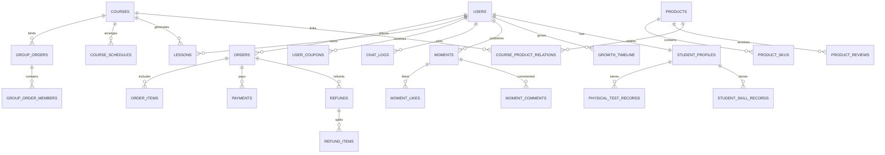

# 体育教培机构管理系统 - 数据库详细设计文档

> 版本：v1.0  
> 日期：2026-04-10  
> 依据文档：《需求分析文档》《系统架构设计文档》  
> 数据库类型：MySQL 8.0

---

## 一、文档目标

本文档用于对体育教培机构管理系统的数据库进行详细设计，作为后续建表、接口开发、业务编码和测试验证的统一依据，主要目标如下：

1. 明确数据库总体设计原则、命名规范和字段规范
2. 给出核心业务表的详细字段设计
3. 明确主键、唯一约束、索引和表关系
4. 支撑拼团、支付、退款、销课、电商、动态、成长档案、AI 客服等核心业务实现

---

## 二、数据库总体设计

### 2.1 数据库选型

系统数据库采用 `MySQL 8.0`，存储引擎统一使用 `InnoDB`，字符集统一为 `utf8mb4`，排序规则建议为 `utf8mb4_general_ci`。

推荐配置：

| 项目 | 建议值 |
|------|--------|
| 数据库字符集 | `utf8mb4` |
| 排序规则 | `utf8mb4_general_ci` |
| 存储引擎 | `InnoDB` |
| 主键类型 | `BIGINT` |
| 主键生成策略 | `MyBatis-Plus ASSIGN_ID` |
| 时间字段类型 | `DATETIME` |
| 金额字段类型 | `DECIMAL(10,2)` |
| 逻辑删除字段 | `TINYINT(1)` |

### 2.2 设计原则

1. 交易一致性优先：订单、支付、退款、课时扣减等核心流程必须支持事务控制
2. 业务闭环优先：能够完整支撑课程、电商、拼团、动态、成长、AI 客服业务
3. 适度规范化：核心交易表规范化设计，低频复杂展示数据适度使用 `JSON`
4. 易扩展优先：预留 `tenant_id`、`institution_id`，支持后续单机构向 SaaS 演进
5. 审计可追踪：关键表保留创建、修改、逻辑删除和操作人字段

### 2.3 命名规范

1. 表名使用小写下划线风格，如 `group_orders`
2. 主键统一为 `id`
3. 外键字段统一使用 `{实体名}_id` 形式，如 `user_id`、`course_id`
4. 状态字段统一命名为 `status`
5. 时间字段统一使用 `_time` 或 `_at` 后缀，如 `pay_time`、`created_at`
6. 金额字段统一使用 `amount`、`price`、`fee` 命名

### 2.4 通用审计字段

除中间关系表外，业务主表默认包含以下通用字段：

| 字段名 | 类型 | 默认值 | 说明 |
|--------|------|--------|------|
| `id` | `BIGINT` | - | 主键 |
| `tenant_id` | `BIGINT` | `0` | 租户 ID，单机构阶段默认 0 |
| `institution_id` | `BIGINT` | `1` | 机构 ID，当前系统默认 1 |
| `created_at` | `DATETIME` | `CURRENT_TIMESTAMP` | 创建时间 |
| `updated_at` | `DATETIME` | `CURRENT_TIMESTAMP` | 更新时间 |
| `created_by` | `BIGINT` | `0` | 创建人 |
| `updated_by` | `BIGINT` | `0` | 更新人 |
| `deleted` | `TINYINT(1)` | `0` | 逻辑删除标记 |

说明：

1. 关系表可只保留 `id`、`created_at`、`deleted`
2. 高频日志表可按需要精简 `updated_by`
3. 所有查询默认增加 `deleted = 0`

### 2.5 主要模型优化说明

相较于需求分析文档中的“初步核心表”，本次详细设计做如下优化：

1. 使用 `orders + order_items + payments + refunds + refund_items` 统一交易中心，替代孤立的 `product_orders`
2. 将套餐退款拆分明细独立为 `refund_items`，保证“课程部分”和“实物部分”的计算可审计
3. 将体测、技能、教练评价从 `student_profiles` 中拆分为独立表，避免成长档案字段过度冗余
4. 将课程排期建模为 `course_schedules`，统一表达团课排期、人数和状态
5. 保留部分 `JSON` 字段用于多值标签、相似问法、媒体列表等低事务敏感数据

---

## 三、数据域划分

系统数据按业务划分为 8 个数据域：

1. 权限与用户域
2. 教务域
3. 营销域
4. 交易与财务域
5. 电商域
6. 内容与成长域
7. AI 客服域
8. 系统扩展域

高层实体关系如下：

---

## 四、字段类型与取值约定

### 4.1 主键与外键

1. 主键统一使用 `BIGINT`
2. 外键在数据库层可不强制建立物理外键，避免影响写入性能
3. 关系一致性由应用层和索引保证

### 4.2 状态字段约定

1. 业务状态字段统一使用 `TINYINT`
2. 枚举含义在代码中使用枚举类维护
3. 数据库文档中给出推荐值，避免魔法数字

### 4.3 金额字段约定

1. 所有金额字段统一使用 `DECIMAL(10,2)`
2. 所有金额单位统一为“元”
3. 原价、优惠金额、实付金额、退款金额分别建独立字段

### 4.4 JSON 字段约定

以下场景允许使用 `JSON`：

1. 标签列表
2. 相似问法列表
3. 多图 URL 列表
4. 多项技能评分明细
5. 教练可授课时间段

---

## 五、详细表设计

### 5.1 权限与用户域

### 5.1.1 `sys_admins`

表说明：后台管理员表。

| 字段名 | 类型 | 非空 | 说明 |
|--------|------|------|------|
| `username` | `VARCHAR(50)` | 是 | 登录账号 |
| `password_hash` | `VARCHAR(255)` | 是 | 密码加密串 |
| `real_name` | `VARCHAR(50)` | 是 | 真实姓名 |
| `phone` | `VARCHAR(20)` | 否 | 手机号 |
| `email` | `VARCHAR(100)` | 否 | 邮箱 |
| `status` | `TINYINT` | 是 | 0-禁用，1-启用 |
| `last_login_time` | `DATETIME` | 否 | 最近登录时间 |

索引建议：

- `uk_username (username)`
- `idx_phone (phone)`
- `idx_status (status)`

### 5.1.2 `sys_roles`

表说明：后台角色表。

| 字段名 | 类型 | 非空 | 说明 |
|--------|------|------|------|
| `role_code` | `VARCHAR(50)` | 是 | 角色编码 |
| `role_name` | `VARCHAR(50)` | 是 | 角色名称 |
| `description` | `VARCHAR(255)` | 否 | 角色描述 |
| `status` | `TINYINT` | 是 | 0-禁用，1-启用 |

索引建议：

- `uk_role_code (role_code)`
- `idx_status (status)`

### 5.1.3 `sys_admin_roles`

表说明：管理员角色关联表。

| 字段名 | 类型 | 非空 | 说明 |
|--------|------|------|------|
| `admin_id` | `BIGINT` | 是 | 管理员 ID |
| `role_id` | `BIGINT` | 是 | 角色 ID |

索引建议：

- `uk_admin_role (admin_id, role_id)`
- `idx_role_id (role_id)`

### 5.1.4 `users`

表说明：小程序用户表。

| 字段名 | 类型 | 非空 | 说明 |
|--------|------|------|------|
| `openid` | `VARCHAR(64)` | 是 | 微信用户唯一标识 |
| `unionid` | `VARCHAR(64)` | 否 | 微信开放平台统一标识 |
| `nickname` | `VARCHAR(100)` | 否 | 昵称 |
| `avatar_url` | `VARCHAR(255)` | 否 | 头像 |
| `real_name` | `VARCHAR(50)` | 否 | 真实姓名 |
| `gender` | `TINYINT` | 否 | 0-未知，1-男，2-女 |
| `birthday` | `DATE` | 否 | 生日 |
| `phone` | `VARCHAR(20)` | 否 | 手机号，建议加密存储 |
| `parent_name` | `VARCHAR(50)` | 否 | 家长姓名 |
| `register_source` | `TINYINT` | 是 | 1-微信授权，2-后台录入 |
| `status` | `TINYINT` | 是 | 0-禁用，1-正常 |
| `last_login_time` | `DATETIME` | 否 | 最近登录时间 |

索引建议：

- `uk_openid (openid)`
- `idx_phone (phone)`
- `idx_status (status)`

### 5.1.5 `user_profiles`

表说明：用户画像与偏好表，用于推荐系统冷启动和个性化排序。

| 字段名 | 类型 | 非空 | 说明 |
|--------|------|------|------|
| `user_id` | `BIGINT` | 是 | 用户 ID |
| `preferred_type` | `TINYINT` | 否 | 1-私教，2-团课，3-都可 |
| `price_range_min` | `DECIMAL(10,2)` | 否 | 可接受最低价格 |
| `price_range_max` | `DECIMAL(10,2)` | 否 | 可接受最高价格 |
| `preferred_location` | `VARCHAR(100)` | 否 | 偏好区域 |
| `sport_preferences` | `JSON` | 否 | 运动偏好数组 |
| `time_preference` | `VARCHAR(50)` | 否 | 时间偏好，如周末 |
| `price_sensitive_level` | `TINYINT` | 否 | 1-低，2-中，3-高 |
| `purchase_count` | `INT` | 是 | 购买次数 |
| `profile_source` | `TINYINT` | 是 | 1-兴趣选座，2-行为学习，3-混合生成 |

索引建议：

- `uk_user_id (user_id)`
- `idx_preferred_type (preferred_type)`

---

### 5.2 教务域

### 5.2.1 `courses`

表说明：课程主表，统一管理私教课、团课、体验课等课程产品。

| 字段名 | 类型 | 非空 | 说明 |
|--------|------|------|------|
| `course_name` | `VARCHAR(100)` | 是 | 课程名称 |
| `course_code` | `VARCHAR(50)` | 否 | 课程编码 |
| `course_type` | `TINYINT` | 是 | 1-私教课，2-团课，3-体验课 |
| `sport_type` | `VARCHAR(50)` | 是 | 运动项目，如篮球、羽毛球 |
| `cover_url` | `VARCHAR(255)` | 否 | 封面图 |
| `description` | `TEXT` | 否 | 课程介绍 |
| `detail_images` | `JSON` | 否 | 图文详情图片 |
| `price` | `DECIMAL(10,2)` | 是 | 销售价 |
| `original_price` | `DECIMAL(10,2)` | 否 | 原价 |
| `lesson_count` | `INT` | 否 | 总课时数 |
| `validity_days` | `INT` | 否 | 有效天数 |
| `is_door_to_door` | `TINYINT` | 是 | 0-否，1-是 |
| `service_areas` | `JSON` | 否 | 上门服务区域列表 |
| `fixed_schedule_desc` | `VARCHAR(100)` | 否 | 团课固定时间描述 |
| `fixed_location` | `VARCHAR(100)` | 否 | 团课固定地点 |
| `max_participants` | `INT` | 否 | 最大人数 |
| `group_success_count` | `INT` | 否 | 团课成团人数 |
| `operation_weight` | `INT` | 是 | 推荐运营权重 1-10 |
| `status` | `TINYINT` | 是 | 0-下架，1-上架 |

索引建议：

- `idx_course_type_status (course_type, status)`
- `idx_sport_type (sport_type)`
- `idx_operation_weight (operation_weight)`

### 5.2.2 `coaches`

表说明：教练档案表。

| 字段名 | 类型 | 非空 | 说明 |
|--------|------|------|------|
| `coach_name` | `VARCHAR(50)` | 是 | 教练姓名 |
| `phone` | `VARCHAR(20)` | 否 | 手机号 |
| `id_card_no` | `VARCHAR(64)` | 否 | 身份证号，建议加密存储 |
| `gender` | `TINYINT` | 否 | 0-未知，1-男，2-女 |
| `sport_items` | `JSON` | 否 | 擅长项目列表 |
| `introduction` | `TEXT` | 否 | 教练简介 |
| `hourly_rate` | `DECIMAL(10,2)` | 否 | 单次/课时费标准 |
| `available_times` | `JSON` | 否 | 可授课时间段 |
| `status` | `TINYINT` | 是 | 0-离职，1-在职 |

索引建议：

- `idx_status (status)`
- `idx_phone (phone)`

### 5.2.3 `course_schedules`

表说明：团课排期表。

| 字段名 | 类型 | 非空 | 说明 |
|--------|------|------|------|
| `course_id` | `BIGINT` | 是 | 课程 ID |
| `coach_id` | `BIGINT` | 是 | 教练 ID |
| `schedule_date` | `DATE` | 是 | 排期日期 |
| `start_time` | `DATETIME` | 是 | 开始时间 |
| `end_time` | `DATETIME` | 是 | 结束时间 |
| `location` | `VARCHAR(100)` | 是 | 上课地点 |
| `capacity` | `INT` | 是 | 最大人数 |
| `min_group_count` | `INT` | 是 | 成团人数 |
| `enrolled_count` | `INT` | 是 | 已报名人数 |
| `waitlist_count` | `INT` | 是 | 候补人数 |
| `status` | `TINYINT` | 是 | 0-待成团，1-已成团，2-已取消，3-已结束 |
| `cancel_reason` | `VARCHAR(255)` | 否 | 取消原因 |

索引建议：

- `idx_course_date (course_id, schedule_date)`
- `idx_coach_time (coach_id, start_time)`
- `idx_status_start_time (status, start_time)`

### 5.2.4 `lessons`

表说明：课时账户表，用于记录用户持有的课包或课程权益。

| 字段名 | 类型 | 非空 | 说明 |
|--------|------|------|------|
| `user_id` | `BIGINT` | 是 | 用户 ID |
| `course_id` | `BIGINT` | 是 | 课程 ID |
| `source_order_id` | `BIGINT` | 是 | 来源订单 ID |
| `lesson_type` | `TINYINT` | 是 | 1-普通课包，2-拼团课包，3-套餐课程 |
| `total_count` | `INT` | 是 | 总课时 |
| `used_count` | `INT` | 是 | 已用课时 |
| `remaining_count` | `INT` | 是 | 剩余课时 |
| `frozen_count` | `INT` | 是 | 冻结课时 |
| `purchase_amount` | `DECIMAL(10,2)` | 是 | 实付金额 |
| `original_amount` | `DECIMAL(10,2)` | 否 | 原价金额 |
| `effective_time` | `DATETIME` | 是 | 生效时间 |
| `expire_time` | `DATETIME` | 否 | 过期时间 |
| `status` | `TINYINT` | 是 | 0-未生效，1-生效中，2-已用完，3-已过期，4-已退款 |

索引建议：

- `idx_user_status (user_id, status)`
- `idx_course_id (course_id)`
- `idx_expire_time (expire_time)`

### 5.2.5 `lesson_records`

表说明：销课流水表。

| 字段名 | 类型 | 非空 | 说明 |
|--------|------|------|------|
| `lesson_id` | `BIGINT` | 是 | 课时账户 ID |
| `user_id` | `BIGINT` | 是 | 用户 ID |
| `course_id` | `BIGINT` | 是 | 课程 ID |
| `schedule_id` | `BIGINT` | 否 | 团课排期 ID |
| `coach_id` | `BIGINT` | 否 | 教练 ID |
| `consume_count` | `INT` | 是 | 扣减课时数 |
| `remaining_count` | `INT` | 是 | 扣减后剩余课时 |
| `consume_type` | `TINYINT` | 是 | 1-私教销课，2-团课签到，3-退款回退 |
| `note` | `VARCHAR(255)` | 否 | 备注 |
| `operator_id` | `BIGINT` | 是 | 操作人 ID |
| `notify_status` | `TINYINT` | 是 | 0-未发送，1-已发送，2-发送失败 |

索引建议：

- `idx_lesson_id (lesson_id)`
- `idx_user_created_at (user_id, created_at)`
- `idx_schedule_id (schedule_id)`

---

### 5.3 营销域

### 5.3.1 `group_orders`

表说明：拼团主表，统一支持私教课包拼团与团课拼团。

| 字段名 | 类型 | 非空 | 说明 |
|--------|------|------|------|
| `group_no` | `VARCHAR(50)` | 是 | 拼团编号 |
| `group_type` | `TINYINT` | 是 | 1-私教课包拼团，2-团课拼团，3-商品拼团预留 |
| `course_id` | `BIGINT` | 否 | 关联课程 ID |
| `schedule_id` | `BIGINT` | 否 | 团课排期 ID |
| `initiator_user_id` | `BIGINT` | 是 | 发起人 |
| `target_count` | `INT` | 是 | 成团人数 |
| `current_count` | `INT` | 是 | 当前人数 |
| `group_price` | `DECIMAL(10,2)` | 是 | 拼团价 |
| `original_price` | `DECIMAL(10,2)` | 否 | 原价 |
| `expire_time` | `DATETIME` | 是 | 拼团截止时间 |
| `success_time` | `DATETIME` | 否 | 成团时间 |
| `status` | `TINYINT` | 是 | 0-进行中，1-已成团，2-已失败，3-已取消 |

索引建议：

- `uk_group_no (group_no)`
- `idx_status_expire_time (status, expire_time)`
- `idx_initiator_user_id (initiator_user_id)`

### 5.3.2 `group_order_members`

表说明：拼团参与人表。

| 字段名 | 类型 | 非空 | 说明 |
|--------|------|------|------|
| `group_order_id` | `BIGINT` | 是 | 拼团 ID |
| `user_id` | `BIGINT` | 是 | 用户 ID |
| `order_id` | `BIGINT` | 是 | 关联订单 ID |
| `join_time` | `DATETIME` | 是 | 参团时间 |
| `member_role` | `TINYINT` | 是 | 1-团长，2-团员 |
| `status` | `TINYINT` | 是 | 0-待支付，1-已支付，2-已退款，3-已失效 |

索引建议：

- `uk_group_user (group_order_id, user_id)`
- `idx_order_id (order_id)`

### 5.3.3 `coupons`

表说明：优惠券模板表。

| 字段名 | 类型 | 非空 | 说明 |
|--------|------|------|------|
| `coupon_name` | `VARCHAR(100)` | 是 | 优惠券名称 |
| `coupon_type` | `TINYINT` | 是 | 1-满减券，2-折扣券，3-新人券，4-指定课程券，5-拼团叠加券 |
| `coupon_scope` | `TINYINT` | 是 | 1-课程，2-商品，3-全场，4-指定课程，5-指定商品 |
| `discount_amount` | `DECIMAL(10,2)` | 否 | 满减金额 |
| `discount_rate` | `DECIMAL(5,2)` | 否 | 折扣率，如 9.00 表示 9 折 |
| `threshold_amount` | `DECIMAL(10,2)` | 否 | 使用门槛 |
| `total_count` | `INT` | 是 | 发放总量 |
| `remain_count` | `INT` | 是 | 剩余数量 |
| `start_time` | `DATETIME` | 是 | 生效时间 |
| `end_time` | `DATETIME` | 是 | 失效时间 |
| `stackable` | `TINYINT` | 是 | 是否可叠加拼团，0-否，1-是 |
| `status` | `TINYINT` | 是 | 0-停用，1-启用 |

索引建议：

- `idx_scope_status (coupon_scope, status)`
- `idx_time_range (start_time, end_time)`

### 5.3.4 `user_coupons`

表说明：用户优惠券表。

| 字段名 | 类型 | 非空 | 说明 |
|--------|------|------|------|
| `user_id` | `BIGINT` | 是 | 用户 ID |
| `coupon_id` | `BIGINT` | 是 | 优惠券模板 ID |
| `acquire_type` | `TINYINT` | 是 | 1-系统发放，2-活动领取，3-后台发放 |
| `status` | `TINYINT` | 是 | 0-未使用，1-已使用，2-已过期 |
| `used_order_id` | `BIGINT` | 否 | 使用订单 ID |
| `used_time` | `DATETIME` | 否 | 使用时间 |
| `expire_time` | `DATETIME` | 是 | 用户券过期时间 |

索引建议：

- `idx_user_status (user_id, status)`
- `idx_coupon_id (coupon_id)`
- `idx_expire_time (expire_time)`

### 5.3.5 `recommendation_logs`

表说明：推荐曝光与效果日志表。

| 字段名 | 类型 | 非空 | 说明 |
|--------|------|------|------|
| `user_id` | `BIGINT` | 是 | 用户 ID |
| `scene_code` | `VARCHAR(50)` | 是 | 推荐场景，如首页、支付成功页 |
| `item_type` | `TINYINT` | 是 | 1-课程，2-商品，3-拼团 |
| `item_id` | `BIGINT` | 是 | 推荐对象 ID |
| `recommend_score` | `DECIMAL(8,4)` | 是 | 推荐分数 |
| `recommend_reason` | `VARCHAR(255)` | 否 | 推荐原因 |
| `clicked` | `TINYINT` | 是 | 0-否，1-是 |
| `purchased` | `TINYINT` | 是 | 0-否，1-是 |
| `exposed_time` | `DATETIME` | 是 | 曝光时间 |
| `clicked_time` | `DATETIME` | 否 | 点击时间 |
| `purchased_time` | `DATETIME` | 否 | 购买时间 |

索引建议：

- `idx_user_scene (user_id, scene_code)`
- `idx_item_type_item_id (item_type, item_id)`
- `idx_exposed_time (exposed_time)`

---

### 5.4 交易与财务域

### 5.4.1 `orders`

表说明：统一订单主表。

| 字段名 | 类型 | 非空 | 说明 |
|--------|------|------|------|
| `order_no` | `VARCHAR(50)` | 是 | 订单号 |
| `user_id` | `BIGINT` | 是 | 下单用户 |
| `order_type` | `TINYINT` | 是 | 1-课程，2-拼团，3-商品，4-套餐，5-混合订单 |
| `group_order_id` | `BIGINT` | 否 | 拼团 ID |
| `total_amount` | `DECIMAL(10,2)` | 是 | 原始总金额 |
| `discount_amount` | `DECIMAL(10,2)` | 是 | 优惠总金额 |
| `pay_amount` | `DECIMAL(10,2)` | 是 | 实付金额 |
| `coupon_amount` | `DECIMAL(10,2)` | 是 | 优惠券减免金额 |
| `freight_amount` | `DECIMAL(10,2)` | 是 | 运费 |
| `coupon_id` | `BIGINT` | 否 | 使用的用户优惠券 ID |
| `consignee_name` | `VARCHAR(50)` | 否 | 收货人姓名 |
| `consignee_phone` | `VARCHAR(20)` | 否 | 收货手机号 |
| `consignee_address` | `VARCHAR(255)` | 否 | 收货地址 |
| `pay_status` | `TINYINT` | 是 | 0-未支付，1-已支付，2-已退款，3-部分退款 |
| `order_status` | `TINYINT` | 是 | 0-待支付，1-待履约，2-履约中，3-已完成，4-已取消，5-售后中 |
| `close_time` | `DATETIME` | 否 | 关闭时间 |
| `pay_time` | `DATETIME` | 否 | 支付时间 |
| `remark` | `VARCHAR(255)` | 否 | 订单备注 |

索引建议：

- `uk_order_no (order_no)`
- `idx_user_order_status (user_id, order_status)`
- `idx_pay_status_pay_time (pay_status, pay_time)`
- `idx_group_order_id (group_order_id)`

### 5.4.2 `order_items`

表说明：订单明细表，支持课程、商品、套餐拆分项。

| 字段名 | 类型 | 非空 | 说明 |
|--------|------|------|------|
| `order_id` | `BIGINT` | 是 | 订单 ID |
| `item_type` | `TINYINT` | 是 | 1-课程，2-商品，3-套餐子项 |
| `biz_id` | `BIGINT` | 是 | 课程 ID 或商品 ID |
| `sku_id` | `BIGINT` | 否 | 商品规格 ID |
| `item_name` | `VARCHAR(100)` | 是 | 冗余名称 |
| `quantity` | `INT` | 是 | 数量 |
| `original_price` | `DECIMAL(10,2)` | 是 | 原价单价 |
| `sale_price` | `DECIMAL(10,2)` | 是 | 成交单价 |
| `discount_amount` | `DECIMAL(10,2)` | 是 | 分摊优惠金额 |
| `pay_amount` | `DECIMAL(10,2)` | 是 | 分摊实付金额 |
| `fulfillment_status` | `TINYINT` | 是 | 0-待履约，1-已发课时，2-待发货，3-已发货，4-已完成，5-已退款 |
| `ext_json` | `JSON` | 否 | 扩展信息，如课程课时数、商品规格 |

索引建议：

- `idx_order_id (order_id)`
- `idx_item_type_biz_id (item_type, biz_id)`
- `idx_fulfillment_status (fulfillment_status)`

### 5.4.3 `payments`

表说明：支付流水表。

| 字段名 | 类型 | 非空 | 说明 |
|--------|------|------|------|
| `order_id` | `BIGINT` | 是 | 订单 ID |
| `pay_no` | `VARCHAR(50)` | 是 | 支付流水号 |
| `pay_channel` | `TINYINT` | 是 | 1-微信支付 |
| `out_trade_no` | `VARCHAR(64)` | 是 | 商户支付单号 |
| `third_trade_no` | `VARCHAR(64)` | 否 | 第三方交易号 |
| `pay_amount` | `DECIMAL(10,2)` | 是 | 支付金额 |
| `status` | `TINYINT` | 是 | 0-待支付，1-支付成功，2-支付失败，3-已关闭 |
| `pay_time` | `DATETIME` | 否 | 支付成功时间 |
| `callback_time` | `DATETIME` | 否 | 回调时间 |
| `callback_content` | `TEXT` | 否 | 回调原始报文 |

索引建议：

- `uk_pay_no (pay_no)`
- `uk_out_trade_no (out_trade_no)`
- `idx_order_id (order_id)`
- `idx_third_trade_no (third_trade_no)`

### 5.4.4 `refunds`

表说明：退款申请主表。

| 字段名 | 类型 | 非空 | 说明 |
|--------|------|------|------|
| `refund_no` | `VARCHAR(50)` | 是 | 退款单号 |
| `order_id` | `BIGINT` | 是 | 订单 ID |
| `user_id` | `BIGINT` | 是 | 用户 ID |
| `refund_type` | `TINYINT` | 是 | 1-课程退款，2-拼团失败退款，3-商品售后退款，4-套餐退款 |
| `refund_reason_type` | `TINYINT` | 否 | 原因类型 |
| `refund_reason` | `VARCHAR(255)` | 否 | 退款原因 |
| `apply_amount` | `DECIMAL(10,2)` | 是 | 申请退款金额 |
| `approved_amount` | `DECIMAL(10,2)` | 否 | 审核通过金额 |
| `status` | `TINYINT` | 是 | 0-待审核，1-待退款，2-退款中，3-退款成功，4-退款失败，5-已拒绝 |
| `audit_admin_id` | `BIGINT` | 否 | 审核人 |
| `audit_time` | `DATETIME` | 否 | 审核时间 |
| `refund_time` | `DATETIME` | 否 | 退款成功时间 |
| `third_refund_no` | `VARCHAR(64)` | 否 | 第三方退款单号 |

索引建议：

- `uk_refund_no (refund_no)`
- `idx_order_id (order_id)`
- `idx_user_status (user_id, status)`
- `idx_refund_time (refund_time)`

### 5.4.5 `refund_items`

表说明：退款拆分明细表，用于记录课程、实物、套餐等每一部分的退款计算过程。

| 字段名 | 类型 | 非空 | 说明 |
|--------|------|------|------|
| `refund_id` | `BIGINT` | 是 | 退款单 ID |
| `order_item_id` | `BIGINT` | 是 | 订单明细 ID |
| `item_type` | `TINYINT` | 是 | 1-课程，2-商品 |
| `biz_id` | `BIGINT` | 是 | 业务对象 ID |
| `calc_type` | `TINYINT` | 是 | 1-按剩余课时退款，2-按原价扣减，3-全额退款，4-不予退款 |
| `original_amount` | `DECIMAL(10,2)` | 是 | 原始金额 |
| `deduct_amount` | `DECIMAL(10,2)` | 是 | 扣减金额 |
| `refund_amount` | `DECIMAL(10,2)` | 是 | 应退金额 |
| `calc_desc` | `VARCHAR(255)` | 否 | 计算说明 |

索引建议：

- `idx_refund_id (refund_id)`
- `idx_order_item_id (order_item_id)`

### 5.4.6 `finance_records`

表说明：财务流水表。

| 字段名 | 类型 | 非空 | 说明 |
|--------|------|------|------|
| `record_type` | `TINYINT` | 是 | 1-收入，2-支出 |
| `category` | `TINYINT` | 是 | 1-课程收入，2-拼团收入，3-商品收入，4-退款支出，5-教练费，6-场地费，7-上门补贴 |
| `order_id` | `BIGINT` | 否 | 关联订单 |
| `refund_id` | `BIGINT` | 否 | 关联退款 |
| `coach_id` | `BIGINT` | 否 | 关联教练 |
| `amount` | `DECIMAL(10,2)` | 是 | 金额 |
| `record_date` | `DATE` | 是 | 记账日期 |
| `remark` | `VARCHAR(255)` | 否 | 备注 |

索引建议：

- `idx_record_type_date (record_type, record_date)`
- `idx_category_date (category, record_date)`
- `idx_order_id (order_id)`

---

### 5.5 电商域

### 5.5.1 `product_categories`

表说明：商品分类表。

| 字段名 | 类型 | 非空 | 说明 |
|--------|------|------|------|
| `category_name` | `VARCHAR(50)` | 是 | 分类名称 |
| `parent_id` | `BIGINT` | 是 | 父级分类 ID，顶级为 0 |
| `sort_order` | `INT` | 是 | 排序 |
| `status` | `TINYINT` | 是 | 0-停用，1-启用 |

索引建议：

- `idx_parent_id (parent_id)`
- `idx_sort_order (sort_order)`

### 5.5.2 `products`

表说明：商品主表。

| 字段名 | 类型 | 非空 | 说明 |
|--------|------|------|------|
| `product_name` | `VARCHAR(100)` | 是 | 商品名称 |
| `product_code` | `VARCHAR(50)` | 否 | 商品编码 |
| `product_type` | `TINYINT` | 是 | 1-实物，2-虚拟，3-套餐 |
| `category_id` | `BIGINT` | 是 | 分类 ID |
| `cover_url` | `VARCHAR(255)` | 否 | 封面图 |
| `image_urls` | `JSON` | 否 | 轮播图列表 |
| `description` | `TEXT` | 否 | 商品详情 |
| `price` | `DECIMAL(10,2)` | 是 | 售价 |
| `original_price` | `DECIMAL(10,2)` | 否 | 原价 |
| `stock` | `INT` | 是 | 总库存 |
| `sales_count` | `INT` | 是 | 销量 |
| `weight` | `DECIMAL(10,2)` | 否 | 重量，kg |
| `stock_warning` | `INT` | 否 | 库存预警值 |
| `status` | `TINYINT` | 是 | 0-下架，1-上架 |

索引建议：

- `idx_category_status (category_id, status)`
- `idx_product_type_status (product_type, status)`
- `idx_sales_count (sales_count)`

### 5.5.3 `product_skus`

表说明：商品规格表。

| 字段名 | 类型 | 非空 | 说明 |
|--------|------|------|------|
| `product_id` | `BIGINT` | 是 | 商品 ID |
| `sku_no` | `VARCHAR(50)` | 是 | SKU 编号 |
| `spec_name` | `VARCHAR(50)` | 是 | 规格名称，如颜色/尺寸 |
| `spec_value` | `VARCHAR(100)` | 是 | 规格值 |
| `image_url` | `VARCHAR(255)` | 否 | SKU 图片 |
| `price` | `DECIMAL(10,2)` | 是 | SKU 售价 |
| `stock` | `INT` | 是 | SKU 库存 |
| `sales_count` | `INT` | 是 | SKU 销量 |
| `status` | `TINYINT` | 是 | 0-停用，1-启用 |

索引建议：

- `uk_sku_no (sku_no)`
- `idx_product_id (product_id)`
- `idx_status (status)`

### 5.5.4 `cart_items`

表说明：购物车表，支持课程与商品混合结算。

| 字段名 | 类型 | 非空 | 说明 |
|--------|------|------|------|
| `user_id` | `BIGINT` | 是 | 用户 ID |
| `item_type` | `TINYINT` | 是 | 1-课程，2-商品 |
| `biz_id` | `BIGINT` | 是 | 课程 ID 或商品 ID |
| `sku_id` | `BIGINT` | 否 | 商品规格 ID |
| `quantity` | `INT` | 是 | 数量 |
| `checked` | `TINYINT` | 是 | 0-未选中，1-选中 |

索引建议：

- `uk_user_item (user_id, item_type, biz_id, sku_id)`
- `idx_user_checked (user_id, checked)`

### 5.5.5 `logistics`

表说明：物流信息表。

| 字段名 | 类型 | 非空 | 说明 |
|--------|------|------|------|
| `order_id` | `BIGINT` | 是 | 订单 ID |
| `company_name` | `VARCHAR(50)` | 是 | 快递公司 |
| `tracking_no` | `VARCHAR(64)` | 是 | 运单号 |
| `ship_time` | `DATETIME` | 否 | 发货时间 |
| `receive_time` | `DATETIME` | 否 | 签收时间 |
| `status` | `TINYINT` | 是 | 0-待发货，1-已发货，2-运输中，3-已签收 |
| `tracking_snapshot` | `JSON` | 否 | 物流轨迹快照 |

索引建议：

- `uk_tracking_no (tracking_no)`
- `idx_order_id (order_id)`
- `idx_status (status)`

### 5.5.6 `product_reviews`

表说明：商品评价表。

| 字段名 | 类型 | 非空 | 说明 |
|--------|------|------|------|
| `product_id` | `BIGINT` | 是 | 商品 ID |
| `order_id` | `BIGINT` | 是 | 订单 ID |
| `user_id` | `BIGINT` | 是 | 用户 ID |
| `rating` | `TINYINT` | 是 | 1-5 星 |
| `content` | `VARCHAR(500)` | 否 | 评价内容 |
| `images` | `JSON` | 否 | 评价图片 |
| `status` | `TINYINT` | 是 | 0-待审核，1-已展示，2-已隐藏 |

索引建议：

- `idx_product_id (product_id)`
- `idx_user_id (user_id)`
- `idx_status (status)`

### 5.5.7 `package_item_relations`

表说明：套餐子项关联表，用于描述“课程 + 商品”的组合关系。

| 字段名 | 类型 | 非空 | 说明 |
|--------|------|------|------|
| `package_product_id` | `BIGINT` | 是 | 套餐商品 ID |
| `item_type` | `TINYINT` | 是 | 1-课程，2-商品 |
| `biz_id` | `BIGINT` | 是 | 课程 ID 或商品 ID |
| `sku_id` | `BIGINT` | 否 | 商品规格 ID |
| `quantity` | `INT` | 是 | 数量 |
| `original_amount` | `DECIMAL(10,2)` | 是 | 原价金额 |

索引建议：

- `idx_package_product_id (package_product_id)`
- `idx_item_type_biz_id (item_type, biz_id)`

### 5.5.8 `course_product_relations`

表说明：课程与商品联动关系表。

| 字段名 | 类型 | 非空 | 说明 |
|--------|------|------|------|
| `course_id` | `BIGINT` | 是 | 课程 ID |
| `product_id` | `BIGINT` | 是 | 商品 ID |
| `relation_type` | `TINYINT` | 是 | 1-推荐商品，2-购课赠品，3-套餐关联 |
| `sort_order` | `INT` | 是 | 排序 |
| `status` | `TINYINT` | 是 | 0-停用，1-启用 |

索引建议：

- `uk_course_product_type (course_id, product_id, relation_type)`
- `idx_product_id (product_id)`

---

### 5.6 内容与成长域

### 5.6.1 `moments`

表说明：动态主表。

| 字段名 | 类型 | 非空 | 说明 |
|--------|------|------|------|
| `title` | `VARCHAR(100)` | 是 | 标题 |
| `description` | `TEXT` | 否 | 内容描述 |
| `media_type` | `TINYINT` | 是 | 1-图片，2-视频 |
| `media_urls` | `JSON` | 是 | 媒体资源列表 |
| `cover_url` | `VARCHAR(255)` | 否 | 封面图 |
| `coach_id` | `BIGINT` | 否 | 关联教练 |
| `course_id` | `BIGINT` | 否 | 关联课程 |
| `location` | `VARCHAR(100)` | 否 | 地点 |
| `tags` | `JSON` | 否 | 标签数组 |
| `publisher_id` | `BIGINT` | 是 | 发布人 ID |
| `like_count` | `INT` | 是 | 点赞数 |
| `comment_count` | `INT` | 是 | 评论数 |
| `view_count` | `INT` | 是 | 浏览数 |
| `is_top` | `TINYINT` | 是 | 0-否，1-是 |
| `status` | `TINYINT` | 是 | 0-下架，1-发布 |

索引建议：

- `idx_status_is_top_created_at (status, is_top, created_at)`
- `idx_course_id (course_id)`
- `idx_coach_id (coach_id)`

### 5.6.2 `moment_likes`

表说明：动态点赞表。

| 字段名 | 类型 | 非空 | 说明 |
|--------|------|------|------|
| `moment_id` | `BIGINT` | 是 | 动态 ID |
| `user_id` | `BIGINT` | 是 | 用户 ID |

索引建议：

- `uk_moment_user (moment_id, user_id)`
- `idx_user_id (user_id)`

### 5.6.3 `moment_comments`

表说明：动态评论表。

| 字段名 | 类型 | 非空 | 说明 |
|--------|------|------|------|
| `moment_id` | `BIGINT` | 是 | 动态 ID |
| `user_id` | `BIGINT` | 是 | 评论用户 |
| `parent_id` | `BIGINT` | 否 | 父评论 ID，顶级为 0 |
| `reply_user_id` | `BIGINT` | 否 | 被回复用户 ID |
| `content` | `VARCHAR(500)` | 是 | 评论内容 |
| `like_count` | `INT` | 是 | 点赞数 |
| `status` | `TINYINT` | 是 | 0-隐藏，1-正常 |

索引建议：

- `idx_moment_parent (moment_id, parent_id)`
- `idx_user_id (user_id)`

### 5.6.4 `student_profiles`

表说明：学员成长档案主表。

| 字段名 | 类型 | 非空 | 说明 |
|--------|------|------|------|
| `user_id` | `BIGINT` | 是 | 用户 ID |
| `join_date` | `DATE` | 否 | 加入时间 |
| `current_skill_level` | `TINYINT` | 否 | 1-初级，2-中级，3-高级，4-专业级 |
| `total_class_count` | `INT` | 是 | 累计上课次数 |
| `total_lesson_hours` | `INT` | 是 | 累计课时消耗 |
| `favorite_course_type` | `TINYINT` | 否 | 偏好课程类型 |
| `privacy_level` | `TINYINT` | 是 | 0-仅自己可见，1-公开展示 |
| `report_last_generated_at` | `DATETIME` | 否 | 最近生成报告时间 |

索引建议：

- `uk_user_id (user_id)`
- `idx_current_skill_level (current_skill_level)`

### 5.6.5 `physical_test_records`

表说明：学员体测记录表。

| 字段名 | 类型 | 非空 | 说明 |
|--------|------|------|------|
| `user_id` | `BIGINT` | 是 | 用户 ID |
| `test_date` | `DATE` | 是 | 体测日期 |
| `height_cm` | `DECIMAL(5,2)` | 否 | 身高 cm |
| `weight_kg` | `DECIMAL(5,2)` | 否 | 体重 kg |
| `bmi` | `DECIMAL(5,2)` | 否 | BMI |
| `body_fat_rate` | `DECIMAL(5,2)` | 否 | 体脂率 |
| `vital_capacity` | `INT` | 否 | 肺活量 |
| `remark` | `VARCHAR(255)` | 否 | 备注 |

索引建议：

- `idx_user_test_date (user_id, test_date)`

### 5.6.6 `student_skill_records`

表说明：技能评分记录表。

| 字段名 | 类型 | 非空 | 说明 |
|--------|------|------|------|
| `user_id` | `BIGINT` | 是 | 用户 ID |
| `sport_type` | `VARCHAR(50)` | 是 | 运动项目 |
| `skill_level` | `TINYINT` | 否 | 技能等级 |
| `skill_scores` | `JSON` | 是 | 技能评分，如运球/投篮/传球等 |
| `evaluate_date` | `DATE` | 是 | 评估日期 |
| `evaluator_id` | `BIGINT` | 否 | 评价人 |
| `remark` | `VARCHAR(255)` | 否 | 备注 |

索引建议：

- `idx_user_evaluate_date (user_id, evaluate_date)`
- `idx_sport_type (sport_type)`

### 5.6.7 `student_coach_comments`

表说明：教练评价记录表。

| 字段名 | 类型 | 非空 | 说明 |
|--------|------|------|------|
| `user_id` | `BIGINT` | 是 | 学员 ID |
| `coach_id` | `BIGINT` | 否 | 教练 ID |
| `schedule_id` | `BIGINT` | 否 | 关联排期 |
| `comment_type` | `TINYINT` | 是 | 1-课后评价，2-阶段总结 |
| `content` | `VARCHAR(500)` | 是 | 评价内容 |
| `comment_date` | `DATE` | 是 | 评价日期 |

索引建议：

- `idx_user_comment_date (user_id, comment_date)`
- `idx_coach_id (coach_id)`

### 5.6.8 `growth_timeline`

表说明：成长时间轴表。

| 字段名 | 类型 | 非空 | 说明 |
|--------|------|------|------|
| `user_id` | `BIGINT` | 是 | 用户 ID |
| `event_type` | `TINYINT` | 是 | 1-首次上课，2-技能晋升，3-比赛获奖，4-阶段总结，5-自定义节点 |
| `event_title` | `VARCHAR(100)` | 是 | 事件标题 |
| `event_date` | `DATE` | 是 | 事件日期 |
| `description` | `VARCHAR(500)` | 否 | 描述 |
| `media_urls` | `JSON` | 否 | 关联图片/视频 |
| `source_type` | `TINYINT` | 是 | 1-系统生成，2-后台录入 |

索引建议：

- `idx_user_event_date (user_id, event_date)`
- `idx_event_type (event_type)`

### 5.6.9 `badges`

表说明：徽章定义表。

| 字段名 | 类型 | 非空 | 说明 |
|--------|------|------|------|
| `badge_name` | `VARCHAR(50)` | 是 | 徽章名称 |
| `icon_url` | `VARCHAR(255)` | 否 | 图标地址 |
| `description` | `VARCHAR(255)` | 否 | 徽章说明 |
| `condition_desc` | `VARCHAR(255)` | 否 | 获得条件 |
| `status` | `TINYINT` | 是 | 0-停用，1-启用 |

索引建议：

- `idx_status (status)`

### 5.6.10 `user_badges`

表说明：用户徽章表。

| 字段名 | 类型 | 非空 | 说明 |
|--------|------|------|------|
| `user_id` | `BIGINT` | 是 | 用户 ID |
| `badge_id` | `BIGINT` | 是 | 徽章 ID |
| `earned_date` | `DATE` | 是 | 获得日期 |
| `source_desc` | `VARCHAR(255)` | 否 | 获得来源说明 |

索引建议：

- `uk_user_badge (user_id, badge_id)`
- `idx_badge_id (badge_id)`

---

### 5.7 AI 客服域

### 5.7.1 `faq_docs`

表说明：FAQ 知识库表。

| 字段名 | 类型 | 非空 | 说明 |
|--------|------|------|------|
| `question` | `VARCHAR(255)` | 是 | 标准问法 |
| `answer` | `TEXT` | 是 | 标准回答 |
| `similar_questions` | `JSON` | 否 | 相似问法列表 |
| `category` | `VARCHAR(50)` | 是 | 分类，如课程咨询、拼团规则 |
| `tags` | `JSON` | 否 | 标签 |
| `related_course_id` | `BIGINT` | 否 | 关联课程 |
| `priority` | `INT` | 是 | 检索优先级 |
| `status` | `TINYINT` | 是 | 0-停用，1-启用 |

索引建议：

- `idx_category_status (category, status)`
- `idx_related_course_id (related_course_id)`
- `fulltext_idx_question_answer (question, answer)`

### 5.7.2 `chat_logs`

表说明：AI 客服问答日志表。

| 字段名 | 类型 | 非空 | 说明 |
|--------|------|------|------|
| `user_id` | `BIGINT` | 是 | 用户 ID |
| `session_id` | `VARCHAR(64)` | 是 | 会话 ID |
| `question` | `VARCHAR(500)` | 是 | 用户问题 |
| `intent_type` | `VARCHAR(50)` | 否 | 意图识别结果 |
| `matched_faq_ids` | `JSON` | 否 | 命中的 FAQ ID 列表 |
| `answer` | `TEXT` | 否 | AI 回答 |
| `model_name` | `VARCHAR(50)` | 否 | 使用模型 |
| `response_time_ms` | `INT` | 否 | 响应耗时 |
| `satisfaction` | `TINYINT` | 否 | 满意度，1-5 |
| `transfer_to_manual` | `TINYINT` | 是 | 0-否，1-是 |

索引建议：

- `idx_user_session (user_id, session_id)`
- `idx_intent_type (intent_type)`
- `idx_created_at (created_at)`

---

## 六、关键表关系与约束说明

### 6.1 用户与交易关系

1. 一个用户可创建多个订单：`users 1:N orders`
2. 一个订单可包含多个订单明细：`orders 1:N order_items`
3. 一个订单可对应多条支付/退款流水：`orders 1:N payments`，`orders 1:N refunds`

### 6.2 课程与课时关系

1. 用户购买课程后生成课时账户：`orders -> lessons`
2. 课时账户发生扣减时记录销课流水：`lessons 1:N lesson_records`
3. 团课签到可关联排期：`course_schedules -> lesson_records`

### 6.3 拼团关系

1. 一个拼团对应多个参团用户：`group_orders 1:N group_order_members`
2. 每个参团人通常对应一个支付订单
3. `group_order_members` 必须保证同一用户不能重复参同一拼团

### 6.4 套餐与退款关系

1. 套餐商品通过 `package_item_relations` 定义子项
2. 套餐订单支付后拆分到 `order_items`
3. 套餐退款时通过 `refund_items` 记录课程项和实物项的分别计算结果

### 6.5 内容互动关系

1. 一条动态可被多个用户点赞：`moments 1:N moment_likes`
2. 一条动态可有多个评论：`moments 1:N moment_comments`
3. 同一用户对同一动态仅允许一条点赞记录

---

## 七、关键业务规则对应的数据落点

### 7.1 私教课包退款规则

实现依赖表：

1. `lessons`：记录总课时、剩余课时、购买金额
2. `lesson_records`：记录已消耗课时
3. `refunds`：记录退款申请
4. `refund_items`：记录退款计算明细

规则说明：

退款金额 = 课时实付金额 - 已消耗课时价值

### 7.2 拼团课包按原价核算退款

实现依赖字段：

1. `lessons.purchase_amount`
2. `lessons.original_amount`
3. `lessons.lesson_type`
4. `refund_items.calc_type`

当 `lesson_type = 2` 时，退款计算按原价核算已消耗部分，防止套利。

### 7.3 套餐已发货退款规则

实现依赖表：

1. `orders`
2. `order_items`
3. `logistics`
4. `refunds`
5. `refund_items`

规则说明：

1. 未发货：全额退款
2. 已发货且质量问题：全额退款
3. 已发货且非质量问题：商品项按原价扣减，课程项按剩余课时退款

### 7.4 拼团失败自动退款

实现依赖表：

1. `group_orders`
2. `group_order_members`
3. `orders`
4. `payments`
5. `refunds`

规则说明：

定时任务扫描 `group_orders.status = 0 and expire_time < now()` 的记录，更新为失败后批量生成退款单。

---

## 八、索引设计建议

### 8.1 高频查询索引

1. 用户订单列表：`orders(user_id, order_status)`
2. 拼团活动列表：`group_orders(status, expire_time)`
3. 团课排期列表：`course_schedules(status, start_time)`
4. 课时查询：`lessons(user_id, status)`
5. 动态首页流：`moments(status, is_top, created_at)`
6. 推荐日志统计：`recommendation_logs(user_id, scene_code)`

### 8.2 唯一性约束

1. 用户微信标识唯一：`users.openid`
2. 订单号唯一：`orders.order_no`
3. 支付流水号唯一：`payments.pay_no`
4. 退款单号唯一：`refunds.refund_no`
5. 拼团编号唯一：`group_orders.group_no`
6. 动态点赞去重：`moment_likes(moment_id, user_id)`

### 8.3 不建议滥建索引的字段

1. `TEXT` 类型详情内容
2. 低区分度布尔字段单列索引
3. 高更新频率且查询少的统计计数字段

---

## 九、分库分表与数据量预估

### 9.1 当前阶段建议

毕业设计阶段不建议分库分表，采用单库单实例即可。

原因：

1. 系统访问量有限
2. 交易规模可控
3. 单库更利于事务和联调

### 9.2 预计增长较快的表

1. `orders`
2. `payments`
3. `refunds`
4. `lesson_records`
5. `recommendation_logs`
6. `chat_logs`
7. `moment_comments`

### 9.3 后续可演进方向

1. 日志类表按月归档
2. `recommendation_logs` 与 `chat_logs` 可独立拆库
3. 媒体资源全部存对象存储，不进数据库

---

## 十、初始化与实施建议

### 10.1 建表顺序建议

1. 基础表：`sys_admins`、`sys_roles`、`users`
2. 教务表：`courses`、`coaches`、`course_schedules`
3. 交易表：`orders`、`order_items`、`payments`、`refunds`
4. 课时表：`lessons`、`lesson_records`
5. 营销表：`group_orders`、`coupons`
6. 电商表：`products`、`product_skus`、`logistics`
7. 内容表：`moments`、`growth_timeline`
8. AI 表：`faq_docs`、`chat_logs`

### 10.2 初始化字典建议

系统初期建议初始化以下数据：

1. 管理员账号
2. 默认角色
3. 商品分类
4. 课程分类与运动项目字典
5. 徽章定义
6. FAQ 知识库基础问答

---

## 十一、数据库设计结论

本次数据库详细设计共覆盖以下核心能力：

1. 用户与权限管理
2. 课程、教练、排课、销课管理
3. 拼团、优惠券、推荐日志
4. 统一订单、支付、退款、财务流水
5. 商品、套餐、物流、评价
6. 动态内容、互动、成长档案
7. AI 客服知识库与问答日志

该设计与《需求分析文档》《系统架构设计文档》保持一致，并对初步数据模型进行了可实现化优化，可直接作为后续：

1. 数据库建表脚本编写依据
2. 后端实体与 Mapper 设计依据
3. 接口文档编写依据
4. 论文系统设计章节依据

---

## 十二、下一步建议

建议基于本文档继续输出：

1. 数据库 E-R 图完整版
2. MySQL 建表 SQL 脚本
3. 后端实体类与字段枚举设计
4. API 接口设计文档

---

**文档结束**
