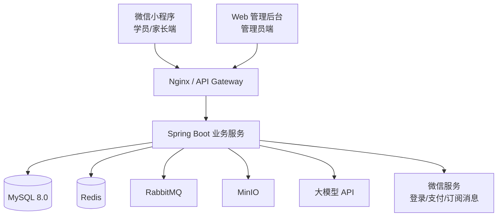
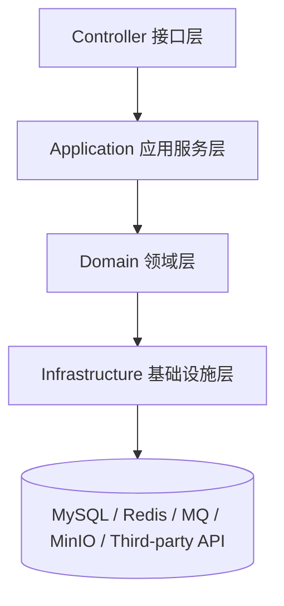
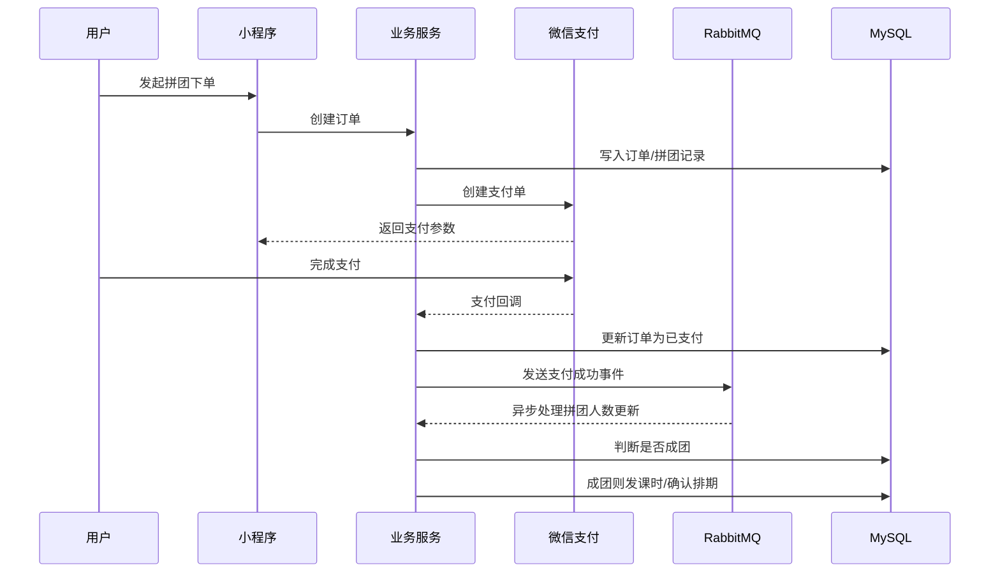
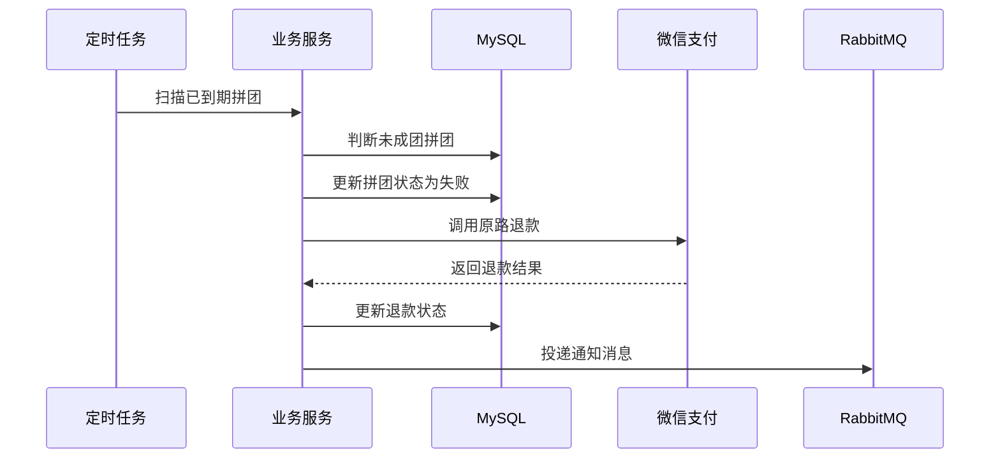
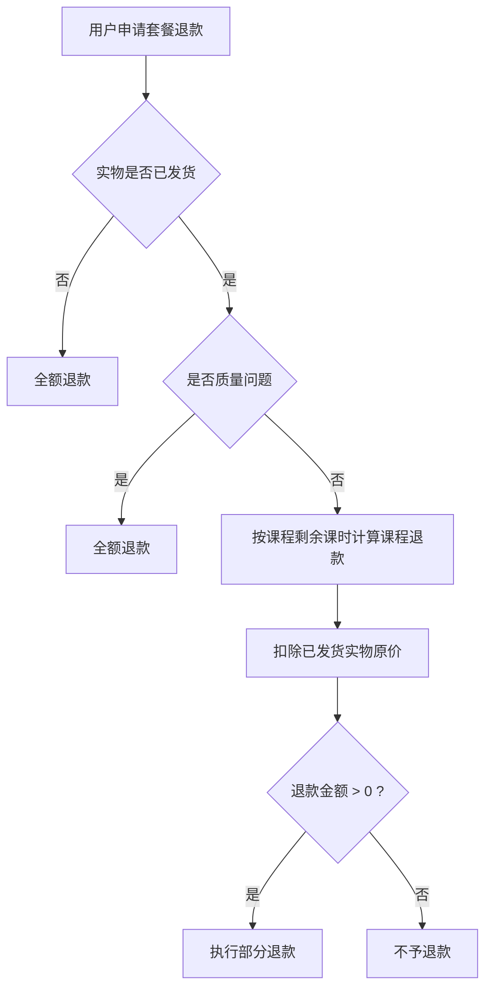
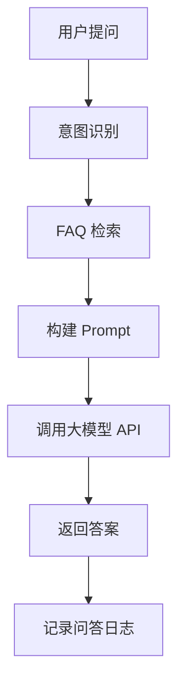
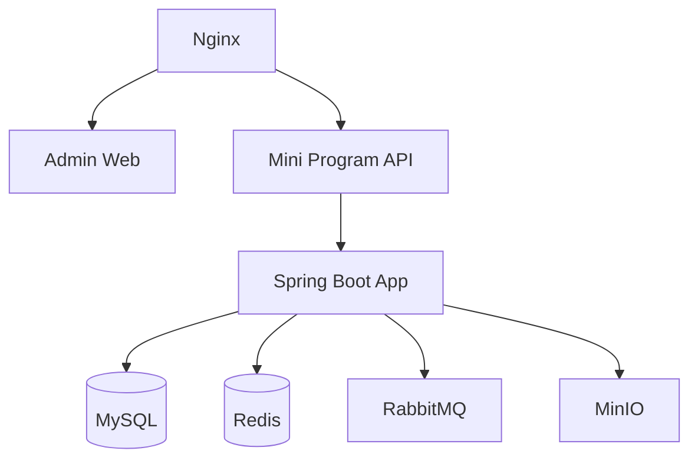

# 体育教培机构管理系统 - 系统架构设计文档

> 版本：v1.0  
> 日期：2026-04-10  
> 依据文档：《需求分析文档》  
> 适用阶段：毕业设计系统设计、数据库设计、接口设计、开发实施

---

## 一、文档目标

本文档基于《需求分析文档》中的业务范围、优先级和非功能需求，对系统的技术栈与总体架构进行正式设计，目标如下：

1. 明确系统实施阶段的推荐技术栈与选型理由
2. 给出适合毕业设计落地的总体架构方案
3. 说明核心业务模块的职责边界与交互方式
4. 为后续数据库设计、接口设计、部署设计提供统一依据

---

## 二、架构设计原则

结合本项目“功能较多、业务链路完整、答辩展示要求高、开发周期有限”的特点，系统架构采用以下原则：

### 2.1 够用优先，避免过度设计

本系统功能覆盖课程、拼团、支付、销课、推荐、AI 客服、电商、动态、成长档案等多个领域，但项目体量仍属于毕业设计范畴，因此不建议直接采用微服务架构。  
最终选择：**前后端分离 + 模块化单体架构 + 关键流程异步化**。

### 2.2 稳定优先，兼顾亮点

系统需要保证拼团成团、自动退款、订单支付、课时扣减、物流发货等核心流程可靠，同时保留推荐算法、AI 客服、成长档案、内容动态等毕设亮点模块。

### 2.3 技术统一，降低维护成本

后端统一采用 Java 技术栈，便于事务控制、权限、安全、支付回调处理；前端统一采用 Vue3 技术体系，降低开发认知切换成本。

### 2.4 面向演进设计

第一阶段支持单机构部署；数据库和业务模型中预留 `tenant_id`、`institution_id` 等扩展字段，为后续多租户 SaaS 化保留空间。

---

## 三、技术栈选型

### 3.1 总体选型结论

系统推荐采用如下技术栈：

| 层次 | 技术选型 | 选型说明 |
|------|----------|----------|
| 用户端 | `uni-app(Vue3 + TypeScript)` | 一套 Vue3 语法开发微信小程序，开发效率高，适合毕业设计交付 |
| 管理后台 | `Vue3 + TypeScript + Vite + Element Plus` | 后台表单、表格、图表丰富，开发成熟稳定 |
| 状态管理 | `Pinia` | 与 Vue3 配套，结构清晰 |
| 图表 | `ECharts` | 用于财务报表、成长曲线、技能雷达图 |
| 后端 | `Spring Boot 3 + Java 17` | 与需求文档一致，生态成熟，适合业务系统开发 |
| ORM | `MyBatis-Plus` | CRUD 开发效率高，适合后台管理型系统 |
| 安全认证 | `Spring Security + JWT` | 支持后台 RBAC 和小程序登录态管理 |
| 数据库 | `MySQL 8.0` | 事务能力稳定，适合订单、课时、退款等核心场景 |
| 缓存 | `Redis` | 缓存热点数据、倒计时、分布式锁、幂等控制 |
| 消息队列 | `RabbitMQ` | 处理支付后异步任务、通知、退款重试、日志解耦 |
| 对象存储 | `MinIO` | 存储课程图文、动态图片/视频、成长档案媒体资源 |
| 定时任务 | `Spring Scheduling + Redis 分布式锁` | 处理拼团超时、订单关闭、消息补偿 |
| AI 能力 | `Spring AI + 大模型 API（通义千问/文心一言）` | 统一封装大模型调用，便于后续切换模型 |
| 知识库检索 | `MySQL FAQ 库 + 关键词检索 + Redis 缓存` | 当前知识库规模较小，采用轻量 RAG，更适合毕业设计落地 |
| 接口风格 | `RESTful API + JSON` | 便于前后端分离与接口文档管理 |
| 部署 | `Docker Compose + Nginx + Linux` | 适合单机部署答辩演示，也便于快速复现环境 |
| 日志监控 | `Logback + Spring Boot Actuator` | 满足运行日志、健康检查、异常定位 |

### 3.2 为什么采用模块化单体，而不是微服务

本系统虽然业务模块较多，但当前阶段具有以下特点：

1. 业务强关联，订单、拼团、退款、课时之间事务边界紧密
2. 团队规模小，开发和调试资源有限
3. 毕业设计更强调完整性、可实现性、可展示性
4. 单体系统更适合快速联调微信支付、订阅消息、后台管理

因此采用：

**架构风格：模块化单体 + 领域模块拆分 + 异步事件驱动**

即：

1. 物理部署为一个后端应用
2. 逻辑上拆分为多个业务模块
3. 对支付回调、退款、消息通知、推荐日志等耗时流程做异步化处理

这样既保证实现难度可控，又具备清晰的系统设计层次。

### 3.3 前端技术栈说明

#### 3.3.1 用户端小程序

推荐技术栈：

- `uni-app`
- `Vue3`
- `TypeScript`
- `Pinia`
- `uView Plus` 或 `uni-ui`

选型理由：

1. 需求文档已明确采用 Vue3 体系
2. 小程序页面较多，组件复用需求明显
3. `uni-app` 对微信小程序适配成熟，开发效率高
4. 后续若需要扩展 H5 展示页，也具备一定复用空间

#### 3.3.2 管理后台

推荐技术栈：

- `Vue3`
- `TypeScript`
- `Vite`
- `Pinia`
- `Vue Router`
- `Element Plus`
- `ECharts`

适配场景：

1. 课程管理、学员管理、教练管理、排课管理
2. 拼团管理、优惠券、订单、发货、退款审核
3. 财务报表、推荐参数设置、知识库管理

### 3.4 后端技术栈说明

推荐技术栈：

- `Java 17`
- `Spring Boot 3`
- `Spring Web`
- `Spring Validation`
- `Spring Security`
- `MyBatis-Plus`
- `Spring Transaction`
- `Spring Scheduling`

选型理由：

1. 业务系统中订单、退款、课时扣减需要强事务控制
2. 管理后台 CRUD 占比较高，`MyBatis-Plus` 可显著提升开发效率
3. `Spring Boot 3` 对现代 Java 特性支持更好
4. 后续对接微信支付、订阅消息、对象存储、消息队列均有成熟生态

### 3.5 数据与中间件选型说明

#### 3.5.1 MySQL 8.0

承担核心业务数据存储：

1. 用户、课程、拼团、订单、课时
2. 商品、套餐、物流、优惠券
3. 财务记录、动态、成长档案
4. FAQ 知识库、推荐日志、客服日志

适用原因：

1. 事务能力强，适合订单与支付类场景
2. 关系模型清晰，适合本系统复杂业务关联
3. 易于答辩展示 ER 图与 SQL 设计

#### 3.5.2 Redis

主要用途：

1. 首页推荐、课程详情、商品详情缓存
2. 拼团倒计时、热点拼团状态缓存
3. 用户 token、验证码、登录态辅助存储
4. 幂等控制与分布式锁
5. 定时任务并发保护

#### 3.5.3 RabbitMQ

主要用于削峰填谷与业务解耦：

1. 支付成功后的异步处理
2. 拼团成功/失败后的通知分发
3. 自动退款任务投递与失败重试
4. 物流通知、课时预警通知
5. 推荐日志、客服日志异步落库

选择 RabbitMQ 而非 Kafka 的原因：

1. 当前吞吐量要求不高
2. 可靠投递、确认机制对交易系统更友好
3. 部署与学习成本较低，更适合毕业设计

#### 3.5.4 MinIO

存储对象包括：

1. 课程图文详情图片
2. 商品图片、SKU 图
3. 动态模块图片/视频
4. 成长档案中的照片、视频、海报

选型原因：

1. 可本地私有部署，不依赖公有云
2. 与 S3 协议兼容，后续迁移成本低
3. 便于答辩环境一键启动

### 3.6 AI 客服技术栈说明

推荐实现：

- `Spring AI`
- `通义千问` 或 `文心一言` 大模型 API
- `MySQL FAQ 知识库`
- `关键词检索 + 分类过滤 + Prompt 拼接`

设计理由：

1. 当前知识库规模可控，FAQ 型知识问答为主
2. 先采用轻量 RAG 即可满足“课程咨询、拼团规则、退款说明、上课安排”等场景
3. 无需额外引入独立向量数据库，降低部署复杂度
4. 后续如果知识库扩张，可演进为“向量检索 + 重排”

---

## 四、总体架构设计

### 4.1 架构概览

系统采用“前端多端 + 后端统一服务 + 数据与中间件支撑”的三层结构。



### 4.2 总体架构说明

#### 4.2.1 接入层

包含两个入口：

1. 微信小程序端
2. Web 管理后台

职责：

1. 页面交互与表单提交
2. 登录授权与 token 携带
3. 推荐内容展示、订单支付发起、客服问答呈现

#### 4.2.2 网关层

使用 `Nginx` 承担以下职责：

1. 静态资源分发
2. 反向代理
3. HTTPS 接入
4. 后台与接口统一入口管理

#### 4.2.3 应用服务层

核心采用单体应用，内部按业务模块拆分：

1. 用户与认证模块
2. 课程与教务模块
3. 拼团营销模块
4. 订单与支付模块
5. 退款与售后模块
6. 电商与物流模块
7. 推荐模块
8. AI 客服模块
9. 动态内容模块
10. 学员成长档案模块
11. 财务统计模块
12. 消息通知模块
13. 系统配置模块

#### 4.2.4 数据与基础设施层

1. `MySQL`：核心业务数据
2. `Redis`：缓存、倒计时、幂等、锁
3. `RabbitMQ`：异步消息
4. `MinIO`：图片/视频等媒体资源
5. 第三方平台：微信支付、订阅消息、大模型 API

---

## 五、逻辑分层设计

后端采用经典分层架构，兼顾可维护性与实现效率。



### 5.1 接口层（Controller）

职责：

1. 接收前端请求
2. 参数校验
3. 用户身份解析
4. 统一返回结果

典型接口：

1. 登录、课程列表、拼团详情、下单、退款申请
2. 后台课程管理、订单发货、财务报表、知识库维护

### 5.2 应用服务层（Application Service）

职责：

1. 编排业务流程
2. 跨模块调用协调
3. 事务边界控制
4. 发布领域事件

例如：

1. 创建拼团订单
2. 支付成功后发课时/扣库存/推通知
3. 套餐退款时拆分课程与商品金额

### 5.3 领域层（Domain）

职责：

1. 封装核心业务规则
2. 保证规则一致性
3. 维护实体状态流转

重点领域规则：

1. 拼团成功与失败判断
2. 私教课包退款公式
3. 拼团课包按原价核算退款
4. 套餐商品已发货时的拆分退款规则
5. 销课后课时余额计算
6. 推荐分计算

### 5.4 基础设施层（Infrastructure）

职责：

1. 数据库持久化
2. Redis 缓存封装
3. MQ 消息收发
4. 对象存储文件上传
5. 第三方接口对接

---

## 六、业务模块划分

### 6.1 模块清单

| 模块 | 主要职责 | 对应需求 |
|------|----------|----------|
| 用户与认证模块 | 微信登录、后台登录、用户资料、RBAC | 用户注册登录、后台权限 |
| 课程管理模块 | 课程 CRUD、上下架、课程详情 | 课程管理、小程序课程展示 |
| 教务管理模块 | 学员、教练、排课、销课 | 学员管理、教练管理、排课、销课 |
| 拼团营销模块 | 发起拼团、参团、成团校验、失败关闭 | 私教拼团、团课拼团 |
| 优惠券模块 | 模板管理、发放、领取、核销 | 优惠券系统 |
| 订单支付模块 | 下单、支付、回调、状态流转 | 课程下单、商品下单、混合订单 |
| 退款售后模块 | 退款申请、审核、自动退款、补偿重试 | 课包退款、套餐退款、商品售后 |
| 电商模块 | 商品、SKU、购物车、发货、物流、评价 | 体育电商模块 |
| 推荐模块 | 冷启动、推荐排序、推荐日志 | 智能推荐 |
| AI 客服模块 | FAQ、意图识别、检索、问答日志 | AI 客服 |
| 动态内容模块 | 动态发布、展示、点赞评论、关联课程 | 精彩瞬间/动态模块 |
| 成长档案模块 | 体测数据、技能评分、徽章、时间轴、报告 | 学员成长档案 |
| 财务模块 | 收入、支出、利润、报表统计 | 财务管理 |
| 消息通知模块 | 微信订阅消息、系统消息、预警提醒 | 支付通知、销课通知、发货通知 |
| 系统配置模块 | 推荐参数、AI 配置、字典配置、日志 | 系统设置 |

### 6.2 推荐的代码包结构

```text
com.sportedu
├── common             # 通用返回、异常、工具、枚举
├── auth               # 登录认证、权限控制
├── user               # 用户、学员档案基础信息
├── course             # 课程、课程详情、课程上下架
├── teaching           # 教练、排课、销课、课时
├── groupbuy           # 拼团、参团、成团逻辑
├── coupon             # 优惠券
├── order              # 订单、支付、订单项
├── refund             # 退款、售后、补偿
├── product            # 商品、SKU、分类、购物车
├── logistics          # 发货、物流
├── recommend          # 推荐算法、推荐日志
├── ai                 # AI 客服、FAQ、检索、问答日志
├── content            # 动态、评论、点赞
├── growth             # 成长档案、体测、徽章、报告
├── finance            # 财务记录、利润报表
├── notify             # 微信消息、站内通知
└── system             # 参数配置、任务调度、操作日志
```

---

## 七、核心业务架构设计

### 7.1 订单中心设计

为了统一课程、电商商品、套餐商品的下单能力，系统采用“统一订单主表 + 订单明细表”的模式。

设计要点：

1. `orders` 保存订单主状态
2. `order_items` 保存课程项、商品项、套餐拆分项
3. 支持订单类型：
   - 课程订单
   - 拼团订单
   - 商品订单
   - 套餐订单
4. 支付成功后，根据明细类型执行不同后置动作

优势：

1. 便于统一支付与退款入口
2. 便于财务报表统一统计
3. 支持课程与商品混合结算

### 7.2 拼团架构设计

拼团模块需要处理高一致性与超时场景，采用“数据库状态 + Redis 倒计时 + 定时校准”的组合设计。

核心机制：

1. 数据库记录拼团主状态与参与人数
2. Redis 维护拼团剩余时间缓存
3. 定时任务扫描即将到期拼团
4. 到期后统一判断是否成团
5. 成功则发放课时或确认团课
6. 失败则触发原路退款

这样可以满足需求文档中的：

1. 拼团倒计时准确
2. 自动退款可靠
3. 成团状态可追踪

### 7.3 退款架构设计

退款是系统最关键的规则密集型模块，必须独立建模。

退款模块分为三类：

1. 课程课包退款
2. 拼团课包退款
3. 套餐与商品售后退款

核心原则：

1. 所有退款必须保留申请记录、审核记录、计算明细、第三方退款结果
2. 金额计算必须服务化封装，禁止前端计算
3. 支付平台退款失败时进入补偿重试队列

### 7.4 销课架构设计

销课场景本质是“课时账户扣减”。

设计方式：

1. `lessons` 作为课时账户表
2. `lesson_records` 作为扣减流水表
3. 销课操作使用事务保证：
   - 扣减剩余课时
   - 写入销课记录
   - 发送通知消息

后台销课是主入口，用户端只读展示，不开放用户自行扣课。

### 7.5 推荐架构设计

推荐模块采用“规则驱动的轻量混合推荐”。

候选集来源：

1. 已上架课程
2. 热门拼团
3. 关联商品

计算过程：

1. 读取用户画像
2. 计算热度分
3. 计算个性化分
4. 叠加运营权重
5. 输出排序结果
6. 异步记录推荐日志与行为反馈

特点：

1. 算法实现可解释，便于论文撰写
2. 数据依赖适中，适合毕业设计阶段
3. 可逐步从热度推荐演进到完整混合推荐

### 7.6 AI 客服架构设计

客服模块采用“规则识别 + FAQ 检索 + 大模型生成”的轻量 RAG 流程。

处理链路：

1. 前端发起问题
2. 系统做意图识别
3. 依据分类、关键词从 FAQ 库检索
4. 将检索结果拼接到 Prompt
5. 调用大模型接口生成回答
6. 写入聊天记录与效果日志

优势：

1. 比纯大模型直答更可控
2. 可利用机构业务规则保证回答稳定
3. 易于答辩展示“AI + 业务知识”的结合

### 7.7 动态与成长档案架构设计

动态模块与成长档案都依赖多媒体资源，因此统一接入 MinIO。

共性设计：

1. 数据元信息存 MySQL
2. 图片、视频文件存 MinIO
3. 页面展示使用预签名地址或统一访问域名
4. 媒体内容上传时记录封面、尺寸、大小、时长

---

## 八、关键流程设计

### 8.1 支付与拼团处理流程



### 8.2 拼团失败自动退款流程



### 8.3 套餐拆分退款流程



### 8.4 AI 客服问答流程



---

## 九、数据架构设计

### 9.1 数据域划分

根据需求分析文档，可将核心数据分为以下几个数据域：

1. 用户域：用户、学员档案、用户画像
2. 教务域：课程、教练、排课、课时、销课记录
3. 营销域：拼团、优惠券、推荐日志
4. 交易域：订单、订单明细、支付、退款
5. 电商域：商品、SKU、分类、物流、评价
6. 内容域：动态、评论、点赞、成长档案、徽章
7. AI 域：FAQ、聊天记录、意图分类、问答日志
8. 财务域：收入、支出、利润统计

### 9.2 数据库设计原则

1. 核心交易表必须保留状态字段与时间字段
2. 所有涉及资金与课时变更的记录必须保留流水
3. 所有表统一包含基础审计字段：
   - `id`
   - `created_at`
   - `updated_at`
   - `created_by`
   - `updated_by`
   - `deleted`
4. 为后续 SaaS 化预留：
   - `tenant_id`
   - `institution_id`

### 9.3 缓存设计

| 缓存对象 | Key 示例 | 说明 |
|----------|-----------|------|
| 首页推荐 | `recommend:home:{userId}` | 缓存推荐结果，降低首页压力 |
| 课程详情 | `course:detail:{courseId}` | 课程详情热点缓存 |
| 热门拼团 | `groupbuy:hot:list` | 热门拼团列表 |
| 拼团倒计时 | `groupbuy:expire:{groupId}` | 倒计时与活动状态辅助 |
| 用户 token | `auth:token:{token}` | 登录态辅助管理 |
| 幂等控制 | `idem:pay:{orderNo}` | 防止支付回调重复处理 |

### 9.4 消息事件设计

推荐事件主题如下：

| 事件 | 触发时机 | 消费动作 |
|------|----------|----------|
| `order.paid` | 支付成功 | 发放课时、扣减库存、写财务记录 |
| `groupbuy.success` | 拼团成功 | 通知用户、确认排期 |
| `groupbuy.failed` | 拼团失败 | 自动退款、通知用户 |
| `refund.created` | 发起退款 | 进入审核或自动计算 |
| `refund.success` | 退款成功 | 更新订单状态、通知用户 |
| `lesson.consumed` | 销课成功 | 发送课时提醒、写统计 |
| `logistics.shipped` | 订单发货 | 发送物流通知 |
| `recommend.exposed` | 推荐展示 | 写推荐日志 |
| `chat.answered` | AI 回答成功 | 写客服日志 |

---

## 十、安全架构设计

### 10.1 认证与授权

#### 10.1.1 小程序端

1. 通过微信登录获取 `code`
2. 后端换取 `openid/session_key`
3. 系统签发业务 `JWT`
4. 使用 token 访问业务接口

#### 10.1.2 后台端

1. 账号密码登录
2. `Spring Security` 进行认证
3. RBAC 控制菜单与接口权限

### 10.2 数据安全

1. 手机号、身份证等敏感信息加密存储
2. 支付回调验签
3. 关键操作记录操作日志
4. 文件上传限制类型、大小与后缀
5. 退款、发货、销课等关键操作需要操作人审计

### 10.3 接口安全

1. 参数校验
2. 统一异常处理
3. 防重复提交
4. 登录接口限流
5. 上传接口鉴权

---

## 十一、部署架构设计

### 11.1 部署方式

推荐采用单机 Docker Compose 部署，适合开发、测试与答辩演示。



### 11.2 部署组件

1. `nginx`
2. `mysql`
3. `redis`
4. `rabbitmq`
5. `minio`
6. `app`（Spring Boot）
7. `admin-web`（Vue 后台静态资源）

### 11.3 环境划分建议

1. 开发环境：本地 Docker Compose
2. 测试环境：单机云服务器
3. 答辩演示环境：固定测试数据 + 稳定配置

---

## 十二、非功能需求落地方案

### 12.1 性能需求对应方案

| 需求 | 目标 | 架构手段 |
|------|------|----------|
| 首页加载 < 2 秒 | 快速首屏 | Redis 缓存推荐、课程、拼团热点数据 |
| 推荐接口 < 500ms | 快速排序 | 规则推荐 + 预计算 + 缓存 |
| AI 客服 < 3 秒 | 控制延迟 | FAQ 先检索，缩短 Prompt，结果缓存 |

### 12.2 可用性需求对应方案

| 需求 | 架构手段 |
|------|----------|
| 拼团倒计时准确 | Redis 倒计时 + 定时任务校准 |
| 自动退款可靠 | MQ 异步 + 重试补偿 + 状态流水 |
| 微信通知可达 | 异步发送 + 失败日志 + 重发机制 |

### 12.3 可维护性需求对应方案

1. 按业务模块拆包
2. 统一异常码与返回结构
3. 日志与审计分层记录
4. 配置集中管理

---

## 十三、分阶段实施建议

### 13.1 P0 阶段

优先实现以下能力，保证系统闭环：

1. 微信登录
2. 课程展示
3. 拼团下单与支付
4. 后台销课
5. 商品展示与下单
6. 动态发布与首页展示
7. 基础财务统计

### 13.2 P1 阶段

补齐毕业设计核心亮点：

1. 混合推荐
2. AI 客服
3. 优惠券
4. 财务报表
5. 成长档案基础版
6. 套餐拆分退款
7. 电商发货与物流

### 13.3 P2 阶段

作为增强功能：

1. 推荐参数配置后台
2. 用户行为分析
3. 电商评价
4. 动态互动深化
5. 成长报告与分享海报

---

## 十四、最终架构结论

综合需求复杂度、开发周期、毕设展示效果与可实现性，本系统最终建议采用如下方案：

### 14.1 架构结论

1. **架构风格**：前后端分离 + 模块化单体
2. **前端方案**：`uni-app(Vue3 + TS)` + `Vue3 Admin`
3. **后端方案**：`Spring Boot 3 + Java 17 + MyBatis-Plus`
4. **核心数据层**：`MySQL + Redis`
5. **异步能力**：`RabbitMQ`
6. **媒体存储**：`MinIO`
7. **AI 能力**：`Spring AI + 大模型 API`
8. **部署方式**：`Docker Compose + Nginx`

### 14.2 本方案优势

1. 能覆盖需求分析文档中的全部核心业务
2. 技术栈统一，开发难度可控
3. 具备推荐与 AI 两个明显技术亮点
4. 兼顾支付、退款、拼团等高风险业务的一致性
5. 文档可直接衔接数据库设计与接口设计

---

## 十五、下一步输出建议

基于本架构设计文档，建议下一步继续产出以下文档：

1. 数据库详细设计文档
2. 接口设计文档
3. 核心业务时序图与状态图
4. 部署说明文档

---

**文档结束**
